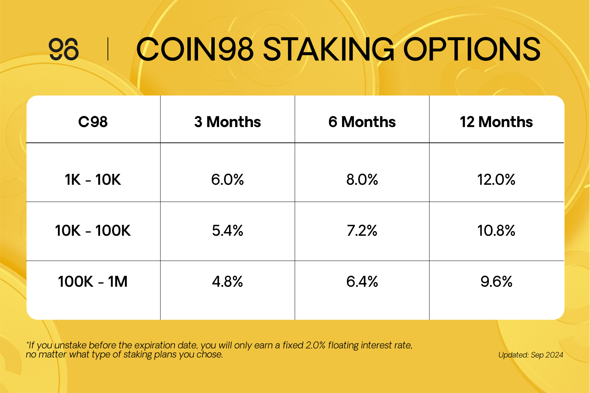

# Coin98

## Fair Access To Open Opportunities to Shape Your Future, Your Ways

As we've grown at Coin98, we've seen the cracks and gaps in the global financial infrastructure — systems designed for a few, ignoring the many. Billions remain sidelined, unable to even open a bank account or freely conduct transactions.&#x20;

Our vision, deeply rooted in our core but not always clear in our words, envisions a world of openness and fairness. A world where anyone, from the busy streets of Asia to the vibrant corners of Africa, has the opportunity not just to survive, but to thrive.&#x20;

Coin98 is more than a crypto wallet; we are your gateway to the Open Internet. Open, decentralized, and secure, we provide the essential tools and infrastructure needed for anyone to enter and participate in any opportunities available online, empowering them to shape their own future.&#x20;

Join us as we work to make our vision a reality, ensuring that the digital and financial worlds are accessible and fair for everyone, empowering each individual to build their own path, shape their own future, and create their own life.&#x20;

Above all, our product suite always focuses on users’ demands to make Web3 easy for everyone.&#x20;

### Coin98 Super Wallet

Coin98 is an open, decentralized, and secure crypto wallet that provides the essential tools, and infrastructure for everyone to enter and participate in any opportunities on the Open Internet, so they can build and shape their own future.&#x20;

<figure><figcaption></figcaption></figure>

Coin98 Super Wallet is the core component of future multichain protocols/applications, serving as the open gateway to access numerous DeFi services across separate blockchains. It has acquired more than 10M+ users worldwide, supporting 100+ blockchains, available on mobile and browser extension.

We believe in a world where all people's visions for the future deserve a fair chance to be realized, regardless of background. Therefore, Coin98 Super Wallet will be everyone’s gateway to pave the way to freely capture all exciting opportunities on the Open Internet.

### Coin98 Staking: The Staking and Earning function.

Coin98 Staking is part of the Coin98 ecosystem, designed to reward C98 holders. It offers a simple and secure way for users to earn passive income while participating in the Coin98 ecosystem.

Coin98 Staking offers fixed interest rates based on your staking plans. There are three different packages with suitable staking periods and amounts of tokens for users to engage.&#x20;

<figure><figcaption></figcaption></figure>

After staking ends, users can unstake and harvest earnings directly to their wallets. Notably, stakers are unable to unstake in the first 15 days. If you unstake before the expiration date, you will only earn a fixed 2.0% floating interest rate, no matter what type of staking plans you chose.

At this moment, we are still heading down for the building. Eventually, the community will figure out a better picture for all the DeFi stacks we are nurturing.

DeFi is the century's innovation, which will undoubtedly change how global finance works in the future. Coin98 Labs is proud to be a special part of the journey of making DeFi accessible to everyone, regardless of their knowledge and familiarity with blockchain.

**Follow us**

[Website](https://coin98.com/) |[ X (Twitter](https://twitter.com/coin98\_labs)) |[ Telegram](https://t.me/coin98wallet) |[ Blog](https://blog.coin98.com/)  |[Discord](https://c98.link/discord)
