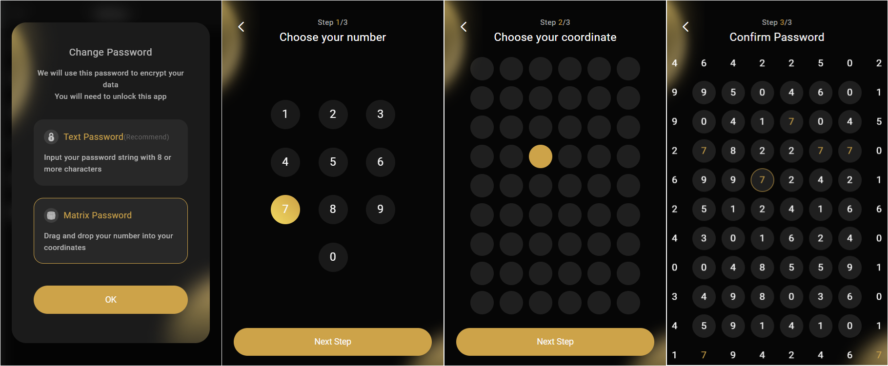
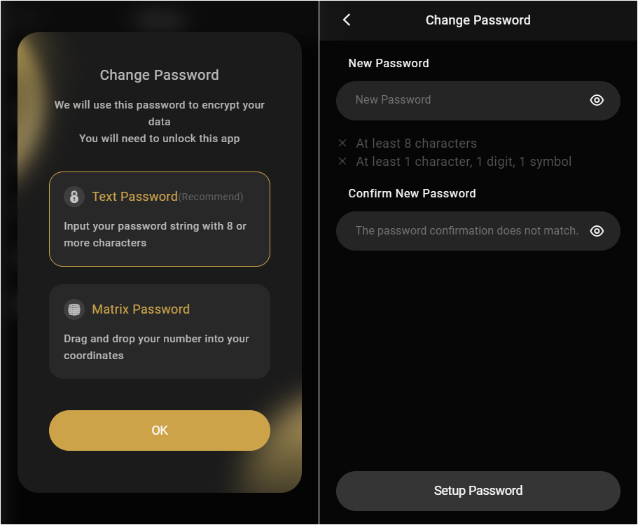

# How to change your Coin98 Extension wallet password

**Step 1**: Click the **Settings icon** on your home screen;

**Step 2**: Choose **Change Password**;

<figure><figcaption></figcaption></figure>

**Step 3:** Enter your current password;

**Step 4:** Setup a new password:

* **Matrix Password:**

1\. Choose your number;

2\. Choose your coordinate;

3\. Confirm the password by dragging your number into the correct coordinate you choose.

Users also can refer to [this video](https://drive.google.com/file/d/12KBccjZoftXRUnVuB-Xfn-ePlYy5gD-s/view) to understand how to set up Matrix Password.

* **Text Password:** Enter your new password then re-enter it to confirm, click **Setup Password** to complete.

