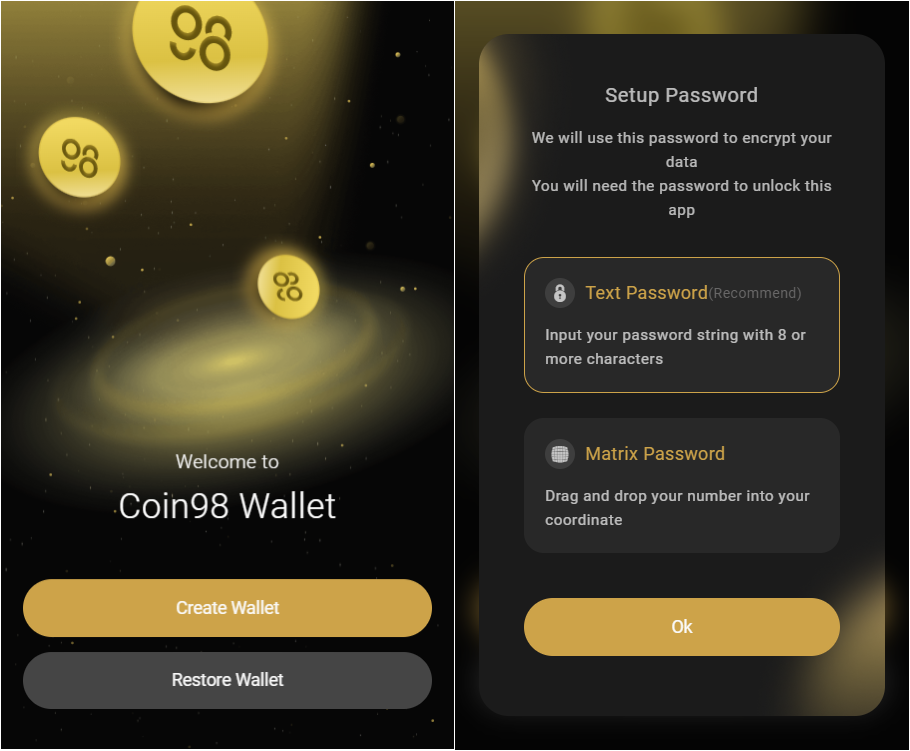
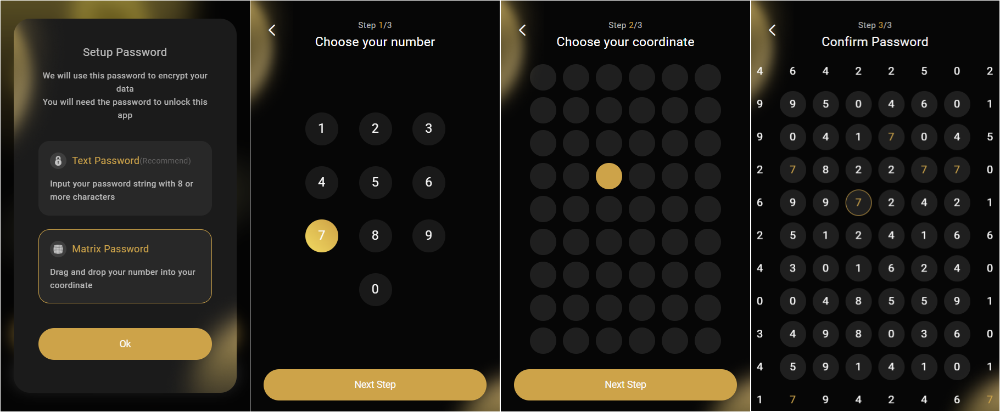
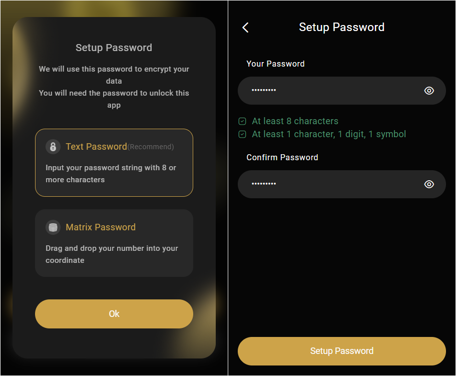

# How to create a password on Coin98 Extension

Coin98 Extension provides users with two password settings options:&#x20;

* Text Password is the common password and is really easy to set. For text passwords, Coin98 Extension allows users to use at least eight characters, including letters, numbers, at least one uppercase letter, and one special character, the generated password is strong enough and secure.&#x20;
* Matrix Password is a new generation password. This is considered the difference between Coin98 Extension and other wallet applications on the market. Matrix passwords contain only certain numbers and coordinates, but their security level is very high.

## Matrix Password

**Step 1:** Pick a number **(1)**;

**Step 2:** Pick a coordinate **(2)**;

**Step 3:** Click and hold the mouse → Drag around until the (1) number is in the (2) position.

_**Pros:** Even if someone else is looking at the screen, they can not know your password_

Note: The Coin98 Extension will be reset if you enter the Matrix Password three times incorrectly. You need to restore your wallet and reset your password from the beginning.

## Text Password

**Step 1:** Enter your password;

**Step 2:** Enter your password to confirm, then select **Setup Password**.

