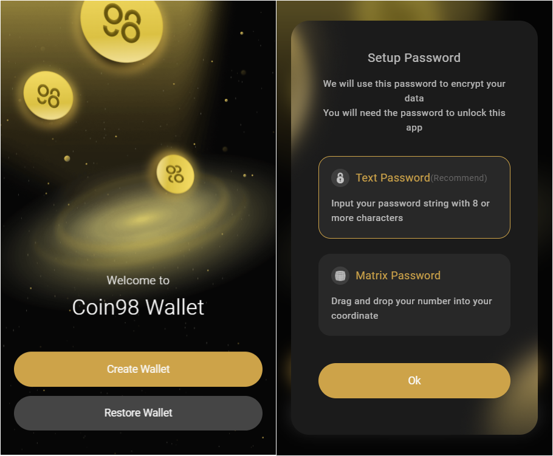

# How to synchronize Coin98 Super Wallet with Coin98 Extension

### Exporting Private Key/Seed Phrase from Coin98 Super Wallet 

Private Key/Seed Phrase must be saved in a safe place when users create wallets on Coin98 Super Walet. You can copy your backed-up Private Key/Seed Phrase and move on to the next step.

However, if you accidentally deleted, or forgot your keys, then here’s how to retrieve them on Coin98 Super Wallet:



## Restoring wallets on Coin98 Extension&#x20;

Now, the most important part of this guide:

**Step 1:** Open Coin98 Extension;

**Step 2:** Click **Restore Wallet** on the initial screen;

**Step 3:** Set up a password if you haven’t done it yet. Choose between 2 options:

* Matrix Password;
* Text Password.

**Read more at** [**How to install Coin98 Extension Wallet for Google Chrome**](https://docs.coin98.com/products/coin98-wallet/extension/beginners-guide/install-extension-google-chrome)

**Step 4:** After setting up the password, choose the icon that matches the wallet you want to restore (**Multi-Chain** is recommended);

**Step 5:** Name the wallet, enter or paste the Private Key or Seed Phrase to restore;

<figure><figcaption></figcaption></figure>

**Step 6:** Select wallet standards. **In each standard wallet option, you need to determine which standard you are importing to make the right choice.**

Coin98 Extension supports both New and Old Standard recovery for wallets on Bitcoin, Solana, Avalanche C-chain, Viction (formerly Tomochain), Celo, Injective, The Open Network, Persistence, Tron, Aptos (Mainnet/Devnet and Testnet).

**Step 7:** Click **Restore** to complete.

<figure><figcaption></figcaption></figure>

By completing these simple steps, you have successfully synchronized your Coin98 Super Wallet with your Coin98 Extension. Manage your assets anytime, anywhere with both our versions from now on!
