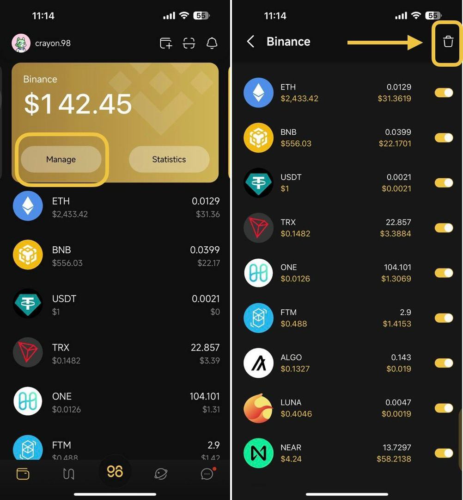
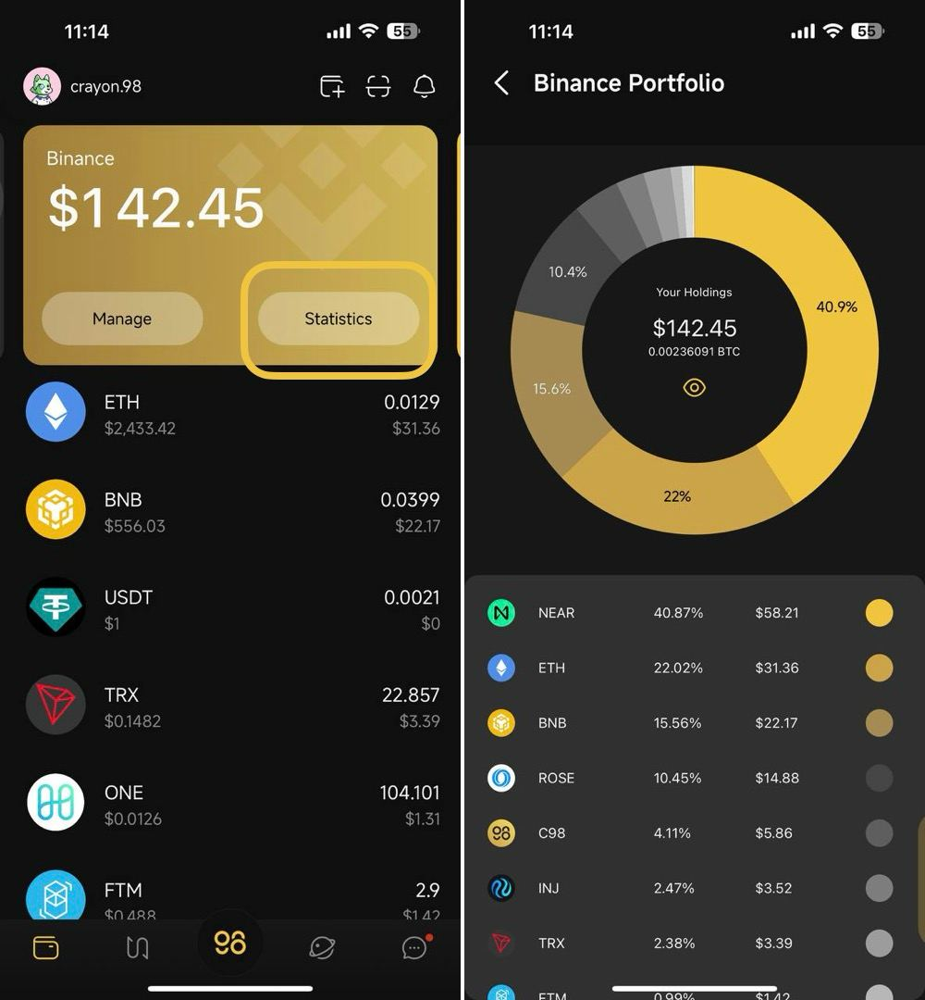

# How to connect your account from an exchange platform to Coin98 Super Wallet

This feature currently supports 5 exchange platforms including Binance, Huobi, Bybit, Poloniex, and Bitfinex.

Preparation:

* An account from at least 1 of the 4 exchange platforms.
* The API key for this account.
* The Secret Key associated with this API.

Follow the platform's instructions on how to create an API before connecting to Coin98 Super Wallet. Please note that you should set the API restrictions to **"Read only"** to eliminate any risk of losing your assets.

**Step 1:** At the yellow frame of the Wallet Tab, swipe left.

**Step 2:** Select your exchange platform from the list -> then click **Register** _(We'll choose Binance in this guide for example)_

<figure><figcaption></figcaption></figure>

**Step 3:** Insert the API key and Secret key associated with your trading account.

**Step 4:** Click **Connect an Exchange** to process -> click **OK** when Exchange is connected successfully

<figure><figcaption></figcaption></figure>

After connecting, your new portfolio will have all assets from the connected trading account and will immediately display on the Coin98 Super Wallet. To connect other accounts, slide the new exchange assets display tab to the right again and repeat as needed.

### What else can you do?

#### 1. Disconnect an exchange account&#x20;

Click **Manage** & click the trashcan icon at the top right corner to disconnect an exchange account.

<figure><figcaption></figcaption></figure>

#### 2. Hide or Unhide coins/tokens

Click **Manage** & click the button next to the coins/tokens that you want to hide or unhide from the total assets display.

<figure><figcaption></figcaption></figure>

#### 3. View statistics

Go to Statistics to see how your portfolio is divided and which coins/tokens contribute the most to your total asset value.

<figure><figcaption></figcaption></figure>
