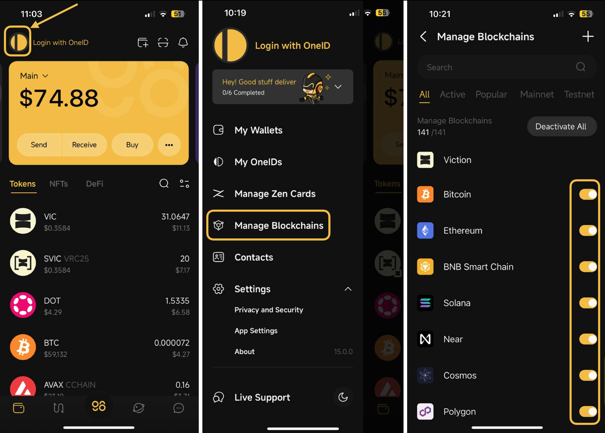
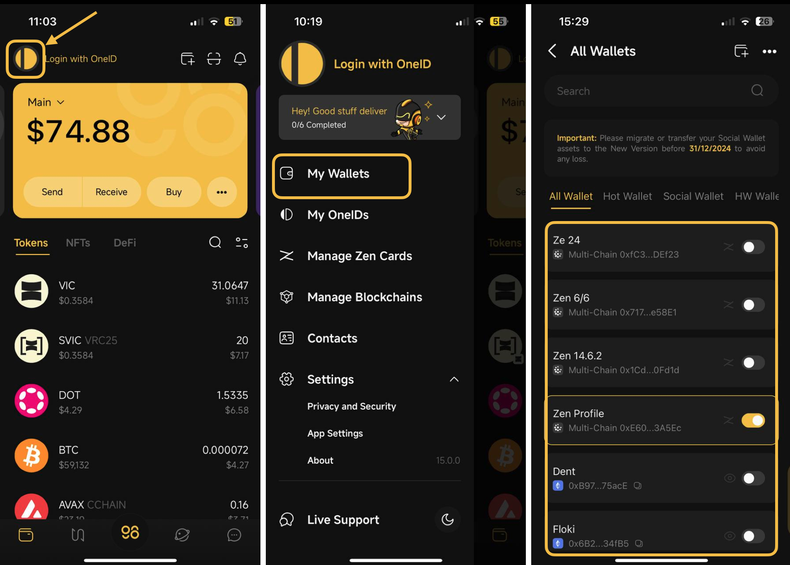
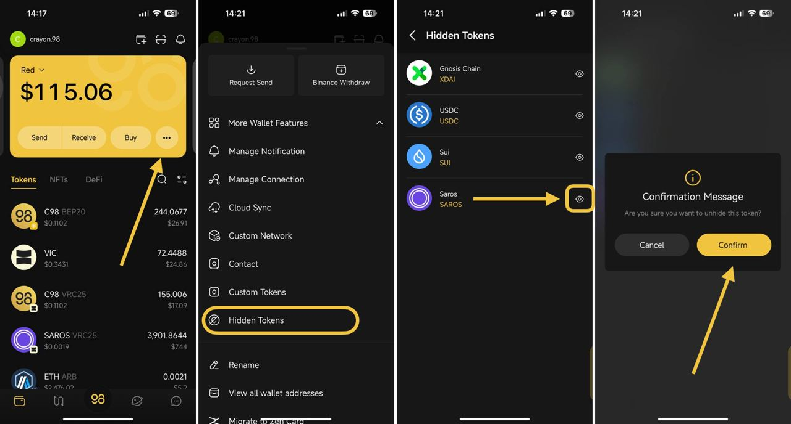
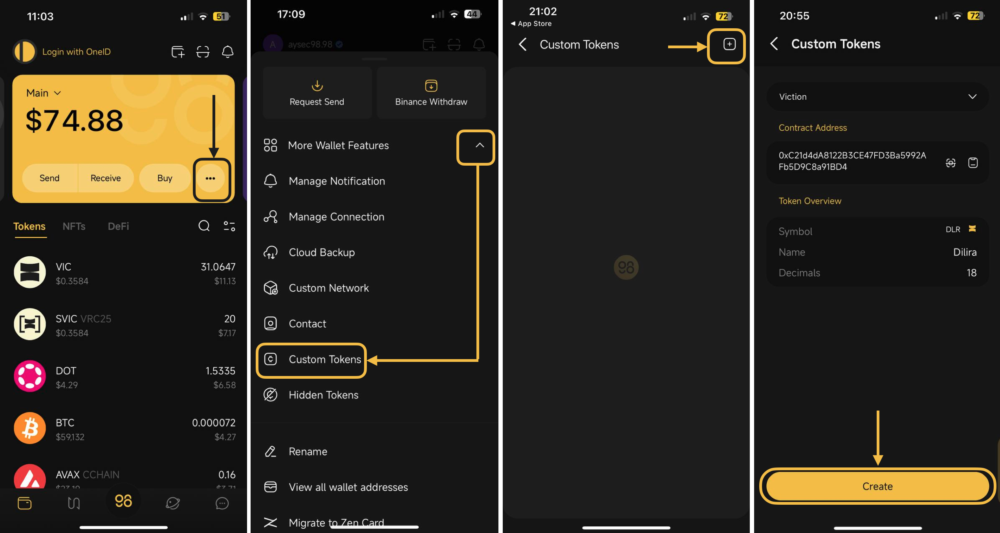

# Balances Not Loading or Showing on my wallet

This is most likely because one of these reasons:

1. **Bad internet connection:** We recommend you check the wifi or cellular connection.&#x20;
2. **Not using the latest version:** Please update to the latest version here:&#x20;

* iOS: [https://ios.coin98.com/ ](https://ios.coin98.com/)
* Android: [https://android.coin98.com/](https://android.coin98.com/)

3. **Unstable RPC:** Please wait for the RPC to become more stable
4. **Inactive wallet in Manage Wallet & inactive blockchain in Manage Blockchains section:**

* Kindly check if you have already activated the blockchain of the wallet holding your funds in the M**anage Blockchains** section

<figure><figcaption></figcaption></figure>

* Kindly check if you activated the wallet holding your funds in the **Manage Wallets** section

<figure><figcaption></figcaption></figure>



5. **Hidden token:**  kindly check the hidden token section to see if your token is hidden.

<figure><figcaption></figcaption></figure>

5. **Unsupported token:** Add a custom token. If the token is listed on Coingecko, kindly contact the Coin98 Support team on [Live Support](https://livechat.coin98.com/), then request for the token to be supported on the Coin98 Super Wallet.

<figure><figcaption></figcaption></figure>


**The token is supported but you are using/activating the wallet belonging to the wrong network/chain in the Manage Wallets section:** Kindly ensure that the wallet address, which contains the token balance and is activated in the Manage Wallets section, belongs to the same blockchain/network as the token balance. Kindly restore the wallet on the correct blockchain if necessary.&#x20;


7. **Bug issue:** Please wait for the dev team to update/ fix the problem or report the issue to us via [Live Support](https://livechat.coin98.com/).


Check all the possibilities but your balance is still incorrect. --> Contact our [Live Support](https://livechat.coin98.com/) for 24/7 support and beware of scammers!


<figure><figcaption></figcaption></figure>
