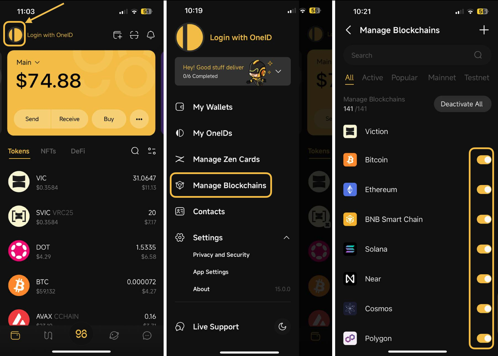

# How to manage blockchains on Coin98 Super Wallet

The latest version of Coin98 Super Wallet includes a feature that allows users to select their active Blockchains with a single tap on their mobile device. Manage Blockchains is one of the updates that maximize the app interface, improving the user experience and the app's performance.

You can activate your favorite blockchains from among the many supported by Coin98, as well as disable some of them. All of your multichain wallets will then be updated automatically based on your settings.

Thanks to this function, your Coin98 will be faster and more smooth than ever.

Before we begin, you need to install or update your Coin98 Super Wallet to the latest version:

* iOS:[https://ios.coin98.com](https://ios.coin98.com)
* Android:[https://android.coin98.com](https://android.coin98.com)

When everything is all set, let’s explore the new feature with Coin98 Super Wallet:

**Step 1:** Open the Coin98 Super Wallet.

**Step 2**: Click on the OneID icon at the top left corner of the main screen.

**Step 3:** Choose **Manage Blockchains**.

**Step 4:** Choose the blockchains you often use (such as BNB Smart Chain) by toggling on the icon next to the chains. You can also click **Activate All/Deactivate All** if you prefer to activate or deactivate all blockchains at once.

After using this feature, please refresh all of the wallets in the Manage interface that are linked to blockchains and dapps in the browser screens you chose will be updated.

You can always use this feature to modify which blockchains you use the most to optimize your asset management on various chains.

<figure><figcaption></figcaption></figure>

You can search for the chain you want by clicking on the search icon at the top right corner.

If a chain is not found in the Manage Blockchains section, it means that this chain has not been integrated into Coin98. You can add the chain by clicking the + icon at the top right corner to access the Custom Network, then click the + icon at the top right corner of the Custom Network interface then fill in the required information. Here are detailed instructions for adding a new network to Coin98:[ link](https://docs.coin98.com/products/coin98-super-wallet/mobile/beginners-guide/how-to-manage-wallets#how-to-add-custom-network)​

<figure><figcaption></figcaption></figure>


**Note:**

* You can use the Refresh Multichain feature to update the recently integrated blockchains to your existing multichain wallets on your application.

