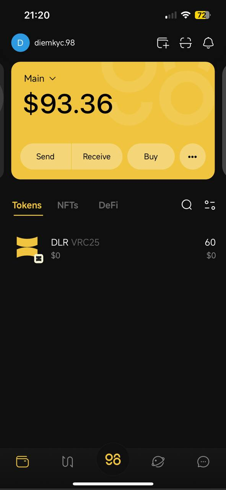

# How to add a Custom Token on Coin98 Super Wallet

### How to add new tokens on Coin98 Super Wallet

The "Custom Token" feature allows users to add and interact with tokens which are not yet officially supported on Coin98 Super Wallet.

**Step 1:** Click the More icon **"..."** on the main screen;

**Step 2:** Click on the **"V"** icon next to the More Wallet Features to show additional features supported on Coin98 Super Wallet;

**Step 3:** Choose **Custom Tokens**

**Step 4:** Click on the Add icon **"+"** at the top right;

> You only need to select the Blockchain and enter the Contract Address of the token correctly. The remaining parameters will be updated automatically in the Overview section.

**Step 5:** Recheck the following parameters in the Overview section:

1. Symbol
2. Name
3. Decimals

**Step 6:** Select **Create**

<figure><figcaption></figcaption></figure>

**Step 7:** Back to the main screen of the Wallet tab to check the token balance.

<figure><figcaption></figcaption></figure>
