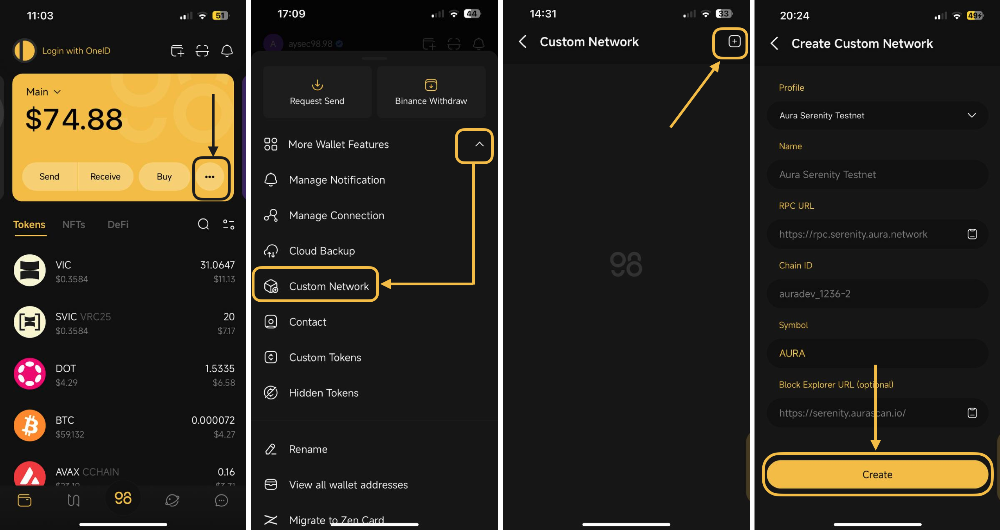
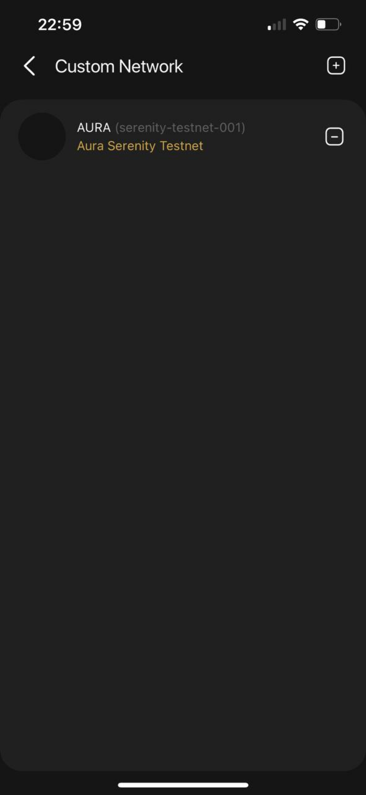

# How to add Custom Network on Coin98 Super Wallet


Please check carefully before receiving any assets on the unsupported networks:

* Coin98 only supports displaying the father token on unsupported networks.
* Coin98 does not yet support adding tokens on unsupported networks, which leads to the fact the unsupported tokens will not be displayed on your app.


The Custom Network feature allows users to add a specific blockchain which is not supported by default in the Coin98 Super Wallet (typically Testnet).

> The added Custom Network will be available in the blockchain list when you add or import a wallet.Comment

### **How to add a network on Coin98 Super Wallet** 

**Step 1:** Click the More icon **"..."** on the main screen;

**Step 2:** Click on the **"V"** icon next to the More Wallet Features to show additional features supported on Coin98 Super Wallet;

**Step 3:** Choose **Custom Networks**

**Step 4:** Click on the Add icon **"+"** at the top right corner;

**Step 5:** You can select from a predefined Custom Network Profile list in the **Profile** section. If the network you want to add is not available in the Profile list, you can manually input the following information about the Network:

1. Network
2. Chain Name
3. RPC URL
4. Chain ID
5. Symbol
6. Block Explorer URL (Optional)

**Step 6**: After filling in the required fields, select **Create**

<figure><figcaption></figcaption></figure>

**Step 7:** Back to your All Wallets section, then [create](../getting-started/v15-how-to-create-a-multichain-wallet.md) or[ import](../wallet-management/v15-how-to-import-multi-chain-wallets-to-coin98-super-wallet.md) the new wallet for the newly created Custom Network.

<figure><figcaption></figcaption></figure>
