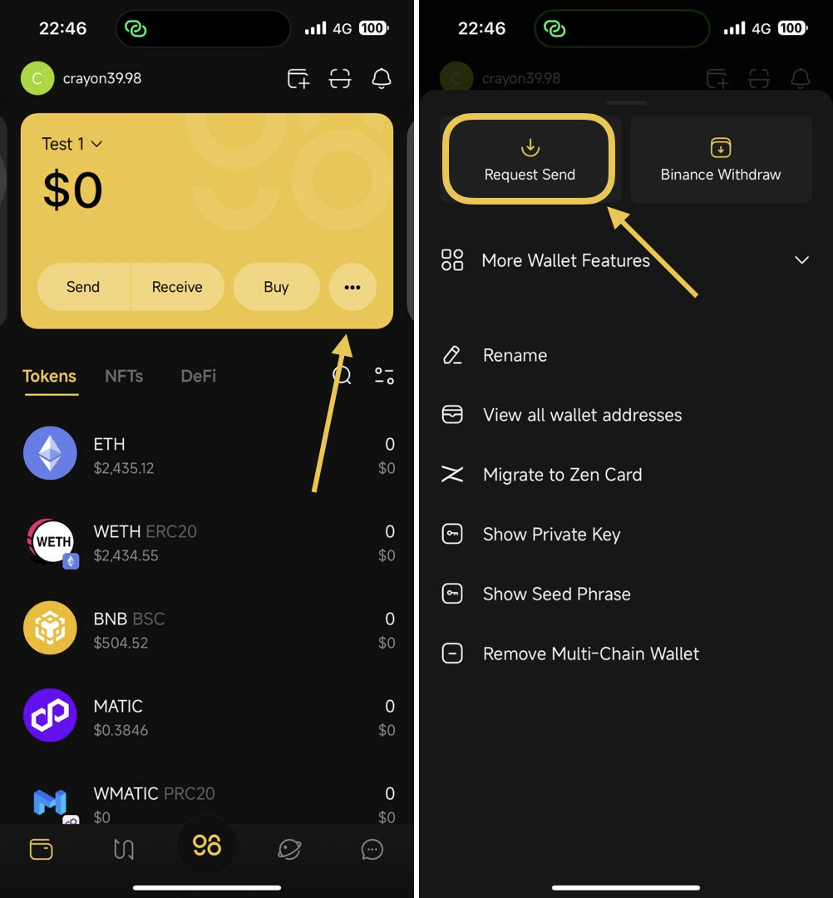
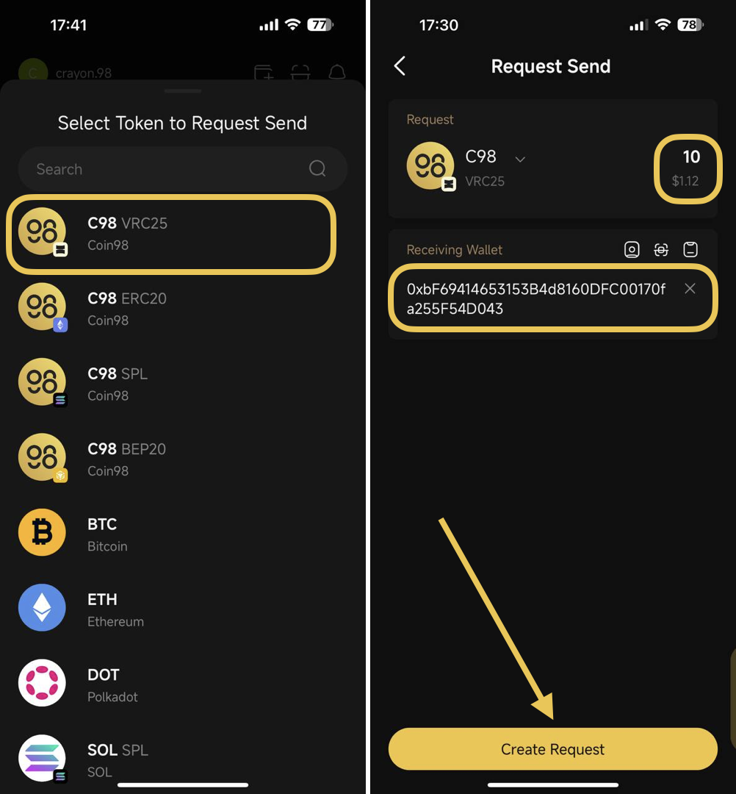
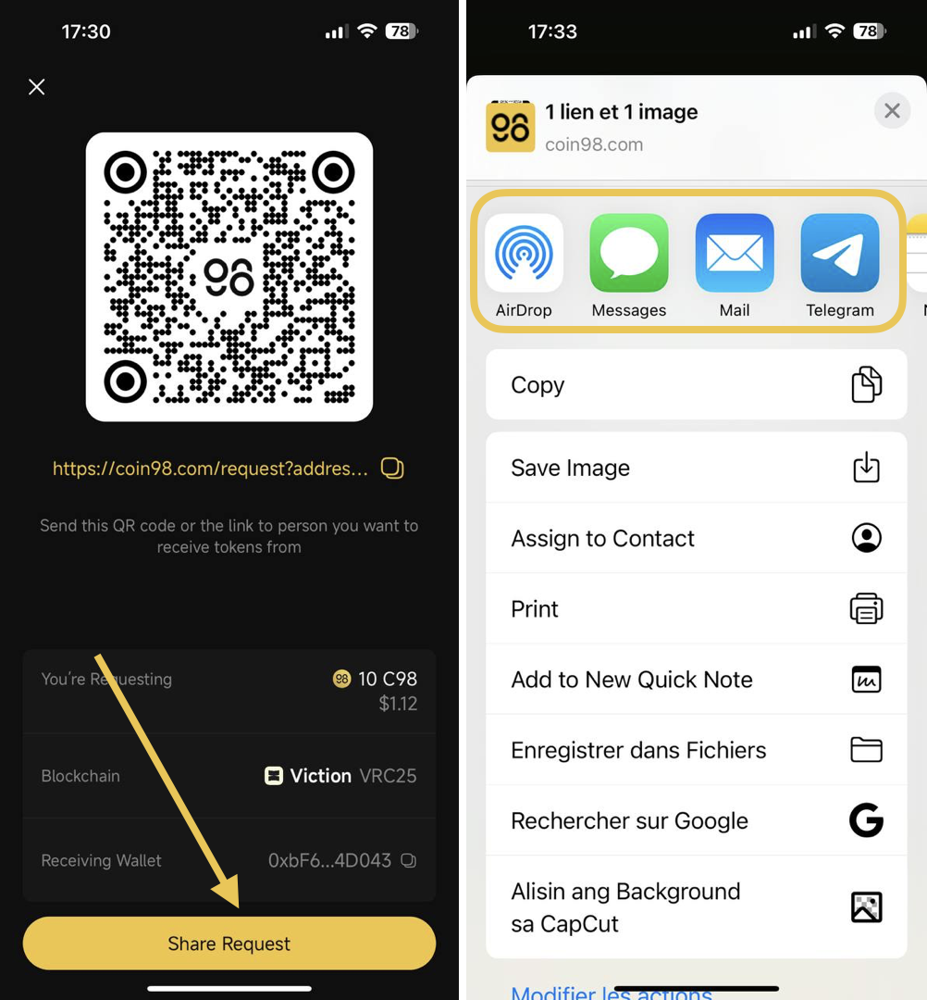
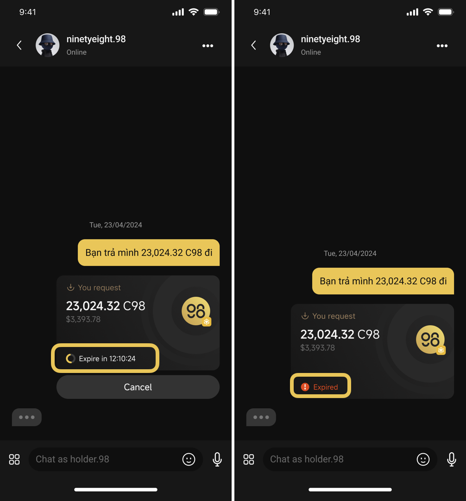
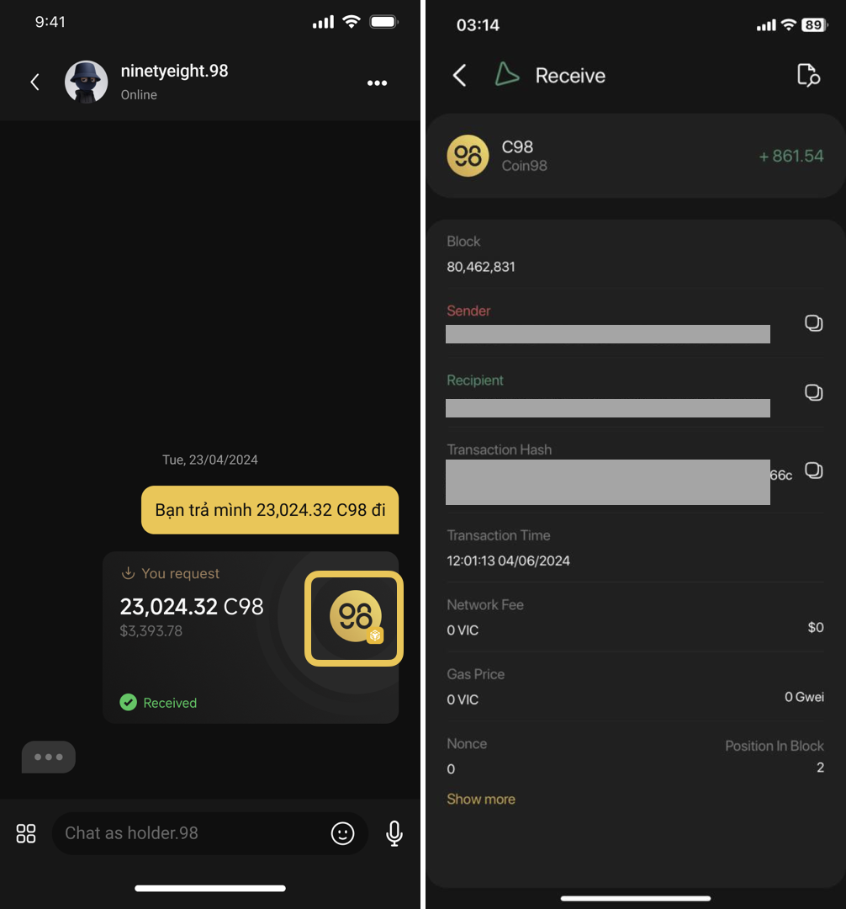
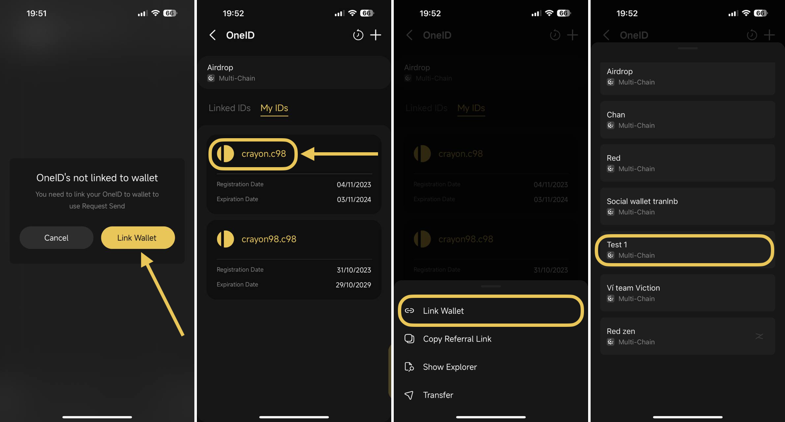

# How to create a send request for someone

You can send a transfer request in the following section:

* Directly Request Send from More section
* Chat section in Private Messages between OneID holders who already log in to OneID on the App

To use the “Request Send" feature, the recipient needs to first link their OneID to the wallet.


Check out this doc for more guide on how to link the wallet to OneID:&#x20;

https://docs.oneid.xyz/beginners-guide/mobile/how-to-link-and-unlink-wallet


## **\*The first way**: Directly Request Send from More section&#x20;

**Step 1**: On the main screen of the Wallet section, choose the **More** icon → then choose **Request Send**

<figure><figcaption></figcaption></figure>

**Step 2**: Select the token and its blockchain that you want the sender to send to you

**Step 3**: Input the amount of the token, and the receiving wallet address where you would like the sender to send → click **Create Request**

<figure><figcaption></figcaption></figure>

**Step 4**: Share your transfer request link with the sender. You can share this link through your social accounts, such as Telegram, Messenger, etc.


Note: To send request link works perfectly on the sender side, please ensure that the sender is also already using Coin98 Super Wallet (from V15)


<figure><figcaption></figcaption></figure>

## **\*The second way: Request Send through the Chat section**

The Chat section is used for only Private Messages  (Private Messages) between OneID holders who already log in to OneID on the App. If you chat with someone (log in by OneIDs), you can send them a transfer request.&#x20;

**Step 1**: In Private Message, click on **More** Options icon

**Step 2**: Select **Utilities** → choose **Receive**

<figure><figcaption></figcaption></figure>

**Step 3**: Select the token and its blockchain that you want the sender to send to you

**Step 4**: Input the amount of the token, and the receiving wallet address where you would like the sender to send to → click **Request**

<figure><figcaption></figcaption></figure>

## Some important notes:

1. Send Request through the Chat section is valid for 24 hours. After this duration, it will show **Expired**

<figure><figcaption></figcaption></figure>

2. &#x20;Once the sender declines your transfer request or sends your token to you, the status will update you:

* \[The name of Sender's OneID] declined: Sender declines your request
* Received: You already received the token successfully from the sender\

<figure><figcaption></figcaption></figure>

By clicking on the "Send Request" that the sender has already executed, you can view the detailed transaction information.

<figure><figcaption></figcaption></figure>

3. If you haven't linked your OneID to your wallet yet, a popup will request you to do so in order to use the "Request Send" feature. To proceed, please click "Link Wallet" on the popup to connect your OneID with the wallet.

<figure><figcaption></figcaption></figure>
