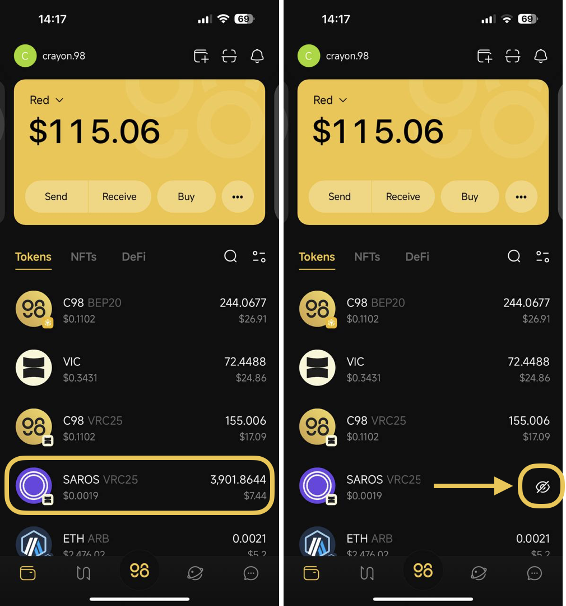
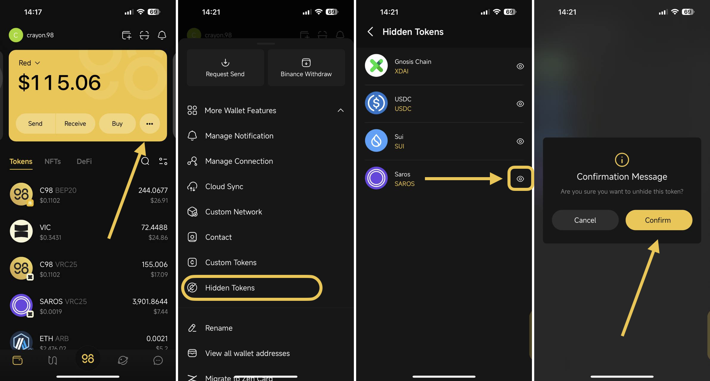
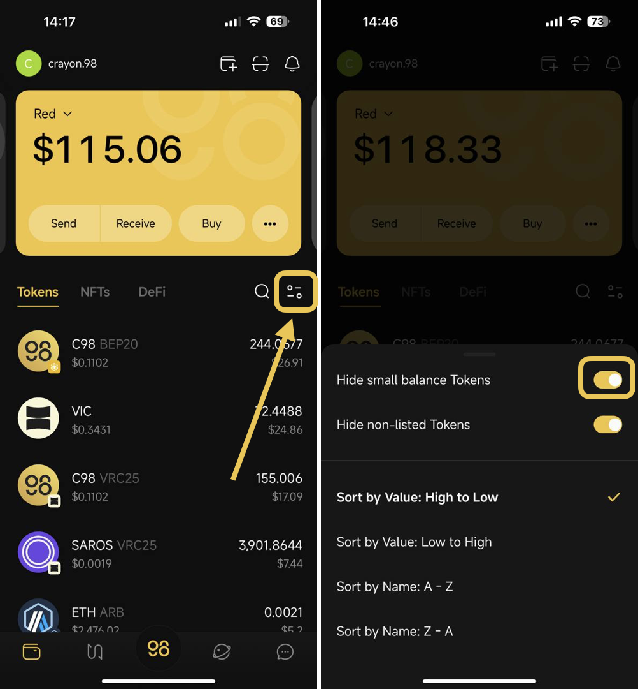
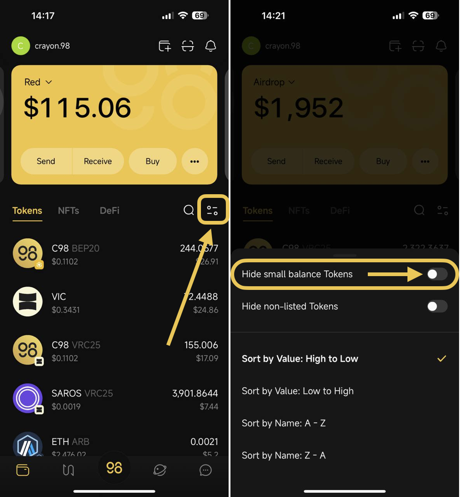
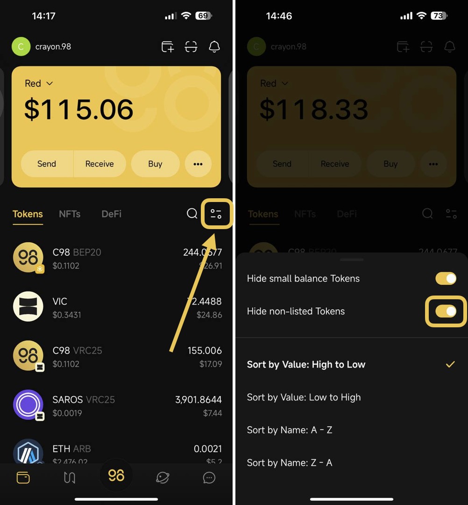
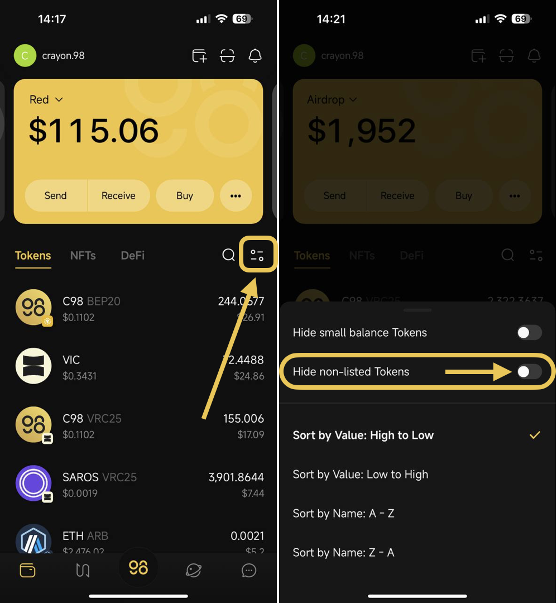

# How to hide/unhide tokens on Coin98 Super Wallet

## How to hide the token on Coin98 Super Wallet

**Step 1**: On the main screen of the Wallet section, press and hold the token, which you would like to hide, for about 2-3 seconds

**Step 2**: An eye icon will show up → click on this **Eye icon** to hide the token

<figure><figcaption></figcaption></figure>

## How to unhide the token on Coin98 Super Wallet

**Step 1**: On the main screen of the Wallet section, click the **More** icon

**Step 2**: Select **Hidden Tokens**

**Step 3**: Click on the **Eye icon** next to the token that you would like to unhide

**Step 4**: Click **Confirm** on the popup that requests your confirmation to unhide the token

<figure><figcaption></figcaption></figure>

## How to hide and unhide small balance Tokens

The "Hide small balance Tokens" feature allows you to hide the token with a balance value under $1 on the Wallet tab


**Note**: This feature only applies to tokens officially supported by Coin98 Super Wallet. Custom tokens cannot be hidden when this feature is enabled.


* To enable this feature, toggle the button on so it displays yellow.&#x20;

<figure><figcaption>
The feature is enabled
</figcaption></figure>

* To disable it, simply toggle the button off

<figure><figcaption>
The feature is disabled
</figcaption></figure>

## How to hide and unhide non-listed Tokens

The “Hide non-listed tokens" feature allows tokens that haven't been officially supported to Coin98 Super Wallet to be displayed automatically on the App's Wallet tab without requiring you to add custom tokens manually.

* To enable this feature, toggle the button on so it displays yellow

<figure><figcaption>
The feature is enabled
</figcaption></figure>

* To disable it, simply toggle the button off

<figure><figcaption>
The feature is disabled
</figcaption></figure>
