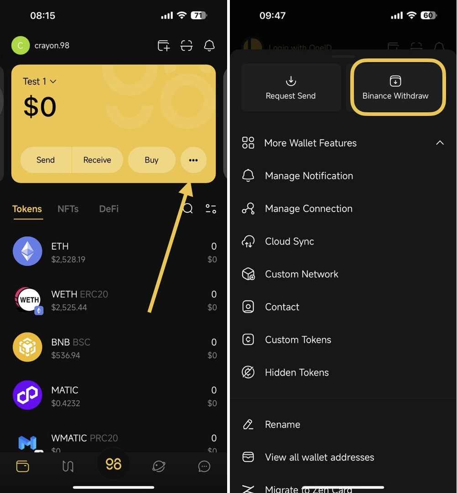
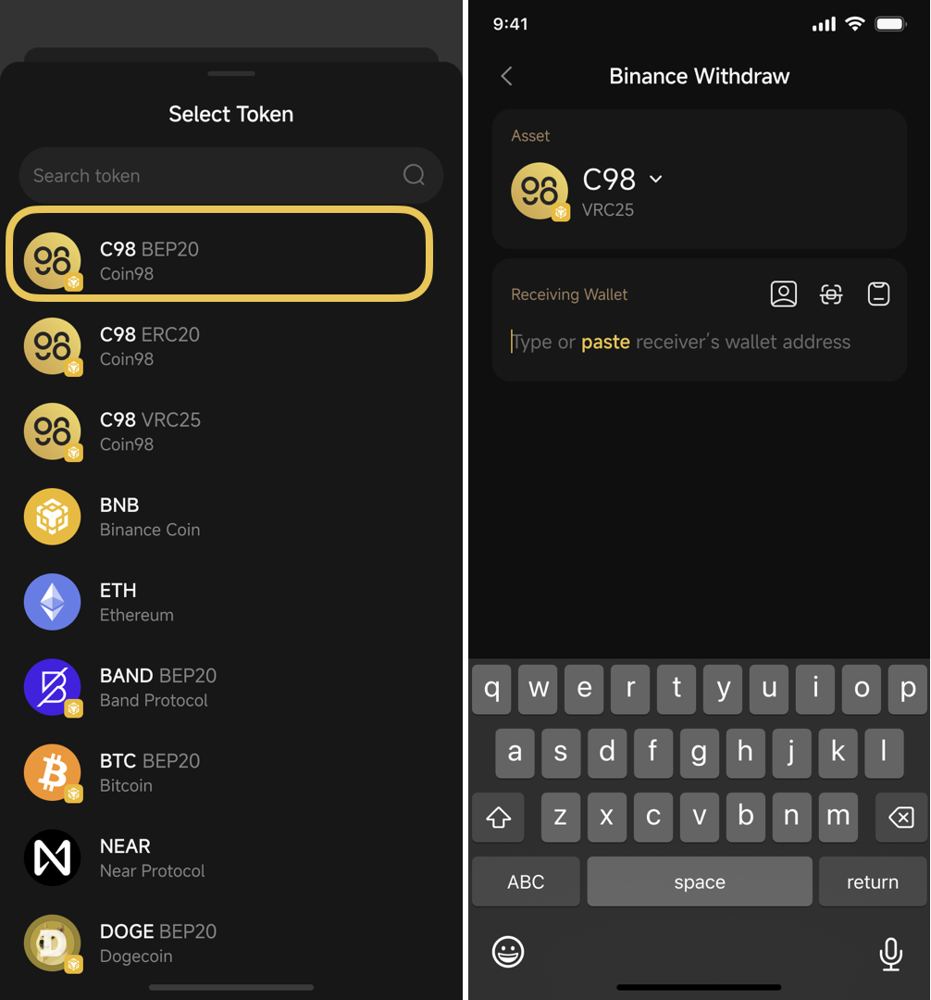
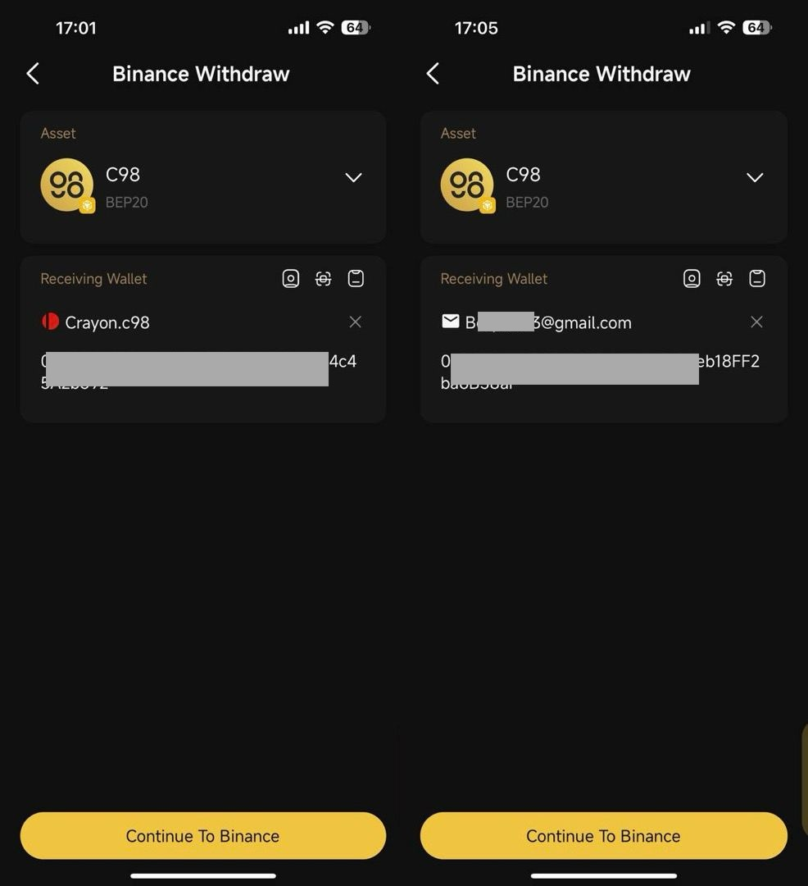
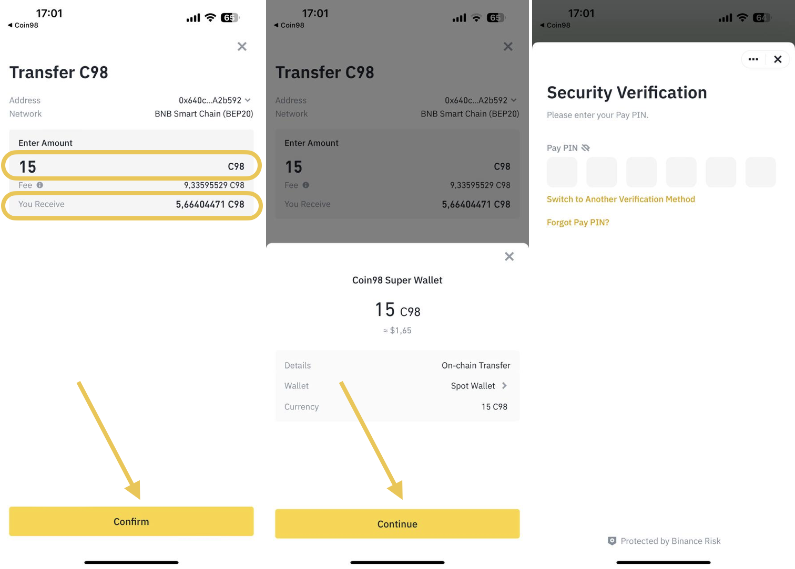

# How to withdraw tokens from Binance to Coin98 Super Wallet

**Step 1**: On the main screen of the App, click the **More** icon → choose Binance Withdraw

<figure><figcaption></figcaption></figure>

**Step 2**: Select the token and its blockchain that you want to receive on Coin98 Super Wallet. We’ll take C98 BEP20 (BNB Smart Chain) as an example.

<figure><figcaption></figcaption></figure>

**Step 3**: Input the receiving wallet address to which you would like to send from Binance&#x20;


Note: You can input the receiving wallet by entering OneID or the email address linked to it&#x20;


Step 4: Click Continue To Binance. Then, you'll be directed to the Binance App platform

<figure><figcaption></figcaption></figure>

**Step 5**: On the Binance App, input the amount of the token you would like to receive, then click **Confirm**


Note: Please be aware that Binance will charge network and platform fees. Make sure to check the final amount you'll receive after charged fees at the "You Receive" section


**Step 6**: Review the transfer information, then click **Continue**.

**Step 7**: Process with Security Verification on your Binance. Then please wait for the transaction to complete on the blockchain, and then check the balance displayed on your Coin98 Super Wallet

<figure><figcaption></figcaption></figure>
