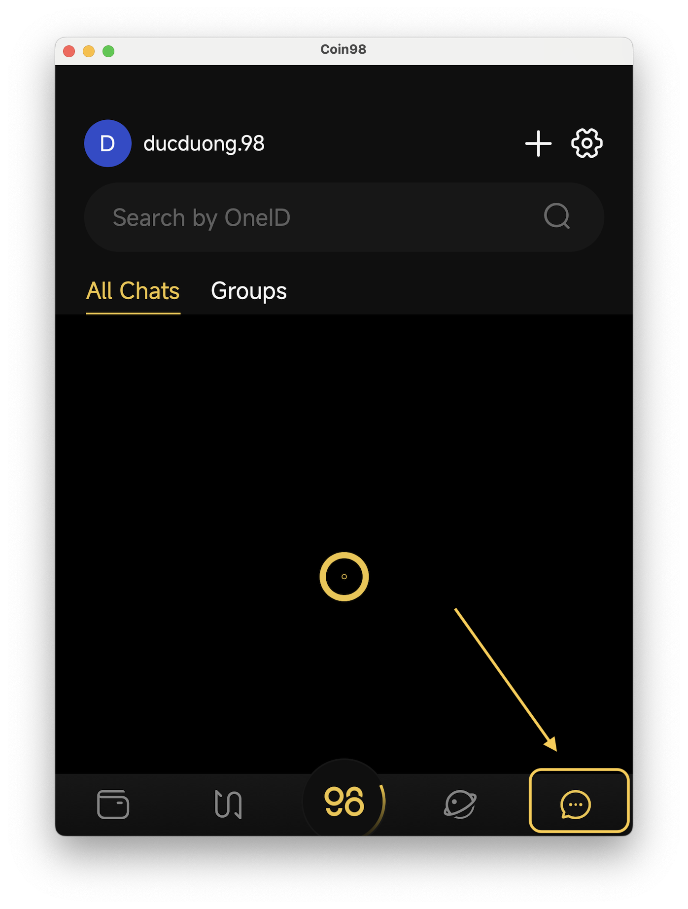
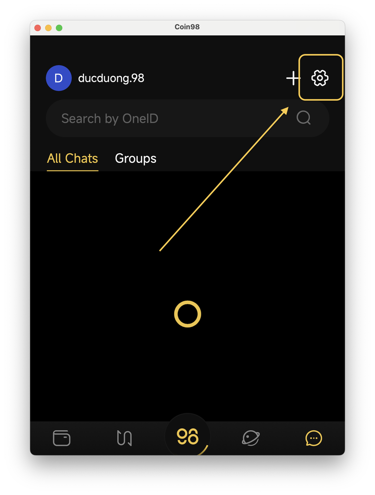

# How to change Messenger settings

**Step 1**: Access Chat Settings section by choosing Coin98 Messenger section, then click on Settings logo on top right of the screen.

<figure><figcaption></figcaption></figure>

 

<figure><figcaption></figcaption></figure>

**Step 2**: Change settings on chat There are options that you can change:

* **Notification**: If enabled, allow notifications from chat to be sent to you
* **Bubble Chat**: If enabled, allow chat appears as bubble in your phone screen.
* If you want to change avatar or log out, click on the 3-dot button on top right of screen to access account settings.

<figure><figcaption></figcaption></figure>

 

<figure><figcaption></figcaption></figure>

**Step 3**: Account settings

* **Change Avatar**: If you want to change avatar, choose **Change Avatar** button. Then you can choose from the following options:
  * **NFT Avatar**: Choose one of your NFT as your avatar.
  * **Take a photo**: Take real life photo. You need to allow Coin98 Super Wallet to access your camera to perform this action.
  * **Choose from Photo Gallery**: Choose from your photo library. You need to allow Coin98 Super Wallet to access your Photo Gallery to perform this action.

<figure><figcaption></figcaption></figure>

* **Logout**: If you want to log out from current account. Choose **Logout** button. A confirmation message will show up, click **OK** to proceed logging out.

<figure><figcaption></figcaption></figure>
