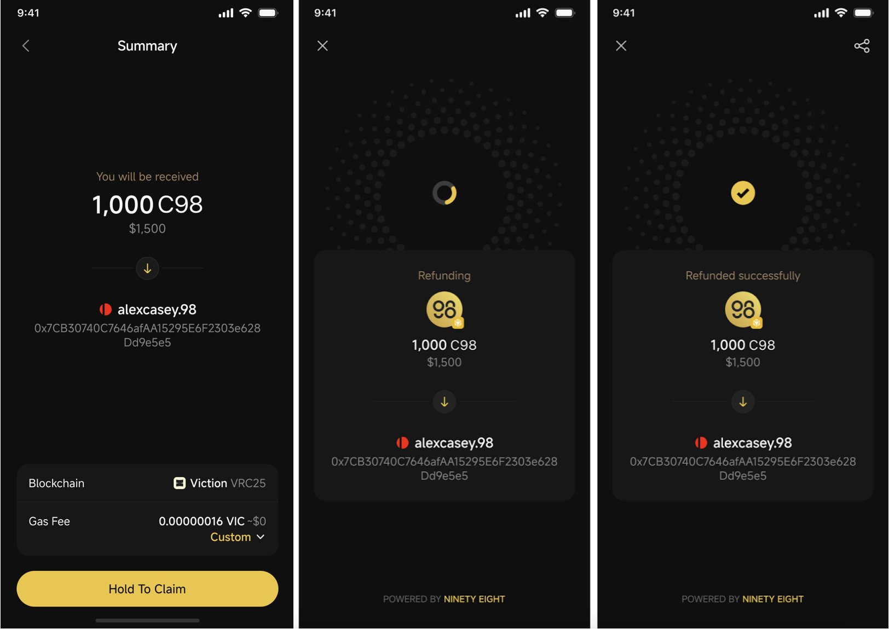

# How to set up a Quiz Gift

With OneID logged in, Coin98 Super Wallet offers a unique feature that allows you to create personalized Gifts for enhancing engagement within the community. These Gifts can be used to connect with other members, celebrate special moments, or simply for random cases.

## How to create a Quiz Gift 


**Requirements:**

* Log in with [OneID](https://docs.oneid.xyz/beginners-guide/mobile/how-to-register-oneid-on-mobile)
* Have at least a wallet with funds in the app
* Prepare a small amount of father token for [Gas Fee](https://docs.coin98.com/products/coin98-super-wallet/faqs/gas-setting)


To set up a Quiz Gift in the Coin98 Super Wallet, follow the steps below:

**Step 1:** On the Home screen, click the **Coin98 Messenger** icon on the bottom right corner and select the community group

**Step 2:** Click on the Menu icon on the left side of the chat box and choose **Quiz Gift**

.png>)

**Step 3:** Choose a type of Quiz Gift

* Single Choice: Participants can select only 1 answer
* Multiple Choice: Participants can select multiple answers
* Short Answer: Participants have to enter the correct answer

.png>)

**Step 4**: Fill in the information

First, you can choose the wallet and currency that you want to use for the Gift.

.png>)

Then, make sure to go through the information below to set up the Lucky Gift:

* **Total Gift Amount**: The amount should be less than the current balance
* **Distribution type**: Equally or Randomly
* **Max. Winners:** The maximum number of winners to receive the Gift
* **Eligible DID**: Select All or specific DIDs
* **Gifting time**: The time indicates how long you will wait for participants to join before gifting
* **Lucky Dip Ratio** (only for Randomly type): Set a ratio to determine the range between the highest and lowest gift amounts compared to the average.
* Tick the box **Remember this setup** if you want to set up the same Gift for the next time.

.png>)

**Step 5**: Click **Setup Question** button

* Single Choice

.png>)

* Multiple Choice

<figure><figcaption></figcaption></figure>

* Short Answer

.png>)

Remember to choose/select/enter the correct answer for the quiz before clicking the **Question Is Ready** button on the bottom of the screen to complete the setup process.

**Step 6**: Review and confirm all the information

Here you can check the Gas Fee and adjust the Custom gas.&#x20;


Note: Make sure to prepare a small amount of father token for the gas fee.


**Step 7**: Press and hold the **Hold To Create Gift** button and wait to complete the process

All done! Now your Quiz Gift is ready and waiting for participants to join.

## How to check the result 

To check the result of the Quiz Gift that you created, follow the steps below:

\
**Step 1**: In the group chat, click on the created Gift box

**Step 2**: Check the list of participants with their status and the remaining time.

## How to claim from the unclaimed gifts 

When the Gift ends but not all rewards have been claimed, you can withdraw the remaining balance back to your wallet, which is linked to your logged in OneID.

**Note:** If the linked wallet is not in the app, you need to [import the wallet](https://docs.coin98.com/products/coin98-super-wallet/switch-to-coin98-wallet/multi-chain-wallet) before withdrawing.

**Step 1**: In the group chat, click on the created Gift box and click on **Claim** button

**Step 2**: Press and hold the **Hold To Claim** button and wait to complete the process

<figure><figcaption></figcaption></figure>
