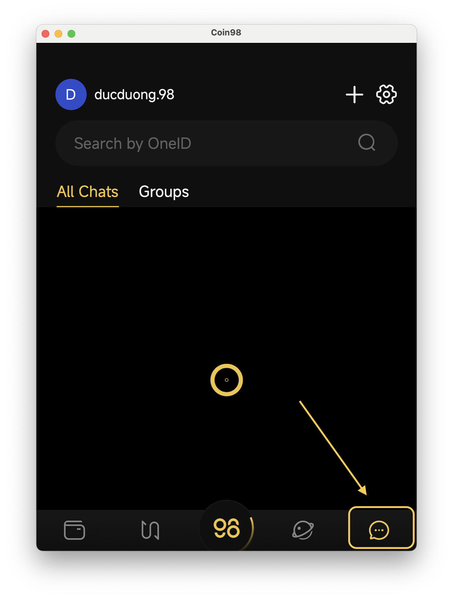
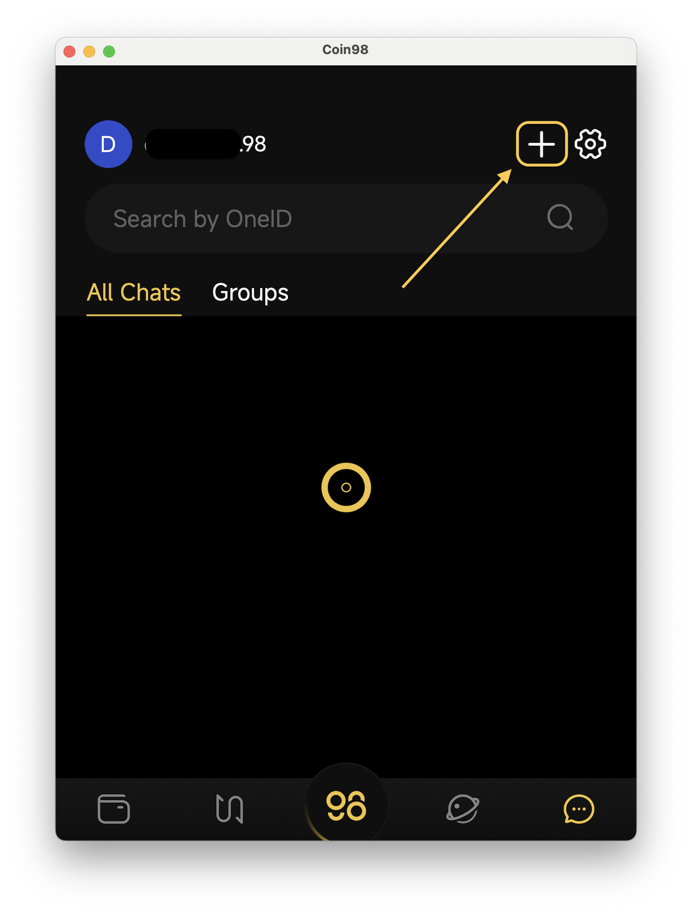
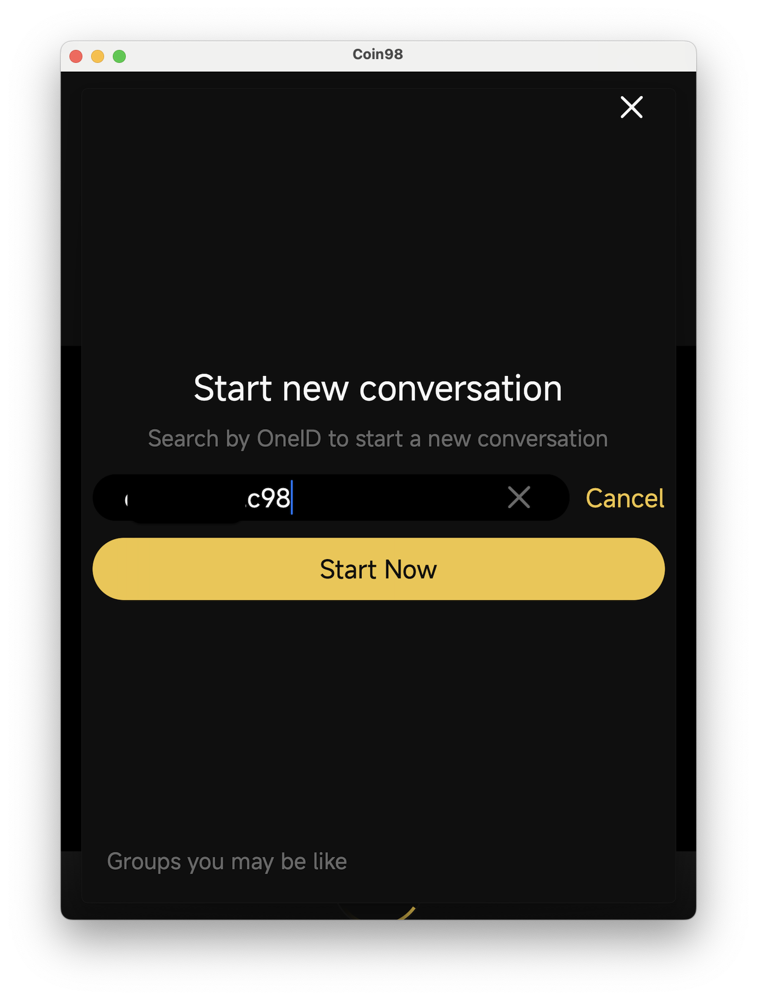

# How to start new conversation in Coin98 Messenger

**Step 1**: Access **Coin98 Messenger** section

<figure><figcaption></figcaption></figure>

**Step 2**: Click on **+** button on top right of the screen

<figure><figcaption></figcaption></figure>

**Step 3**: Type in search bar the OneID account that you want to start chat with. Click **Start Now** to start chatting

<figure><figcaption></figcaption></figure>
