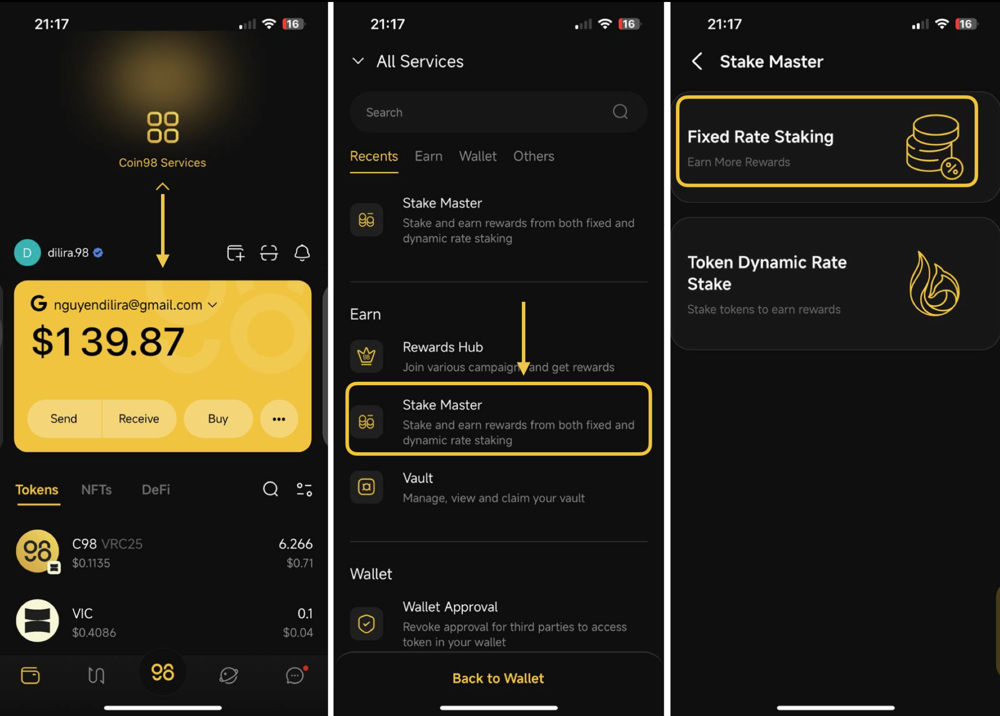
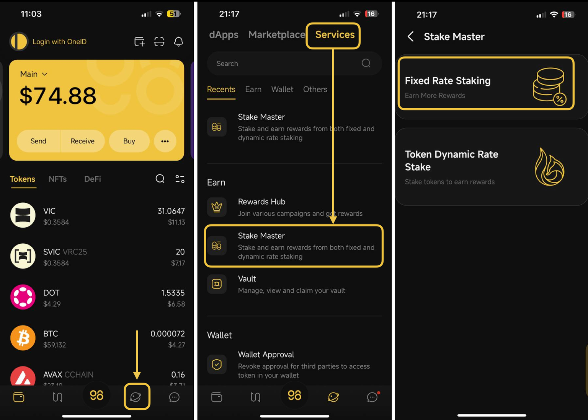
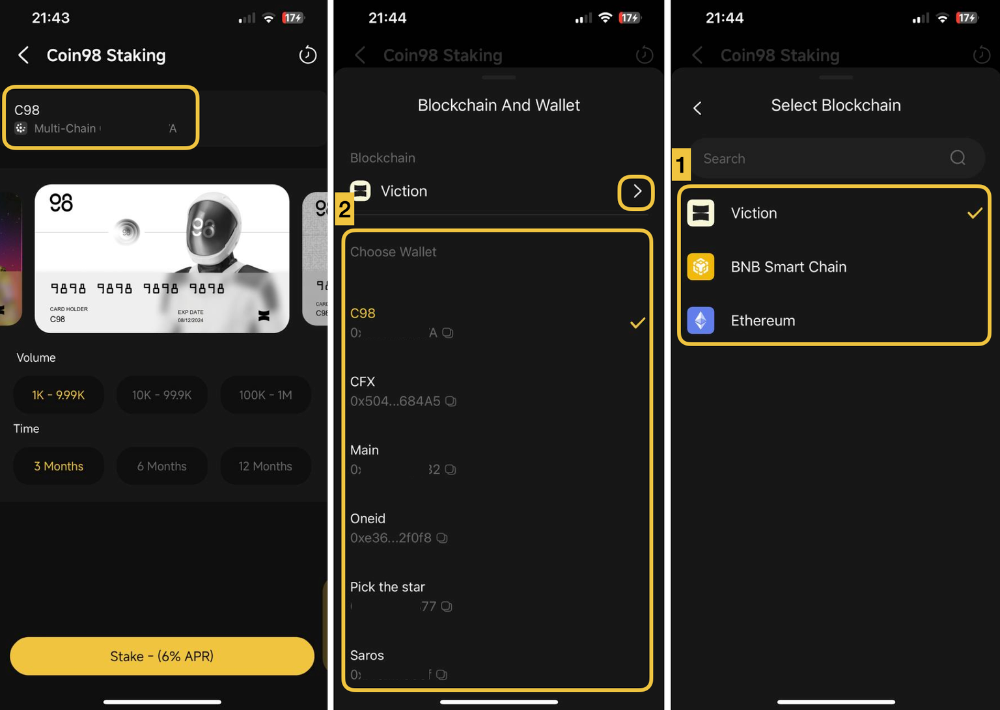
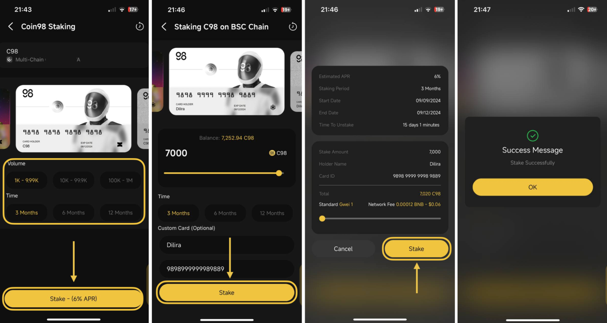
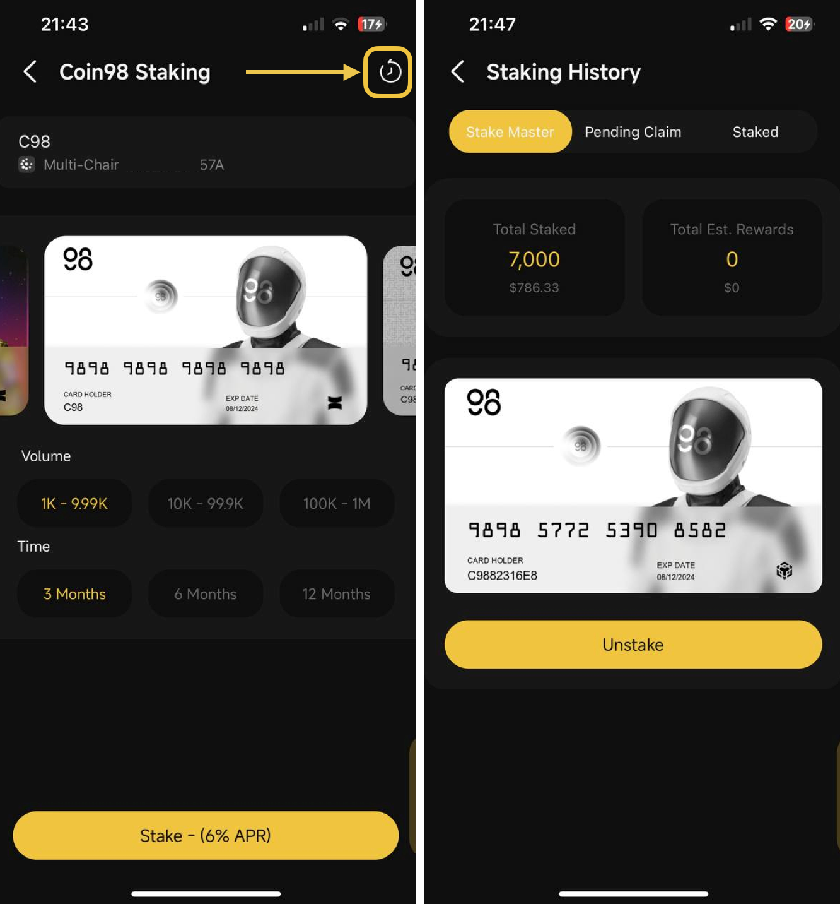

# How to use Coin98 Staking on Coin98 Super Wallet

### How to stake C98 on Coin98 Super Wallet


Coin98 Staking currently supports staking C98 tokens on the following blockchains:

* BNB Smart Chain (BEP20)
* Viction (VRC25)
* Ethereum (ERC20)


**Step 1:** Access **the Stake Master** section, there are two ways to access it:

* **Option 1:** Open Coin98 Super Wallet, then drag the main screen down to show all services => Choose **Stake Master**
* **Option 2:** Open Coin98 Super Wallet, click on the Discover icon at the bottom, and then switch to the S**ervices** tab => Choose **Stake Master**

**Step 2:** Choose **Fixed Rate Staking** to access Coin98 Staking.

<figure><figcaption>
Option 1
</figcaption></figure>

<figure><figcaption>
Option 2
</figcaption></figure>

**Step 3:** Click the wallet name at the top corner of Coin98 Staking's main interface → Select a chain (BNB Smart Chain, Ethereum, or Viction) and the wallet address holding your C98 token.

<figure><figcaption></figcaption></figure>

**Step 4:** Select the package you want to join from Coin98 Staking's main interface, then click **Stake**. For example, we choose to stake 1000 C98 BEP20 (on BNB Smart Chain) with a term of 3 months.

**Step 5:** Fill in the required information:

* The amount of C98 you want to stake
* Staking time (Optional if you want to change)
* Enter the desired card name (Optional)
* Enter the desired card ID (Optional)


Coin98 allows users to personalize their cards by supporting them in customizing names and card IDs (optional). You can change the card name as many times as you want, even after having staked. However, the card ID can be changed only once before confirming staking.

**Fees for Customization**:

* Name card: 10 C98
* ID card: 10 C98


**Step 6:** Review the information and select **Stake** to execute the transaction.

<figure><figcaption></figcaption></figure>


**Note**: You need to prepare native tokens of each blockchain to pay[ the gas fee](https://coin98.net/what-is-gas-fee) for staking:

* Ethereum: ETH for C98 ERC20 staking transactions
* BNB Smart Chain: BNB for C98 BEP20 staking transactions
* Viction: Zero gas fee for C98 VRC25 staking transactions (No need for native VIC token)


Once the transaction is successful, you can check the details in the **Stake History** section by clicking **the clock icon** at the top right corner of Coin98 Staking’s main interface.

The Coin98 Staking NFTs will show up in the NFTs section on your Coin98 Super Wallet.

<figure><figcaption></figcaption></figure>

### **How to unstake C98 on Coin98 Staking** 

**Step 1:** Access **the Stake Master** section, there are two ways to access it:

* **Option 1:** Open Coin98 Super Wallet, then drag the main screen down to show all services => Choose **Stake Master**
* **Option 2:** Open Coin98 Super Wallet, click on the Discover con at the bottom, and then switch to the S**ervices** tab => Choose **Stake Master**

<figure><figcaption>
Option 1
</figcaption></figure>

<figure><figcaption>
Option 2
</figcaption></figure>

**Step 2:** Choose **Fixed Rate Staking** to access Coin98 Staking.

**Step 3**: Select the chain (BEP20, VRC25, or ERC20) and the wallet address used to stake your C98 tokens before.

**Step 5:** Access **Stake History** by clicking **the clock icon** at the top right corner of Coin98 Staking's main interface → Select the staking package you want to unstake.


**Note:**

* You can't unstake within the first 15 days.
* If you unstake before the expiration date, you will only earn a fixed 2.0% floating interest rate, no matter what type of staking plans you choose.


**Step 5:** Review all information → Click **Unstake** to execute the transaction.

<figure><figcaption></figcaption></figure>

### Use Case Example

Anderson is planning to stake **10,200 C98** within a 6 months period. He goes to stake.coin98.com and then selects 8% APR. He enters a detailed page and decides to customize his card.

* Name on Card: Anderson Kozlov
* CardID: 9898 0000 0000 0000

Then, he confirms and stakes successfully 10,200 C98(BEP20) with his summary.

* Staking Period: 6 months
* APR: 7.2%
* Claimed Start: 15 days
* Day start: 01/01/2022
* Day end: 30/06/2022
* Stake Amount: 10,200 C98
* Holder Name: 10 C98
* Card ID: 10 C98

The next day, Anderson is about to unstake his packages, but unfortunately, he is unable to unstake his assets based on staking policy (:rotating\_light:**Only after 15 days to unstake**:rotating\_light:). He must wait until after 15 days to unstake his assets. On the 16th day, he could unstake with a float rate (2%) APR. Now he is going to unstake his package with an APR **2**% (\~**8.3835 C98**). Then, 10,200 C98 and the reward - 8.3838 C98 will be in his wallet.
