# Coin98 Super Wallet V15 UI Overview

Coin98 Super Wallet V15 introduces a sleek new design along with many exciting features, including AI-powered Cypheus Assistant, Coin98 Messenger, Zen Profile & Zen Card management, native NFT Marketplace addition, simplified asset withdrawal from Binance to Coin98, and overall performance improvement to level up user experience.

[**1. Wallet**](coin98-super-wallet-v15-ui-overview.md#id-1.-wallet)

[**2. Swap:**](coin98-super-wallet-v15-ui-overview.md#id-2.-swap) [Swap](coin98-super-wallet-v15-ui-overview.md#id-2.1.-swap) | [Bridge](coin98-super-wallet-v15-ui-overview.md#id-2.2.-bridge)

[**3. Cypheus Assistant**](coin98-super-wallet-v15-ui-overview.md#id-3.-cypheus-ai-assistant)

[**4. Discover**](coin98-super-wallet-v15-ui-overview.md#discover)[**:** ](coin98-super-wallet-v15-ui-overview.md#id-4.-discover)[DApps](coin98-super-wallet-v15-ui-overview.md#id-4.1.-dapps) | [Marketplace](coin98-super-wallet-v15-ui-overview.md#id-4.2.-marketplace) | [Services](coin98-super-wallet-v15-ui-overview.md#id-4.3.-services)

[**5. Coin98 Messenger**](coin98-super-wallet-v15-ui-overview.md#id-5.-coin98-messenger)

<figure>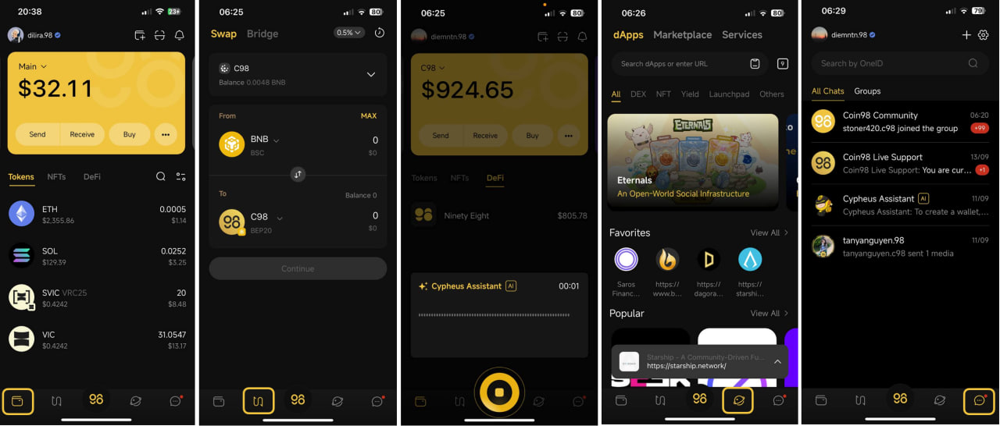<figcaption></figcaption></figure>

## 1. Wallet

### 1.1. Main Screen

<figure><figcaption></figcaption></figure>

\[1] [**Log in with OneID**](https://docs.coin98.com/products/coin98-super-wallet/mobile/oneid/log-in-with-oneid)**.** Learn more about OneID [here](https://docs.oneid.xyz/);

\[2] [**Create a wallet**](https://docs.coin98.com/products/coin98-super-wallet/mobile/getting-started/how-to-create-a-multichain-wallet): users can tap this icon to create a wallet instantly;

\[3] **Super Connect/QR Code**: allows users to connect their wallet to one or multiple DEXs simultaneously via WalletConnect. Users can also scan QR of a receiving address to be navigated directly to the Send screen;

\[4] [**Notification**](https://docs.coin98.com/products/coin98-super-wallet/mobile/getting-started/how-to-manage-notifications-on-coin98-super-wallet#notification-management): allows users to receive notification messages for various on-chain activities performed on their wallets, such as token/NFT transfer, swap, approval, etc., as well as exciting news like campaigns, new feature updates, and important announcements from Coin98;

<figure>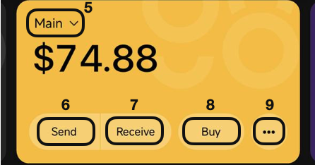<figcaption></figcaption></figure>

\[5] [**Active wallet**](https://docs.coin98.com/products/coin98-super-wallet/mobile/wallet-management/how-to-activate-a-wallet-on-coin98-super-wallet): the assets displayed in the app belong to the currently activated wallet. Users can click on the wallet name to easily switch between wallets;&#x20;

\[6] [**Send**](https://docs.coin98.com/products/coin98-super-wallet/mobile/asset-management/how-to-send-a-token)**:** send coins/tokens;

\[7] [**Receive**](https://docs.coin98.com/products/coin98-super-wallet/mobile/asset-management/how-to-receive-deposit-a-token): receive or deposit coins/tokens to your wallet.&#x20;

\[8] [**Buy**](https://docs.coin98.com/products/coin98-super-wallet/mobile/getting-started/how-to-buy-cryptocurrency-by-fiat): purchase crypto with fiat currency through third-party services like Moonpay, Transak, etc.;&#x20;

\[9] **More:** explore additional features such as:

<figure><figcaption></figcaption></figure>

* \[9a] [**Request Send**](https://docs.coin98.com/products/coin98-super-wallet/mobile/asset-management/how-to-create-a-send-request-for-someone)**:** users can create a token send request and send the link to others. Link recipients can simply click on the link to be directed to the Send screen with all information (address, amount) filled out for them; &#x20;
* \[9b] [**Binance Withdraw**](https://docs.coin98.com/products/coin98-super-wallet/mobile/asset-management/how-to-withdraw-tokens-from-binance-to-coin98-super-wallet): users can directly transfer assets from Binance to Coin98 without going through complicated steps on different platforms. Moreover, users can also input the receiving wallet by entering OneID or the email address linked to it;
* \[9c] **More Wallet Features**: include Notifications Settings, Connection Management, Cloud backup, add/remove Custom Network, Manage Contacts, add/remove Custom Tokens, hide/unhide tokens;
* \[9d] **Managing Wallets:** various actions depending on wallet types. The image is demonstrating actions for Hot Wallets: Rename Wallet, View all wallet addresses, Migrate a hot wallet to Zen Card, Show Seed Phrase and Private Key, Remove Wallet.

**Estimated total assets:** Includes the estimated total value of Tokens, NFTs in the wallet, and assets on DeFi platforms such as staked assets.

<figure>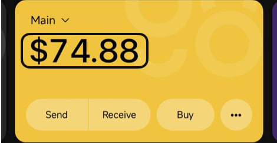<figcaption></figcaption></figure>

**1.1.1. Token**

<figure><figcaption></figcaption></figure>

\[1] **Tokens**: the list of tokens/coins in the currently activated wallet;

\[2] **Search token**: search tokens by token name and symbol;

\[3] **Display filter**: customize the token’s display according to personal preferences:

* Hide small balance tokens,
* Hide non-listed tokens,
* Sort by value: High to low and low to high,
* Sort by name: A-Z and Z-A.

**1.1.2. NFTs:** The list of NFTs in the currently activated wallet.

**1.1.3. DeFi:** Assets currently held on DeFi platforms.

<figure>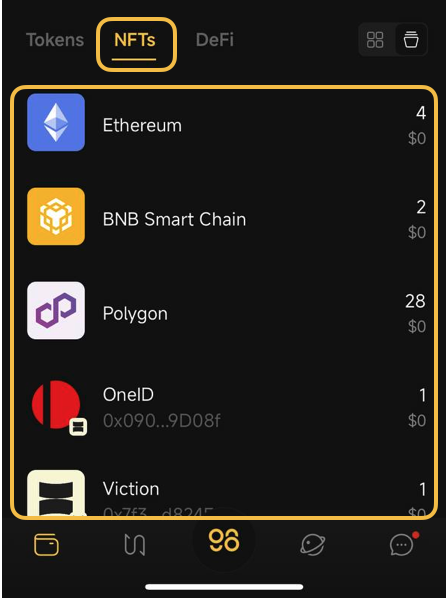<figcaption></figcaption></figure>

 

<figure>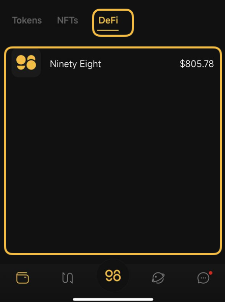<figcaption></figcaption></figure>

### 1.2. Sidebar

Users can perform the following app management actions:

<figure>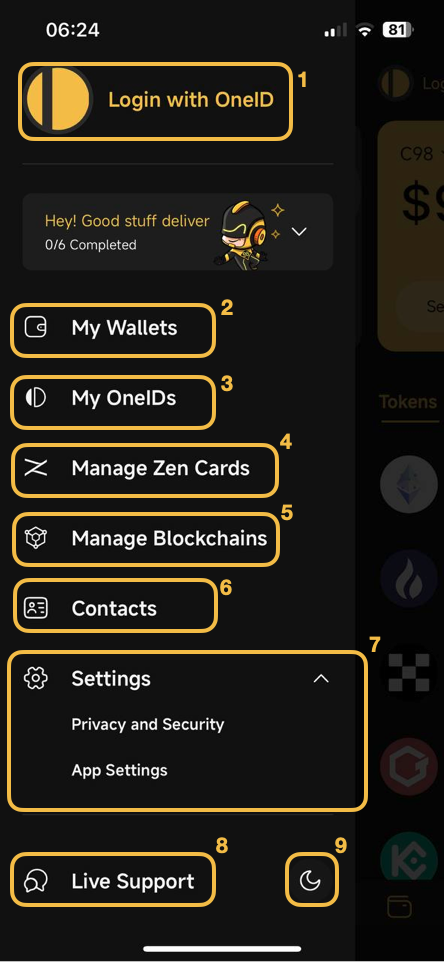<figcaption></figcaption></figure>

\[1] [**Login with OneID**](https://docs.coin98.com/products/coin98-super-wallet/mobile/oneid/log-in-with-oneid): logging OneID into the app allows users to enjoy standout features such as chatting with others through the logged-in ID;

\[2] [**My Wallets**](https://docs.coin98.com/products/coin98-super-wallet/mobile/wallet-management)**:** allows users to manage all their wallets. Users can create new wallets, restore old ones, activate the wallet they want to use, refresh wallets to integrate newly supported blockchains, and perform other actions such as viewing wallet addresses, deleting wallets, renaming wallets, checking wallet recovery keys, and viewing wallet assets on the blockchain;

\[3] [**My OneIDs**](https://docs.coin98.com/products/coin98-super-wallet/mobile/oneid/how-to-use-oneid-on-coin98-super-wallet): allows users to register for new OneIDs, link the ID to a wallet address, and manage IDs.

\[4] **Manage Zen Card:** allows users to manage their Zen Cards. With each Zen Card, users can:

* \[4a] [**Create a Zen Card Wallet**](https://docs.coin98.com/products/coin98-super-wallet/mobile/user-guides/how-to-manage-zen-card): A hybrid wallet, offering security, convenience and cost-effectiveness compared to cold wallets and hot wallets.&#x20;
* \[4b] [**Create a Zen Profile (eCard)**](https://docs.coin98.com/products/coin98-super-wallet/mobile/user-guides/how-to-use-zen-card): Users can share their digital business card with others by tapping their Zen Card on the recipient’s device.&#x20;

<figure>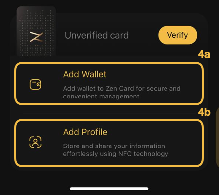<figcaption></figcaption></figure>

\[5] [**Manage Blockchains**](https://docs.coin98.com/products/coin98-super-wallet/mobile/asset-management/how-to-manage-blockchains-on-coin98-super-app)**:** allows users to activate/deactivate chains among 100+ supported blockchains to easily manage their assets;&#x20;

\[6] [**Contacts**](https://docs.coin98.com/products/coin98-super-wallet/mobile/getting-started/how-to-add-a-contact-on-coin98-super-wallet): allows users to create and manage their contact list, making it easier to send assets;&#x20;

\[7] [**Settings**](https://docs.coin98.com/products/coin98-super-wallet/mobile/getting-started/general-settings)**:** set a Pincode, FaceID/Fingerprint, and customize app language, theme, currency, and default screen upon opening the app;&#x20;

\[8] [**Live Support**](https://livechat.coin98.com/): contact our support team for instant help with any issue;

\[9] **App Mode**: sets mode for your app: Dark or Light.

## 2. Swap

### 2.1. [Swap](https://docs.coin98.com/products/coin98-super-wallet/mobile/swap/how-to-trade-natively)

The Swap feature allows users to exchange tokens within the same network.&#x20;

<figure><figcaption></figcaption></figure>

\[1] [**Slippage**](https://docs.coin98.com/products/coin98-super-wallet/mobile/swap/faqs/slippage-tolerance)**:** 0.5% by default. Users can adjust it to fit their needs. Note that changing this parameter may impact the number of tokens received;

\[2] **Trade History:** Displays all transactions that have been completed in the wallet;

\[3] **Swap Transaction Information**:

* \[3a] The wallet containing the tokens,
* \[3b] Token pair,
* \[3c] Blockchain.

### 2.2. [Bridge](https://docs.coin98.com/products/coin98-super-wallet/mobile/spacegate/convert-tokens)

The Bridge feature allows users to convert their tokens from one network to another.&#x20;

<figure><figcaption></figcaption></figure>

\[1] **Blockchains (From-To):** supported blockchains include BNB Smart Chain, Solana, Ethereum, Polygon, and Viction;&#x20;

\[2] **Tokens to be converted**: supported tokens include C98 (Coin98), SAROS (Saros), VIC (Viction), and GSTS (Gunstar Metaverse);&#x20;

\[3] **Bridge History**: Displays all transactions that have been executed in the wallet. Users can check details for each transaction, including:

* \[3a] The wallet executed transactions;
* \[3b] Pending transactions;
* \[3c] Completed transactions: transaction time, tokens and amounts converted, network, withdrawal address, and receiving address.

## 3. [Cypheus Assistant](https://docs.coin98.com/products/coin98-super-wallet/mobile/coin98-messenger/cypheus-assistant-bot)

Providing comprehensive support for all users’ Web3 needs when interacting with Cypheus by typing or voicing questions on a wide range of topics, from Web3 terms to product guides. Additionally, users can generate images based on their descriptions and preferred art styles.&#x20;

<figure>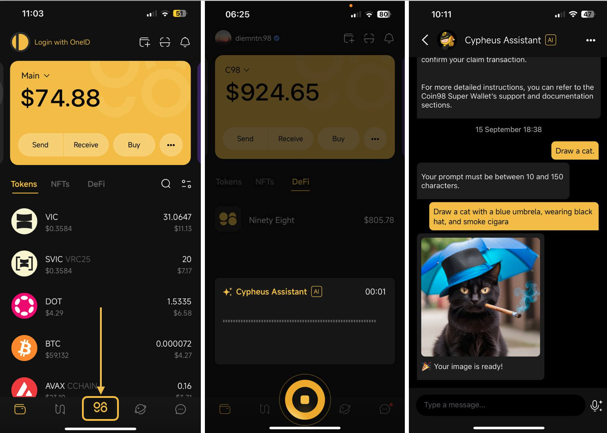<figcaption></figcaption></figure>

## 4. Discover

### 4.1. [dApps](https://docs.coin98.com/products/coin98-super-wallet/mobile/third-party-platforms-and-dapps/dapp-browser)

This feature acts as a gateway for users to interact with external platforms by connecting their wallet on Coin98 Super Wallet to any DEX.

<figure><figcaption></figcaption></figure>

\[1] **Search**: Users can search dApps by entering dApps name or URL;

\[2] **Opened Tabs;**

\[3] **dApps Category**: DEX, NFT Marketplace and trading, Yield, Launchpad, and Others;

\[4] **Favorite dApps**: Users can add frequently used dApps to their favorites list for quicker access;

\[5] **Popular dApps:** Users can explore and easily access popular dApps available on the market here.

### 4.2. Marketplace

This feature provides users with a seamless experience on the Dagora NFT Marketplace, allowing them to purchase NFTs directly on Coin98 Super Wallet without needing to access Dagora or connect their wallet to the marketplace. Check out [how to buy NFT right on Coin98 Super Wallet](https://docs.coin98.com/products/coin98-super-wallet/mobile/third-party-platforms-and-dapps/how-to-buy-nft).

<figure><figcaption></figcaption></figure>

\[1] **Search: s**earch NFTs by NFT or collection name;

\[2] **Top Collections:** collections with the highest trading volumes;

\[3] **Listed NFTs**: NFTs that are currently being listed for sale.

### 4.3. Services

Users can access all services by switching to the Services tab on Discover or swipe down the main screen on the Wallet interface.

<figure>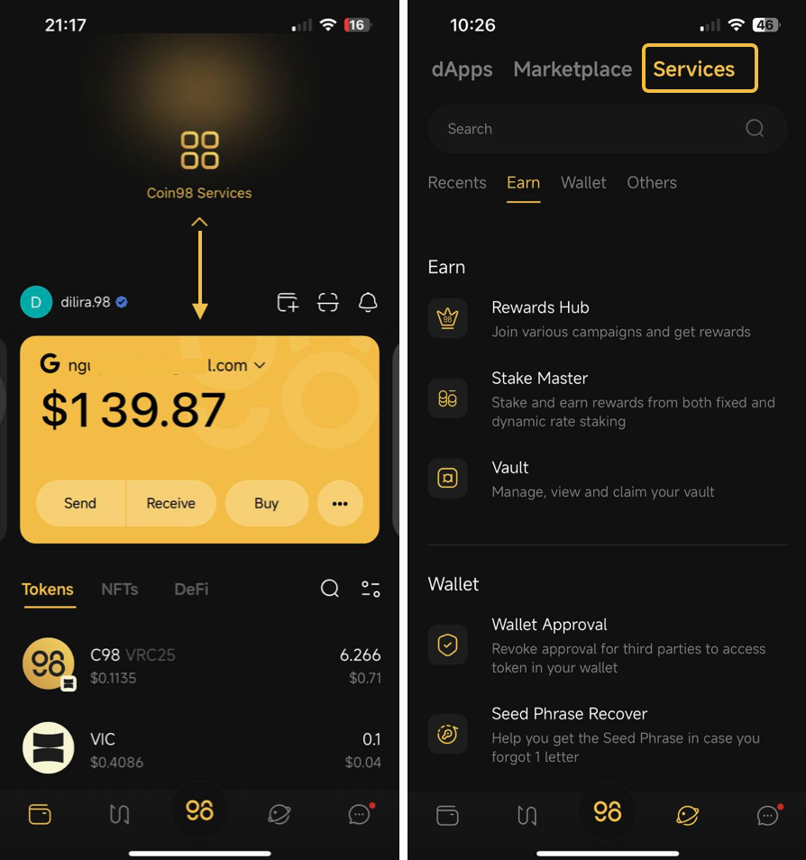<figcaption></figcaption></figure>

This is a summary of the features supported on Coin98 Super Wallet, divided into three categories:

#### 4.3.1. Earn

<figure>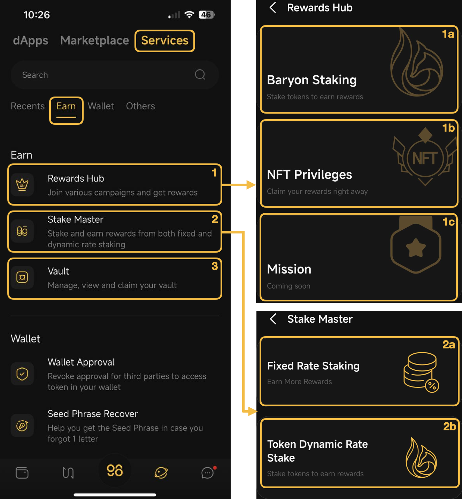<figcaption></figcaption></figure>

\[1] **Rewards Hub:** Users can earn rewards through the following categories:

* \[1a] **Baryon Staking**: Stakes on Baryon Staking to receive rewards,
* \[1b] [**NFT Privileges**](https://docs.coin98.com/products/coin98-super-wallet/mobile/coin98-vault/how-to-claim-nft-on-nft-privileges)**:** Supports claiming NFTs such as Zen Master NFTs,
* \[1c] **Mission**: Complete tasks to earn rewards;

\[2] **Stake Master**

* \[2a] [**Fixed Rate Staking**](https://docs.coin98.com/products/coin98-super-wallet/mobile/coin98-staking/how-to-use-coin98-staking-v15): Allows users to stake C98 tokens on Viction, BNB Smart Chain, and Ethereum with a fixed interest rate for each packet to earn additional rewards,
* \[2b] **Token Dynamic Rate Stake**: Allows users to stake directly on Baryon Staking, where the interest rate fluctuates based on the total volume of tokens staked;

\[3] [**Vault**](https://docs.coin98.com/products/coin98-super-wallet/mobile/coin98-vault/how-to-use-coin98-vault-on-coin98-super-wallet)**:** Allows users to manage, view, and claim tokens/rewards.

#### 4.3.2. Wallet

<figure><figcaption></figcaption></figure>

\[1] [**Wallet Approval**](https://docs.coin98.com/products/coin98-super-wallet/mobile/security-and-privacy/wallet-approval)**:** users can view and revoke approval from third parties (dApps/contracts);

\[2] [**Seed Phrase Recovery**](https://docs.coin98.com/products/coin98-super-wallet/mobile/wallet-management/how-to-use-seed-phrase-recovery-tool)**:** supports users recover their Seed Phrase if they forgot 1 letter;

\[3] **Asset Statistic:** helps users oversee and manage their assets of all imported wallets in Coin98 Super Wallet;

\[4] [**Cloud Backup**](https://docs.coin98.com/products/coin98-super-wallet/mobile/security-and-privacy/use-cloud-sync)**:** allows users to back up their wallets via cloud services (Drive or iCloud). With the option to back up multiple wallets at once, it simplifies restoring multiple wallets simultaneously and makes switching between devices easier;

\[5] [**Multi-Sender**](https://docs.coin98.com/products/coin98-super-wallet/mobile/asset-management/how-to-send-a-token-to-multiple-addresses): allows users to send assets to multiple addresses in a single transaction.

#### 4.3.3. Other Features:

<figure><figcaption></figcaption></figure>

\[1] **Live Support**: contact our support team to get instant help with any issues;

\[2] [**Clear Clipboard**](https://docs.coin98.com/products/coin98-super-wallet/mobile/security-and-privacy/how-to-use-clear-clipboard-on-coin98-super-wallet): allows users to delete copied data within the app, including keys to ensure wallet security;

\[3] **Cryptocurrencies**: help users catch up on the latest updates on the market;

\[4] [**OneID KYC**](https://docs.coin98.com/products/coin98-super-wallet/mobile/oneid/how-to-perform-kyc-verification-on-coin98-super-wallet): supports OneID verification to qualify for participation in Launchpad. Note that this is optional, meaning users can still use the wallet normally without completing KYC;

\[5] [**Faucet**](https://docs.coin98.com/products/coin98-super-wallet/mobile/third-party-platforms-and-dapps/how-to-use-faucet-on-coin98-super-app)**:** allows users to receive free tokens from Testnet or Devnet blockchain;

\[6] [**Token Issuer**](https://docs.coin98.com/products/coin98-super-wallet/mobile/asset-management/how-to-create-a-token-using-token-issuer)**:** a tool that helps users create/issue their own token;

\[7] [**NFT Issuer**](https://docs.coin98.com/products/coin98-super-wallet/mobile/nfts/how-to-create-a-nft-using-nft-issuer): a tool that helps users create/issue their own NFT.

## 5. Coin98 Messenger

Coin98 Messenger allows users to easily connect and chat through OneID.

<figure>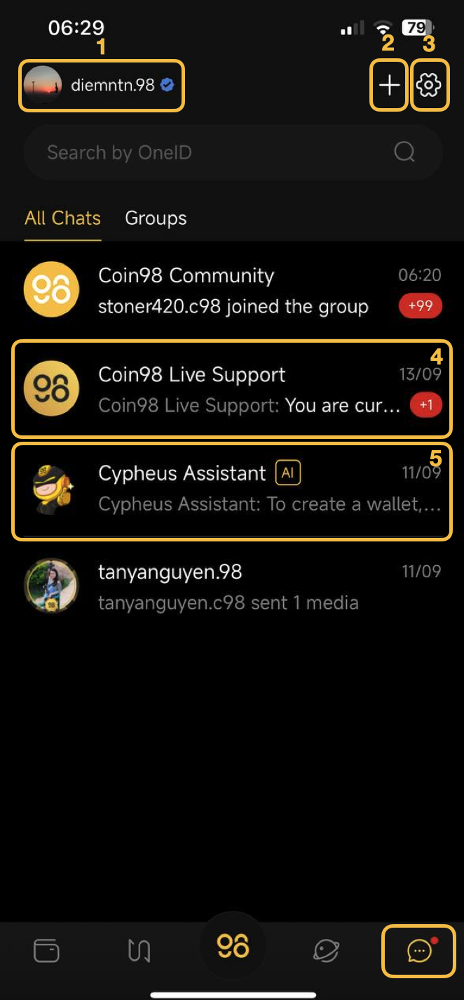<figcaption></figcaption></figure>

\[1] **User's logged-in OneID;**

\[2] [**Start a new conversation**](https://docs.coin98.com/products/coin98-super-wallet/mobile/coin98-chat/how-to-start-new-conversation): users can search by OneID to start a new conversation;

\[3] [**Messenger Settings:**](https://docs.coin98.com/products/coin98-super-wallet/mobile/coin98-chat/how-to-change-chat-settings) Users can check OneID’s information including KYC status & linked wallet and set up to receive notifications or enable Bubble Chat.&#x20;

\[4] **Coin98 Live Support:** chat with our support team to get instant help with any issue;

\[5] **Chat with Cypheus AI**: users can interact with Cypheus AI for assistance and information;

<figure>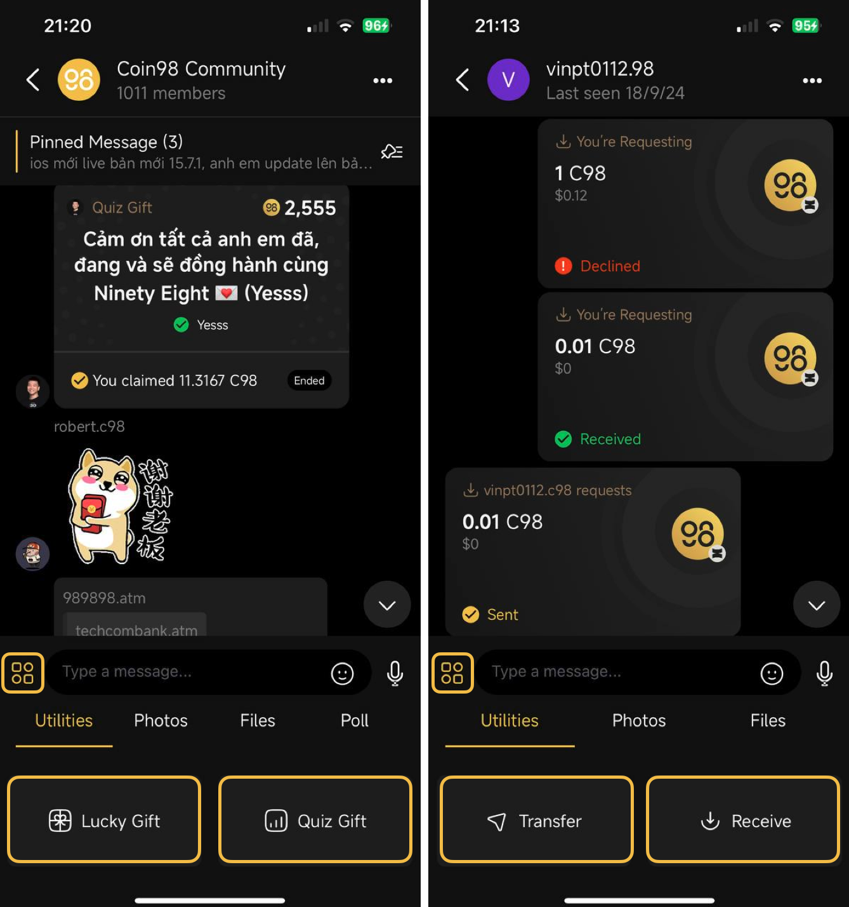<figcaption></figcaption></figure>

**Community Chat:** users can interact with communities and create gifts to send to the community through features like [Set up](https://docs.coin98.com/products/coin98-super-wallet/mobile/coin98-chat/how-to-set-up-a-lucky-gift) I [Claim](https://docs.coin98.com/products/coin98-super-wallet/mobile/coin98-chat/how-to-receive-a-lucky-gift) Lucky Gift or [Set up](https://docs.coin98.com/products/coin98-super-wallet/mobile/coin98-chat/how-to-set-up-a-quiz-gift) I [Claim](https://docs.coin98.com/products/coin98-super-wallet/mobile/coin98-chat/how-to-receive-a-quiz-gift) Quiz Gift;

**1:1 Chat:** Users can chat directly with each other through their OneID and additionally can send or receive tokens and request others to send assets directly within the chat;

* **Transfer:** transfer tokens to the OneID that you're chatting with,
* **Receive:** create a Send Request for the OneID that you're chatting with;
