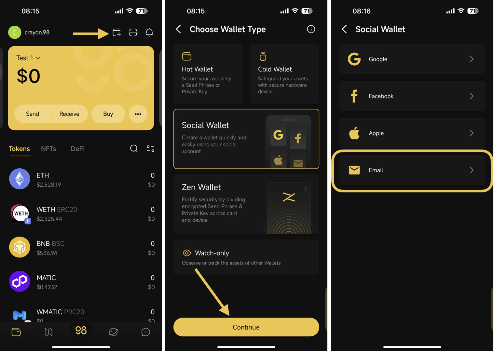
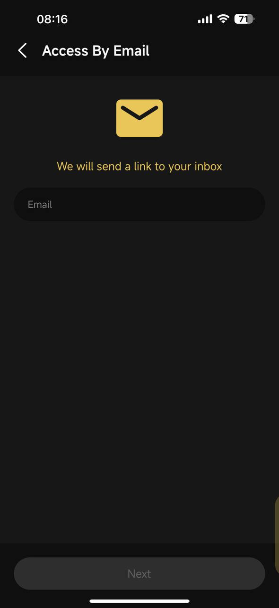
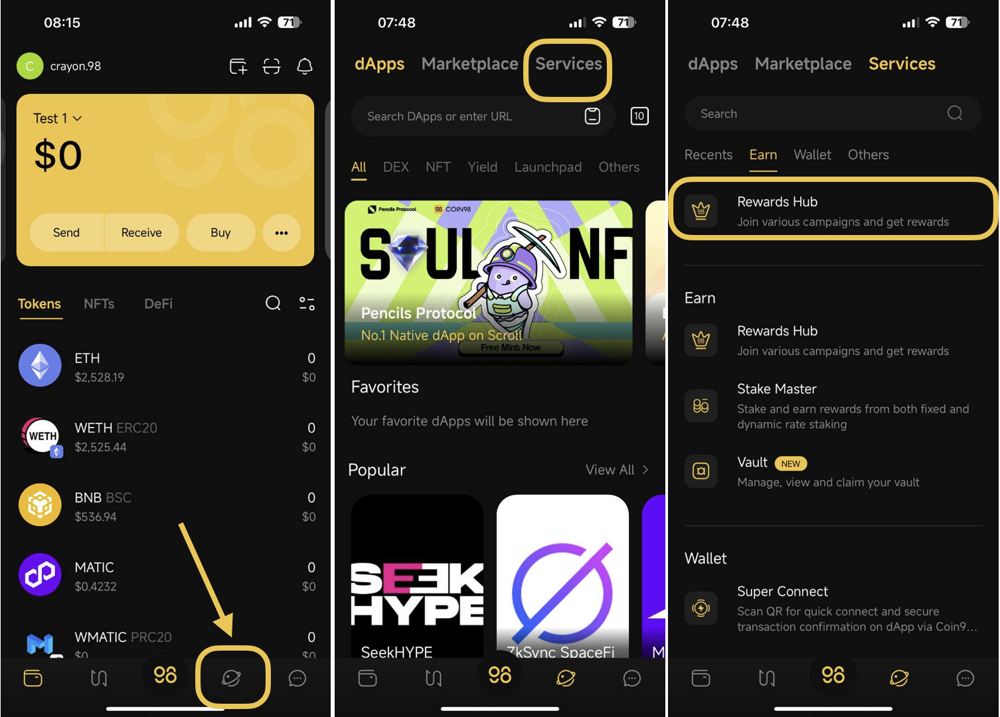
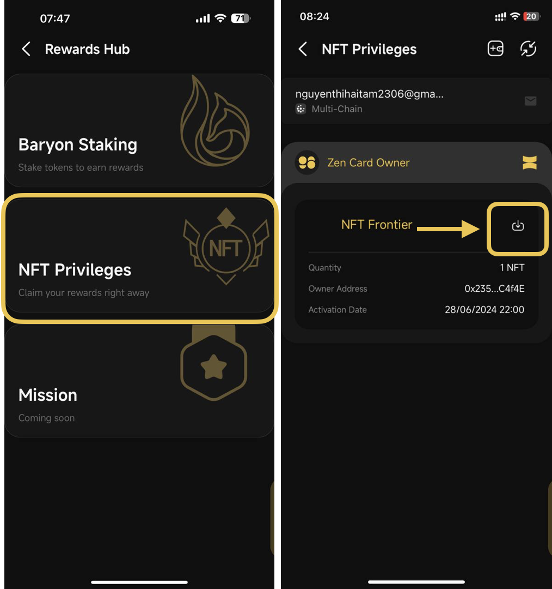

# How to claim NFT on NFT Privileges

The NFTs will be distributed to the Social Wallet linked to the email address eligible for receiving rewards. Please ensure that you already logged into the Social Wallet with the correct email address before try claiming NFTs on NFT Privileges

### **Stage 1**: Log in to the Social Wallet on Coin98 Super Wallet

**Step 1**: On the main screen, choose **Add Wallet** icon at the top right corner

<figure><figcaption></figcaption></figure>

**Step 2**: Choose **Social Wallet** → Then choose **Continue** → then choose **Email**&#x20;

**Step 3**: Input the email address eligible for NFT rewards. Then, access the mailbox of your email address to verify the sign-in wallet on Coin98 Super Wallet&#x20;

<figure><figcaption></figcaption></figure>

### Stage 2: Claim NFTs on NFT Privileges

**Step 1**: Choose **Discover** icon → Select **Services**&#x20;

**Step 2**: Choose **Earn** category → choose **Rewards Hub**

<figure><figcaption></figcaption></figure>

**Step 3**: Select **NFT Privileges** → Choose the social wallet eligible for receiving NFT rewards

**Step 4**: Click the **Claim** icon next to the NFT you’d like to claim&#x20;


**Note:**&#x20;

* NFTs rewards in NFT Privileges are on Viction Network
* Claiming NFTs through NFT Privileges comes with no gas fees or claiming fees


<figure><figcaption></figcaption></figure>
