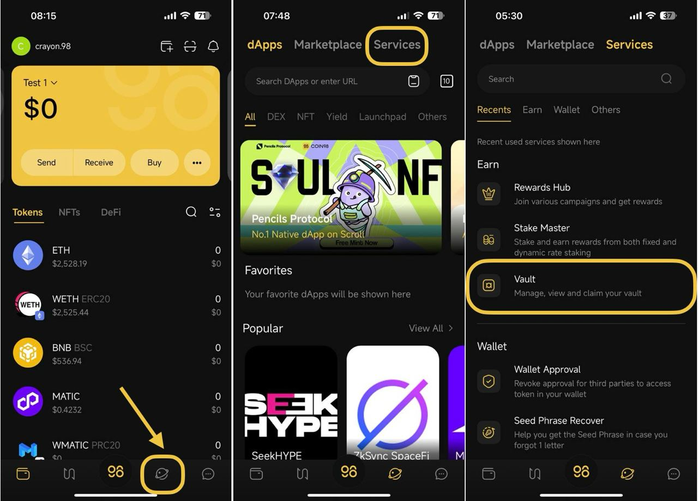
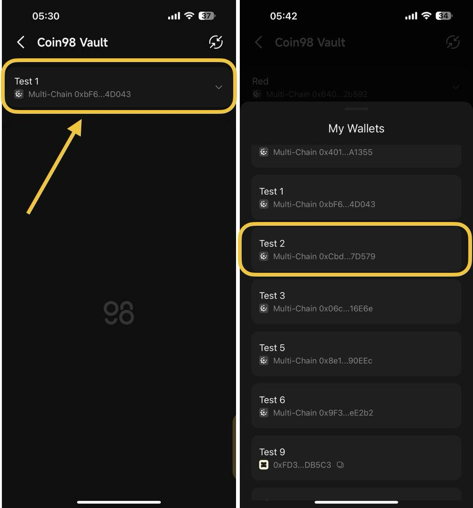
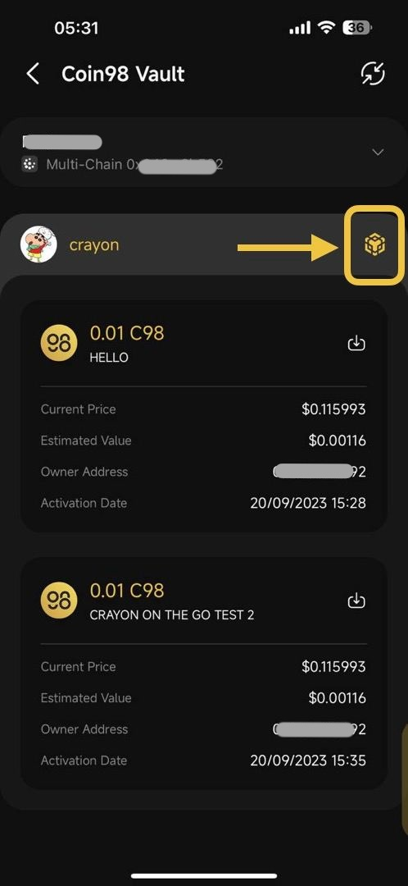
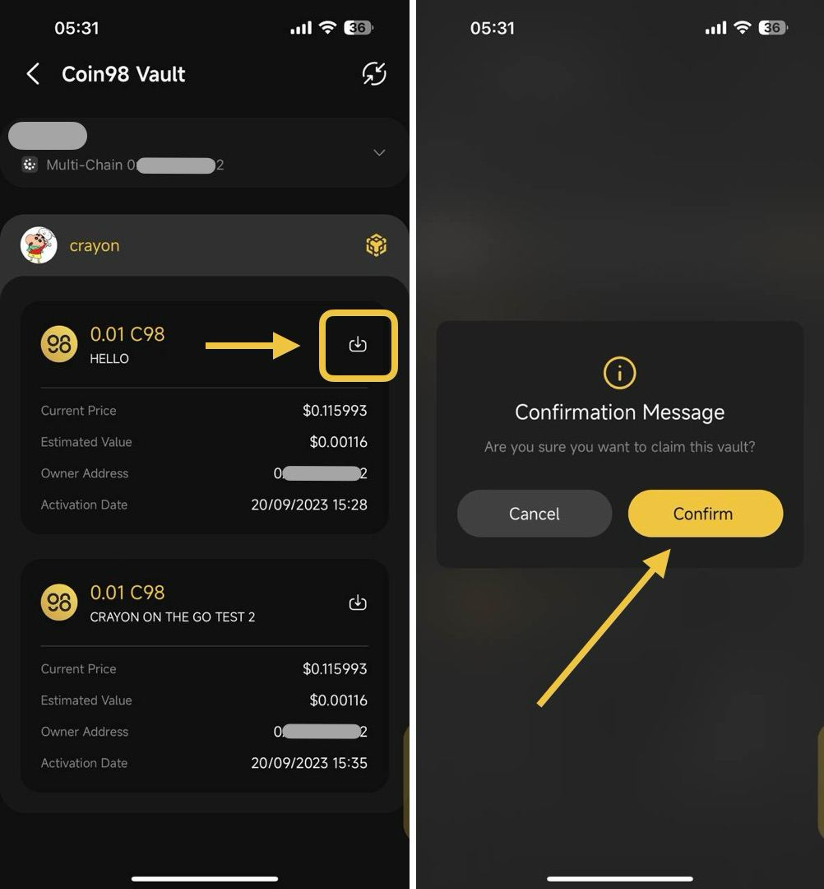

# How to use Coin98 Vault on Coin98 Super Wallet

## Prepare before claiming tokens on Coin98 Vault

#### Install Coin98 Super Wallet

Coin98 Vault is one of the powerful tools on the **Earn** section in the Coin98 Super Wallet. Therefore, if you are eligible to receive the tokens through Coin98 Vault, you have to install the Coin98 Super Wallet to claim.


[how-to-download-install.md](../getting-started/how-to-download-install.md)


#### Restore your receiving addresses 

Ignore this step if your receiving addresses are already active in the Manage Wallets section of the Coin98 Super Wallet.


[Broken link](broken-reference)


#### Prepare father tokens for gas fees 

Coin98 Vault uses the father tokens of each blockchain as **gas fees,** so you have to have these tokens as fees to claim the tokens.


[What is Gas Fee?](https://www.google.com/url?q=https://coin98.net/what-is-gas-fee\&sa=D\&source=editors\&ust=1679192748536237\&usg=AOvVaw16jms6hsBILqZBOBdQPThB)


You can buy the native coins on CEXs like Binance, Kucoin,… and withdraw to the corresponding wallets to experience the product. For layer 2 blockchains like Boba, please convert ETH to the corresponding network to use it.


**Note**: You have to transfer the father token/coin to the corresponding wallet on the correct blockchain.


## How to claim tokens on Coin98 Vault

**Step 1:** On the home screen of the Coin98 Super Wallet, select **Discover** icon**.**

**Step 2**: Select **Services** category -> choose **Vault**

<figure><figcaption></figcaption></figure>

**Step 2:** Select the wallet address that received the token vaults.&#x20;


* In case the single-chain wallet address that received token vaults, is included in the Multichain wallet on Coin98 Super Wallet, please choose that corresponding Multichain wallet.&#x20;
* Once you choose the Multichain wallet, all token vaults belonging to each single-chain wallet address of that Multichain wallet (such as Ethereum, BSC, Solana, etc.) will show up


<figure><figcaption></figcaption></figure>

**Step 3:** All Token Vaults belonging to the wallet chosen in Step 2 will show up.


Kindly take a look at the chain icon displayed in each Vault to know the blockchain of that Vault. For example, the Vault in the photo below is on BNB Smart Chain, so it's necessary to prepare a little BNB balance to pay the gas fee for claiming transactions on this Vault.


<figure><figcaption></figcaption></figure>

**Step 4**: Then, kindly check the activation date of each Vault so that you can claim it. If it is the right time, select the **Claim icon** and then confirm your claim transaction.

<figure><figcaption></figcaption></figure>
