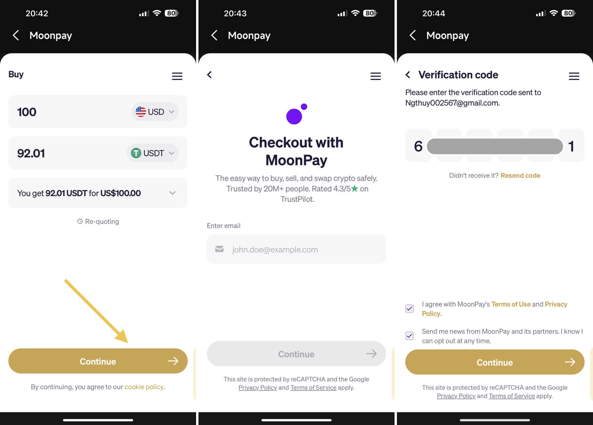
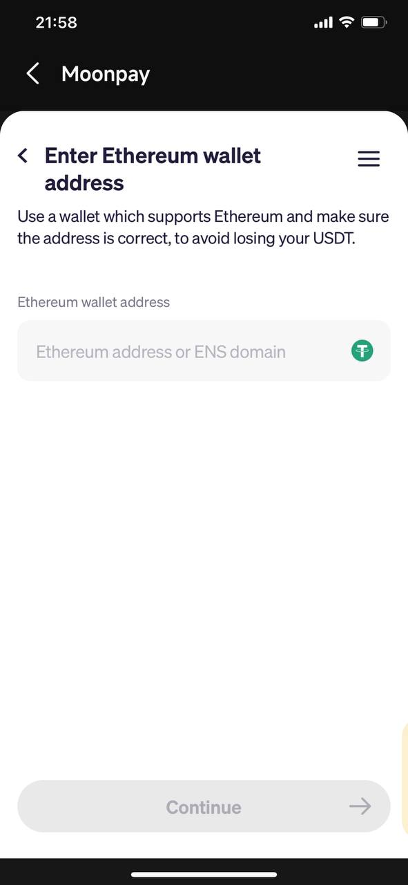

# How to buy cryptocurrency by fiat on Coin98 Super Wallet?

Coin98 Super Wallet has integrated MoonPay, Transak, Stably, Unlimit Crypto, Banxa, and Mercuryo. We enable users to participate in DeFi without using CEXs to buy crypto. Users can jump straight ahead to the crypto realm, in one single-app: [Coin98 Super Wallet](https://coin98.net/coin98-wallet-is-now-coin98-super-app)!

## **Preparation**

Before we begin, you need to install or update your Coin98 Super Wallet to the latest version:

* iOS: [https://ios.coin98.com](https://ios.coin98.com/)
* Android: [https://android.coin98.com](https://android.coin98.com/)

We recommend you create a Multi-Chain wallet on Coin98 Super Wallet to easily manage and get access to all single-blockchain wallets with only one single Seed Phrase.

## How to buy cryptocurrency by fiat on Coin98 Super Wallet

**Step 1**: On the main screen of the App, select Buy.


Note: Copy your wallet address to receive coins/tokens before selecting the Buy Crypto section. Bear in mind that you must copy the right address of the blockchain on which you would like to receive tokens.


**Step 2**: Select the coin/ token and fill in the amount for the purchase → the system will automatically compare price quotes from providers and find the best rate for users. All you need to do is double-check and click **Confirm!**

<figure><figcaption></figcaption></figure>

**Step 3**: Click **Confirm** to confirm the coin/token and the amount you want to buy\
In this article, we'll use MoonPay as an example to provide a step-by-step guide on how to buy cryptocurrency with fiat currency using Coin98 Super Wallet

<figure><figcaption></figcaption></figure>

**Step 4**: On the next screen of MoonPay’s interface, please confirm the coin/token and the amount you want to buy by clicking **Continue**

**Step 5**: Fill in your email to get code verification, and enter the Code sent to your email to confirm → click **Continue**

<figure><figcaption></figcaption></figure>

**Step 6**: Enter your basic details

<figure><figcaption></figcaption></figure>

**Step 7**: The new user for the first time making the transaction with Moonpay will be prompted to enter your information and upload personal documents → so please fill in your personal information. Then, Moonpay will verify your identity and approve your transaction, provided you have met the requirements.


* You can refer to more details[ here](https://support.moonpay.com/hc/en-gb/articles/360011931677-How-can-I-verify-my-identity).
* It takes you a short time to review your KYC, please wait for its status before going to the next steps.


<figure><figcaption></figcaption></figure>

**Step 8**: Enter your wallet address, which will receive coins after purchase. The wallet address depends on the blockchain of the coin you will buy, so please read the information carefully to avoid loss.&#x20;

<figure><figcaption></figcaption></figure>

**Step 9**: Select your payment method, then click **Continue**

<figure><figcaption></figcaption></figure>


**Notes:**

* Each service provider has the minimum and maximum purchase amount for each transaction.
* The transaction cost will depend on the coin/token and the corresponding network.

