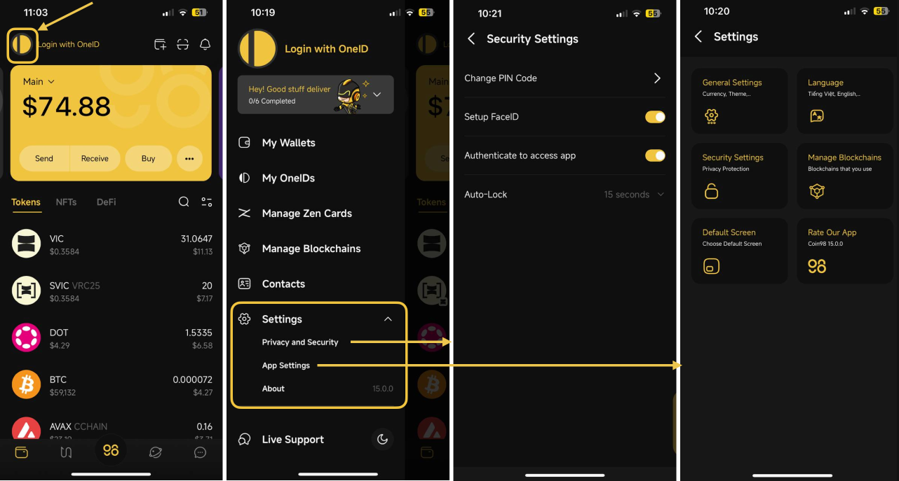
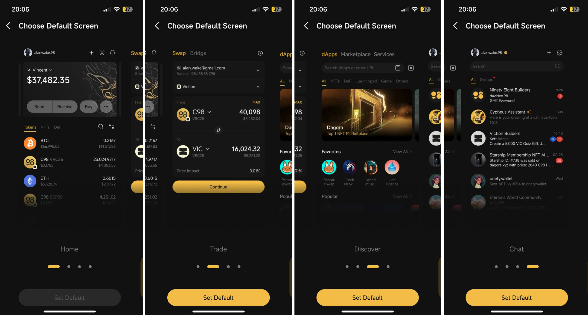
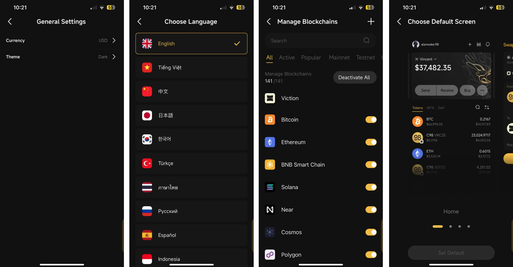

# General Settings

### Where can I find Settings? 

You can access the Settings section by following the steps:

**Step 1:** Click on the OneID icon at the top left corner of the main screen

**Step 2:** Click **Settings**

<figure><figcaption></figcaption></figure>

### What can I do in the Settings? 

**Set up your Privacy and Security Settings**

1. Set up and change PIN Code: aA 6-digits
2. Set up FaceID/Fingerprint: Only displayed on the devices that support these features
3. Authenticate to access the app: Only displayed after FaceID or Fingerprint is set up. The app will automatically require FaceID or Fingerprint upon opening and making any transactions
4. Auto-lock: This setting allows the app to lock after a specified period of inactivity. If the Never option is selected, FaceID or Fingerprint authentication will only be required upon reopening the app after closing it.


* You can remove these settings whenever you want, simply by turning off Set up FaceID or Fingerprint. The app will then require your PIN Code for verification before restoring your settings to the original condition.
* We strongly recommend keeping the PIN Code & Biometrics Authentication activated to prevent risks of losing your assets.


**App Settings**

1. General Settings: Set your app's currency and mode (dark/light mode)
2. Change your language: The supported languages in Coin98 Super Wallet include Vietnamese, English, Chinese, Japanese, Korean, Turkish, Thai, Spanish, Indonesian, Greek, Portuguese, French, and coming soon.
3. Set up your Privacy and Security Settings
4. Manage blockchains: Activate chains according to your preference
5. Set the Default Screen you wish to access each time you open the app. This gives you a chance to have a fresh experience as well as flexibility in adjusting your favorite interface on the app.
6. Rate the app

<figure><figcaption>
Default Screen
</figcaption></figure>

<figure><figcaption>
App Settings
</figcaption></figure>
