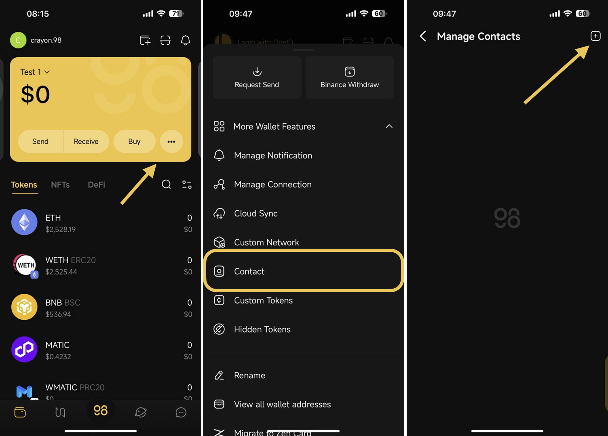
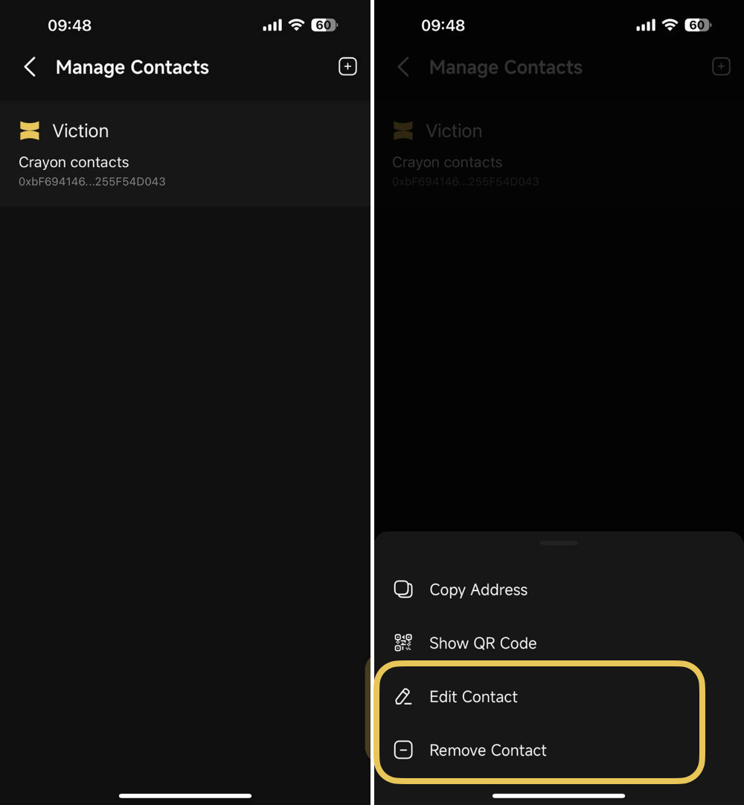

# How to add a contact on Coin98 Super Wallet

Adding a contact feature on Coin98 Super Wallet makes sending tokens or NFTs to frequently used addresses easier by allowing you to quickly get the wallet address.

**Step 1**: Choose the **More** icon on the main screen of the Wallet section → Select **More Wallet Features** so all options can show up&#x20;

**Step 2**: Select Contact

**Step 3**: Choose the **+** icon at the top right corner of the screen

<figure><figcaption></figcaption></figure>

**Step 4**: Fill in the required information:

1. Contact Name
2. Wallet Address
3. Blockchain&#x20;

**Step 5**: Click **Create** → back to **Manage Contacts** interface to recheck

<figure><figcaption></figcaption></figure>

You can edit or remove existing contacts by selecting the contact you would like to modify.

<figure><figcaption></figcaption></figure>
