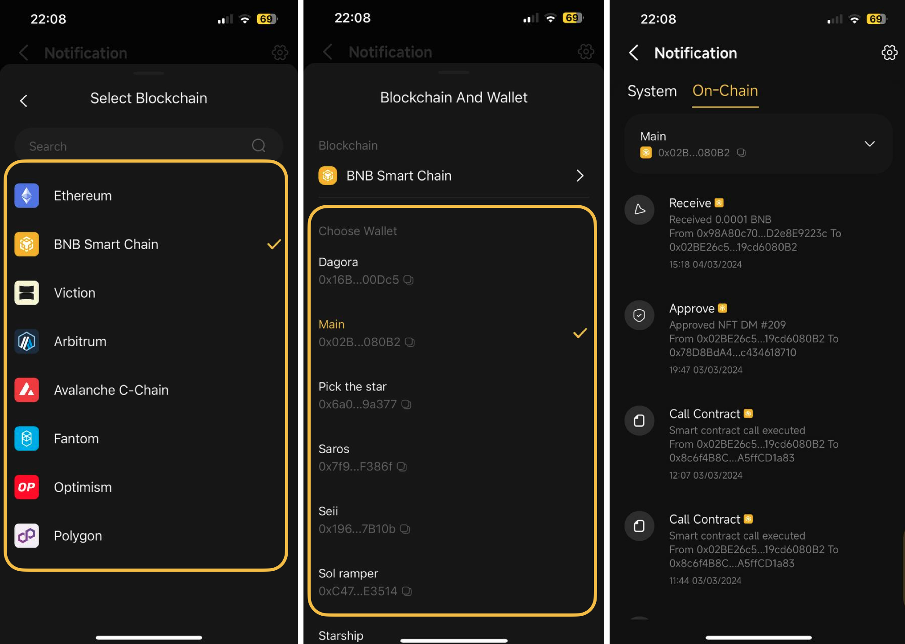

# How to manage notifications on Coin98 Super Wallet

### Notification Management

The push notification feature is now available on Coin98 Super Wallet, allowing users to receive notification messages for various on-chain activities performed on their wallets, such as token/NFT transfer, swap, approval, etc., as well as exciting news like campaigns, new feature updates, and important announcements from Coin98.

Currently, this feature is available for Ethereum, BNB Smart Chain, Viction, Arbitrum, Avalanche C-Chain, Fantom, Optimism, and Polygon. More chains are coming soon.

### How to manage In-App Notifications

**Step 1**: Open the app and click the notification icon at the top right corner.

**Step 2:** Click the settings icon at the top right corner.

**Step 3**: Toggle the button next to the wallets for which you wish to receive notifications.

<figure><figcaption></figcaption></figure>

#### How to check on-chain activities

**Step 1:** Open the app and click the notification icon at the top right corner.

**Step 2**: Select the "On-chain" tab and click the ">" icon next to the current wallet

<figure><figcaption></figcaption></figure>

**Step 3:** Select the blockchain and the wallet you want to check transactions.

<figure><figcaption></figcaption></figure>

You can also check official announcements on the System tab of the Notification section.

<figure><figcaption></figcaption></figure>
