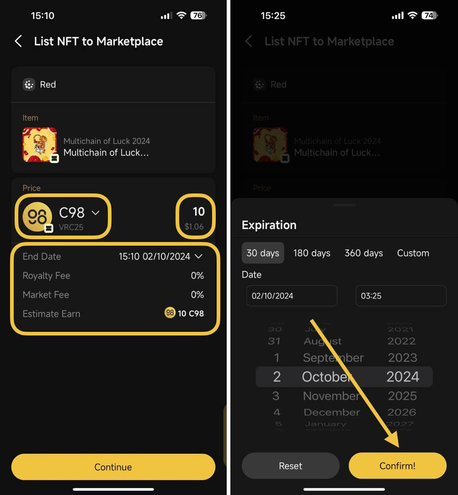
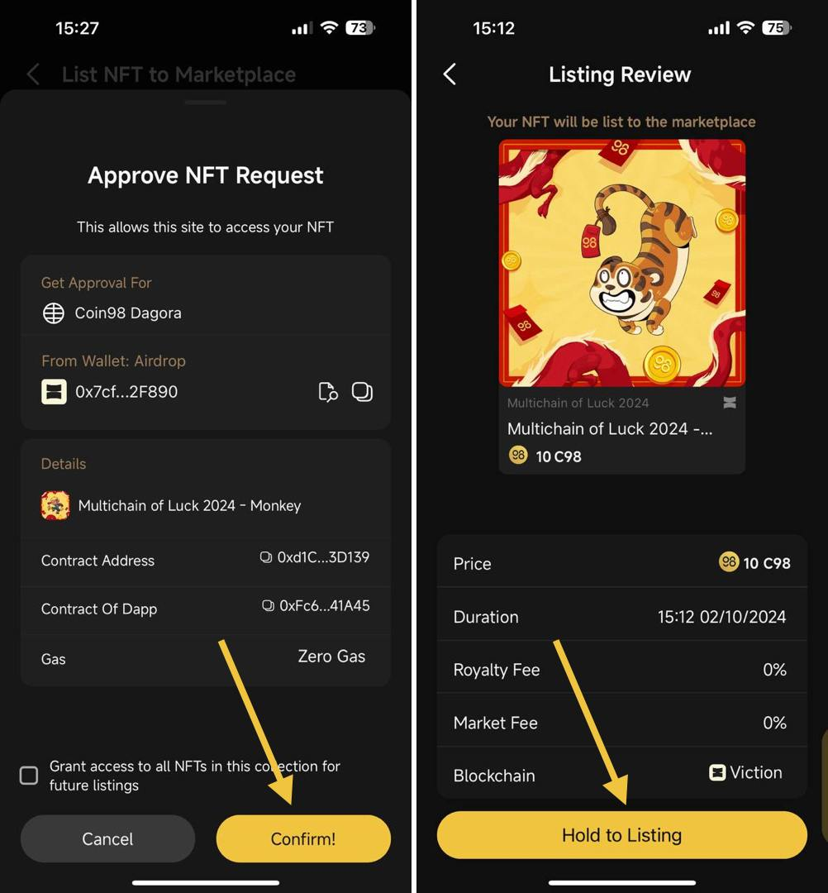
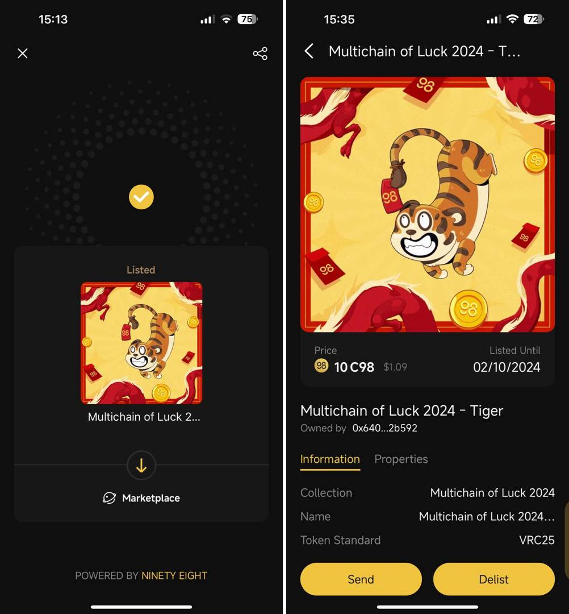
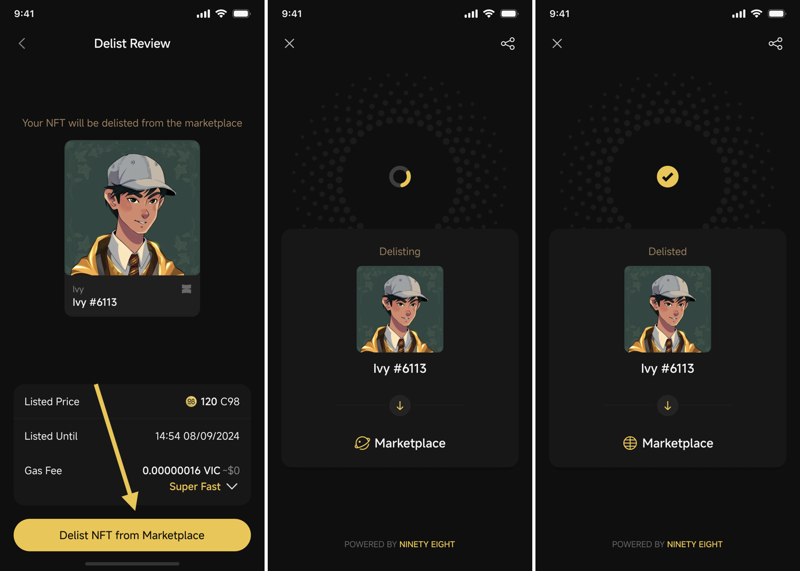

# How to list an NFT on Marketplace

From V15 of the Coin98 Super Wallet, you can list NFTs directly on Coin98 Dagora NFT Marketplace

## How to list an NFT on Marketplace

**Step 1**: On the main screen of the App, access the NFTs section, then choose the NFT you would like to list

**Step 2**: On the detail screen of the NFT, click List

<figure><figcaption></figcaption></figure>

**Step 3**: Select the following required NFT:

1. Choose the type of currency for payment
2. Choose a default duration for the listing or set a custom duration, then click Confirm! to switch to a custom duration
3. Enter the NFT price

→ then click **Continue**

<figure><figcaption></figcaption></figure>


Note: Be aware of the Royalty Fee and Market Fee, as these will be deducted from the NFT price paid by the buyer.


**Step 4**: You'll then be asked to confirm your listing by signing the transactions:

4.1. Please first approve your NFT for listing on NFT Marketplace

4.2. On the Listing Review screen, you can adjust the gas fee based on your preference (Standard, Fast, or Slow to process the transaction speed) and review the Listing information. To continue, click and hold Hold to Listing


_The gas fee varies depending on the blockchain of the NFT project. You need to ensure you have the appropriate father tokens to cover gas fees in your listing transactions (e.g., ETH for transactions on the Ethereum network, BEP20 for BNB Smart Chain, etc.)._ \
_For more details on gas fees, see this article:https://coin98.net/what-is-gas-fee_


<figure><figcaption></figcaption></figure>

**Step 5**: Please wait for the transaction to be completed, then recheck&#x20;

<figure><figcaption></figcaption></figure>

## How to delist an NFT on Marketplace

**Step 1**: On the NFT section, click on the listed NFT

**Step 2**: On the detail screen of the listed NFT, choose **Delist**&#x20;

<figure><figcaption></figcaption></figure>

**Step 3**: On the next interface, you can review all listing information of your NFT, then choose Continue\
**Step 4:**  On the Delist Review screen, you can adjust the gas fee based on your preference (Standard, Fast, or Slow to process the transaction speed) and review the Delisting information. Then, click and hold Hold to Delist button to execute the transaction.


_The gas fee varies depending on the blockchain of the NFT project. You need to ensure you have the appropriate father tokens to cover gas fees in your delisting transactions (e.g., ETH for transactions on the Ethereum network, BEP20 for BNB Smart Chain, etc.)._ \
_For more details on gas fees, see this article:https://coin98.net/what-is-gas-fee_


<figure><figcaption></figcaption></figure>
