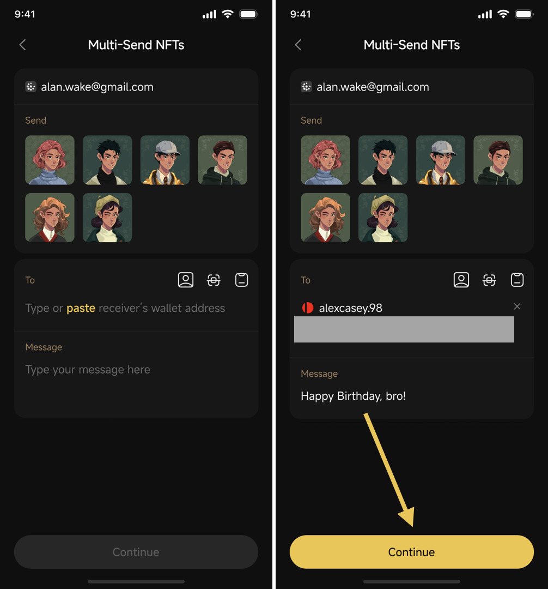

# How to send multiple NFTs to an address

**Step 1:** On the mainscreen of the App, choose the **NFTs** section

<figure><figcaption></figcaption></figure>

**Step 2**: On the NFTs section, choose multiple NFTs you would like to send

2.1. Start to select the multiple NFTs for one transfer transaction

2.2. Tick the NFTs you would like to send&#x20;


Note: You can only maximum 10 NFTs in one transaction&#x20;


Step 3: Click **Multi-Send**

<figure><figcaption></figcaption></figure>

**Step 4**: At the NFT sending interface, enter some of the required information below then click Continue:

* The recipient NFT’s wallet address of (you can use quick action buttons such as QR code scanning, and contacts)
* Enter the message for the recipient (if any)

<figure><figcaption></figcaption></figure>

**Step 5**: On the Summary screen, you can adjust the gas fee based on your preference (standard, fast, or slow to process the transaction speed) and review the transfer details. Then, click **Hold To Send** to execute the transaction. Then, please wait until the transfer transaction is completed.

<figure><figcaption></figcaption></figure>


**Note**:

* The gas fee varies depending on the blockchain of the NFT project. You need to ensure you have the appropriate father tokens to cover gas fees in your transfer transactions (e.g., ETH for Ethereum network transfers, SOL for Solana network, etc.). For a clearer understanding of gas fees on different blockchains, refer to this article:  [https://coin98.net/what-is-gas-fee](https://coin98.net/what-is-gas-fee)
* By default, on Coin98 Super Wallet, the gas fee is set at the Standard rate that offers the most optimized speed at a reasonable cost.

