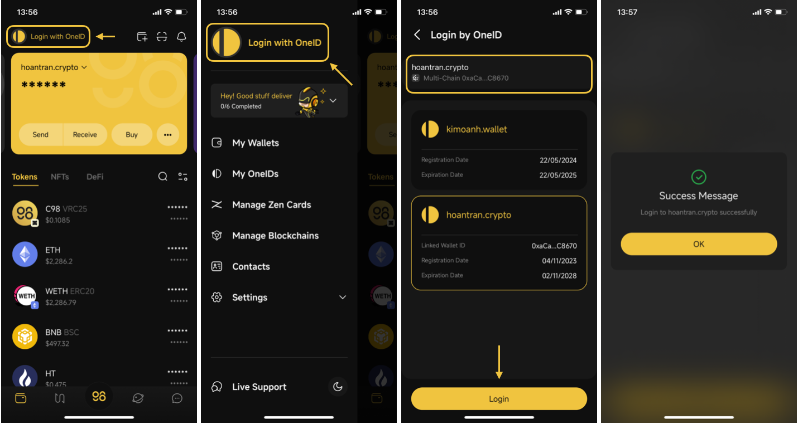
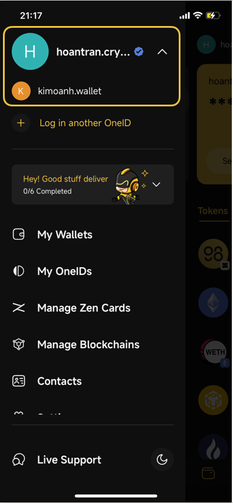
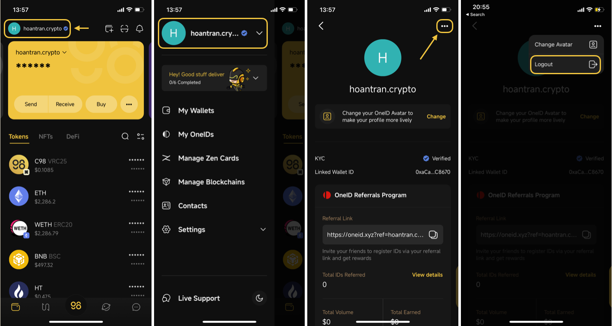
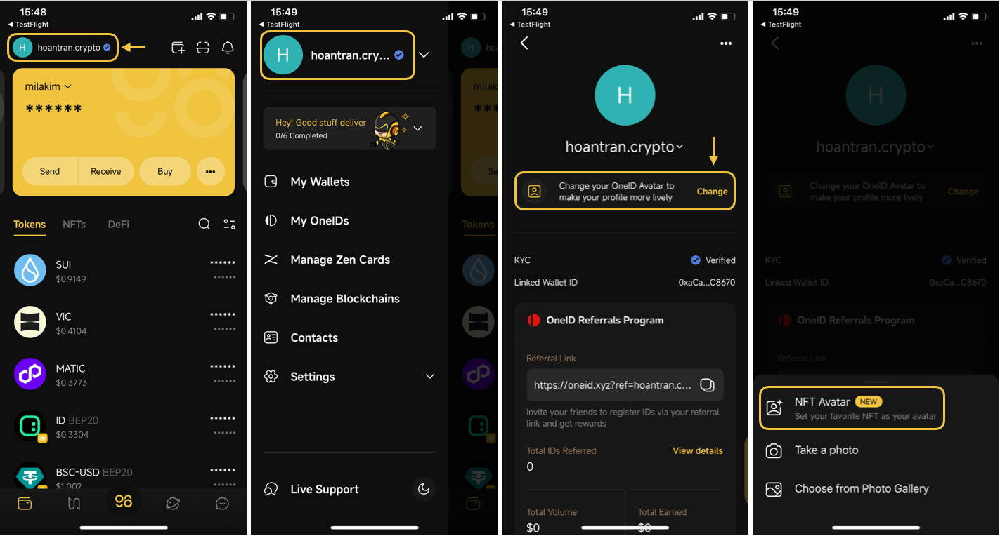
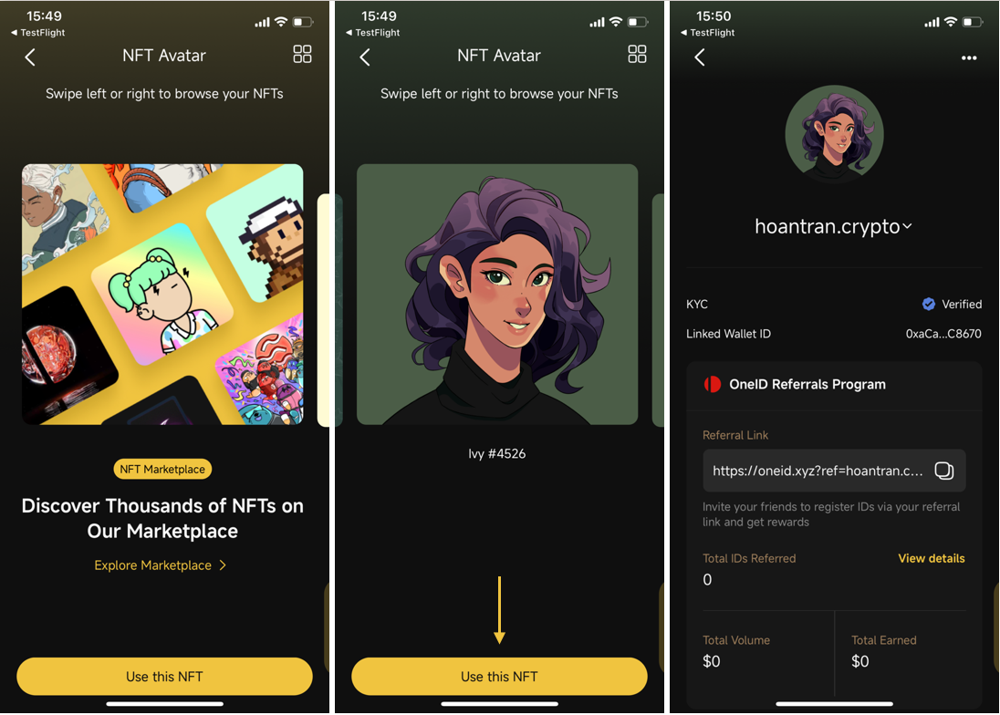
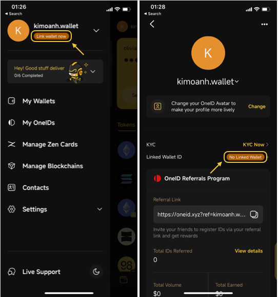
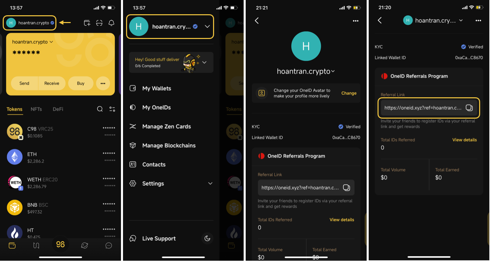

# OneID Profile: Log in with OneID, Manage Profile and Get OneID Referral Link

1. [How to log in OneID on Coin98 Super Wallet](log-in-with-oneid.md#nsov4ytcaqr6)&#x20;
2. [How to log out OneID on Coin98 Super Wallet](log-in-with-oneid.md#g2u4zz6jlyr3)
3. [How to set profile avatar](log-in-with-oneid.md#id-3v9u2lxjuki0)
4. [Link OneID to a wallet](log-in-with-oneid.md#mll4v4lpkm9v)
5.  [How to get OneID referral link](log-in-with-oneid.md#id-559w2kexz2sm)

## 1. How to log in OneID on Coin98 Super Wallet 

**Step 1:** To login OneID, click on **Login with OneID** on the top left corner of the wallet screen to open the side menu

Click on **Login with OneID**

**Step 2:** Choose the ID you want to login with, then hit **Login**

If the current active wallet does not contain any OneID, you can switch wallets by clicking on the wallet name and address box on the top.

If you do not own any OneID, follow the instructions here \<Link to “How to register OneID”>

After logging in successfully, you will see a pop-up Success Message and be directed to the wallet screen with your logged-in OneID on top.


If you have KYC-ed your OneID, you will see the “verified” mark next to the ID.



You can log in with multiple OneID and easily switch between IDs in just a few seconds.


\*Note: You can log in a OneID on only one device at a time. If you log in with that OneID on a second devide, it will automatically be logged out from the first device.&#x20;

## 2. How to log out OneID on Coin98 Super Wallet 

To log out, simply access the side menu like described above, click on the logged in OneID to access the profile.

On the profile interface, click on the 3 dots icon on the top right corner and choose Log out.

## 3. How to set profile avatar: 

**Step 1:** Access the OneID Profile, and click Change in the section right under the OneID name.

**Step 2:** Choose to use NFT, Take a photo, or Choose an image from your Photo Library. This will demonstrate the steps with NFT avatar.

**Step 3:** Choose the one you want to set among your NFTs as your avatar or explore and buy a new one on Dagora NFT Marketplace. Click **Use this NFT** and you're all set!

## 4. Link OneID to a wallet: 

If the logged-in OneID has not been linked with a wallet address, you can quickly link your wallet by clicking on “Link wallet now" under your OneID on the side menu, or clicking on “No Linked Wallet" on your OneID Profile, choosing the wallet you want to link, and done.

## 5. How to get OneID referral link: 

You can use your referral link to invite friends to register for OneID. More information about OneID referral program here \<Link>

On Coin98 Super App, access your OneID profile, find the Referral Links section, and click the Copy icon to copy.

