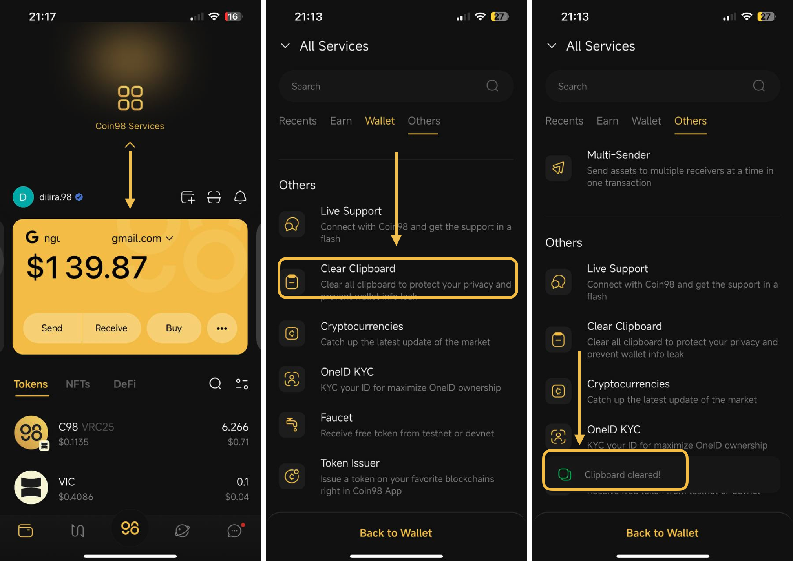
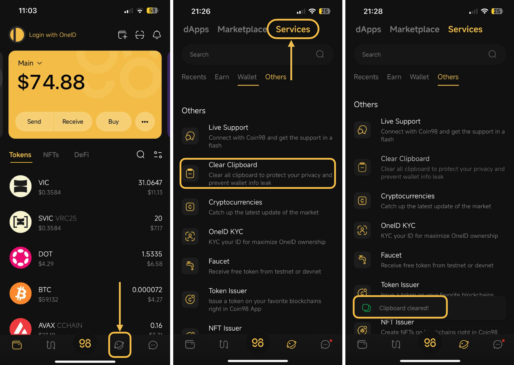

# How to use Clear Clipboard on Coin98 Super Wallet?

## What is the Clipboard? 

A clipboard is a short-term storage area embedded within your mobile device's operating system, permitting you to copy and paste text, images, or other data such as wallet addresses, and Seed Phrase/private keys between various applications. When you copy data, it gets temporarily stored in the clipboard, allowing you to paste it elsewhere. The attackers behind the Copy-Paste Heist illicitly access the data directly from your clipboard.

Coin98 Super Wallet now includes a new **Clear Clipboard** feature designed to prevent other applications from reading your clipboard.

## How to use Clear Clipboard on Coin98 Super Wallet? 

* The 1st way:&#x20;

Open Coin98 Super Wallet, then drag the main screen down to show all services → Choose **Clear Clipboard**

<figure><figcaption></figcaption></figure>

* The 2nd way:&#x20;

Open Coin98 Super Wallet, click on the Browser ícon at the bottom, and then switch to the S**ervices** tab → Choose **Clear Clipboard**

<figure><figcaption></figcaption></figure>


**Note**: When you click **Clear Clipboard**, your device's clipboard will be cleared, including any previously copied Private Key or Seed Phrase.

