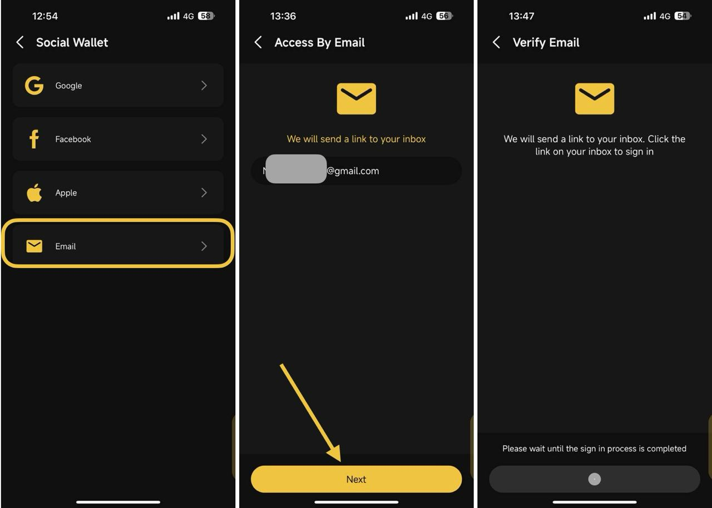
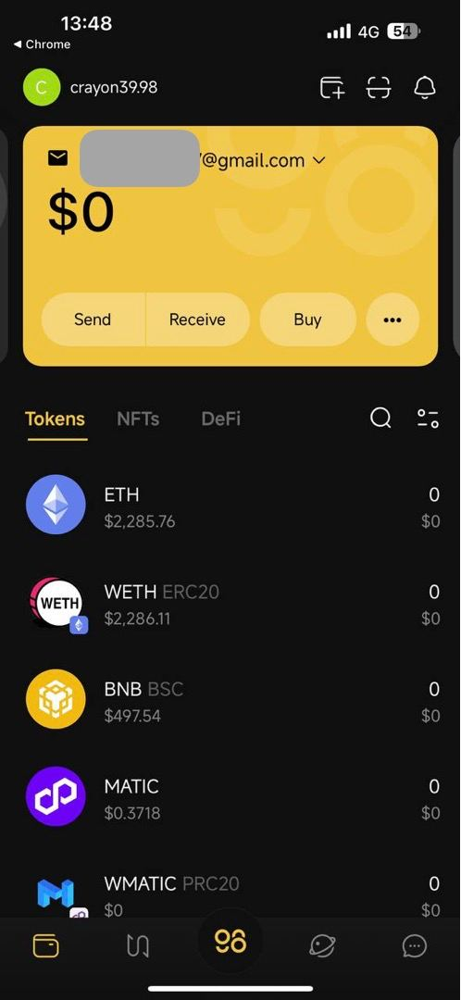

# How to create a Social Wallet


Before you get started, please ensure you have an active social media account (e.g., Facebook, Google, Email) that you intend to utilize for setting up a wallet.


**Step 1**: At the top right corner of the home page, choose **Add Wallet** icon

**Step 2**: Select the **Social Wallet** option then click **Continue**

<figure><figcaption></figcaption></figure>

**Step 3**: Choose the Social Account

* Choose the social media platform you prefer for authentication (e.g., Facebook, Google, Email. Apple).

**Step 4**: Authorize Access

* You will be redirected to the login page of the selected social media platform.
* If you're not already logged into your social media account, you'll be asked to enter your social media credentials (username and password).


**Note**: If you opt to log in using the Email option, you will need to verify your email to sign in.


<figure><figcaption></figcaption></figure>

**Step 5**: You will be navigated back to the **Wallets** main screen with the recently created Social Wallet selected.&#x20;

The newly created Social Wallet is a Multi-chain Wallet.

<figure><figcaption></figcaption></figure>
