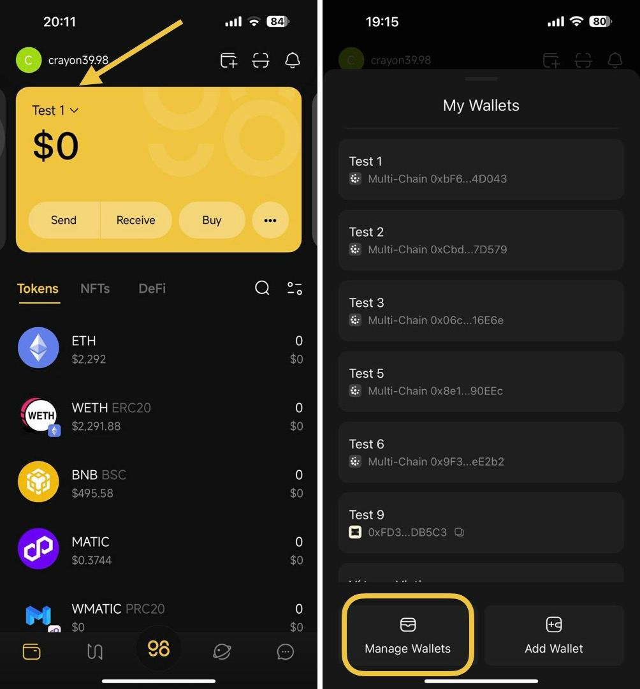
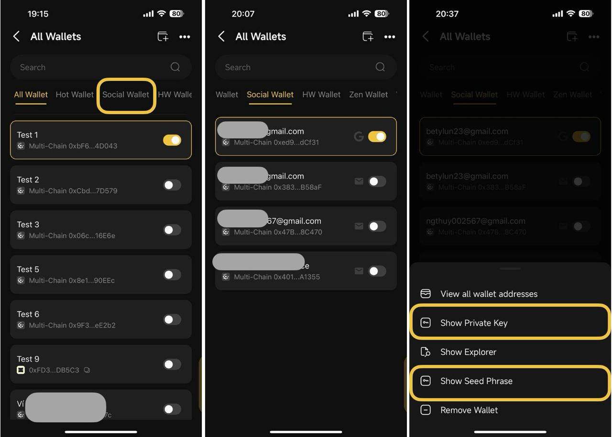

# How to manage a Social Wallet

#### 1. You can only display one Social wallet in the All Wallets or Social Wallet section if you have multiple social wallets

#### 2. How to show the Seed Phrase / Private Key of the Social Wallet

Social Wallet is managed by Seed Phrase exactly like Hot Wallets, so you also need to back up the Seed Phrase in a safe place and not share it with anyone. Anyone who has the Seed phrase will be able to access your wallet as well as the assets inside it.&#x20;

To retrieve the Seed Phrase, please refer to the steps below:

**Step 1**: On the main screen of the App, click on the name of the currently active wallet

**Step 2**: Choose **Manage Wallets**

<figure><figcaption></figcaption></figure>

**Step 3**: Choose **Social Wallet**

**Step 4:**  Choose the wallet which you would like to retrieve its Seed Phrase or Private Key

**Step 5**: Then click **Show Private Key** or **Show Seed Phrase**

<figure><figcaption></figcaption></figure>
