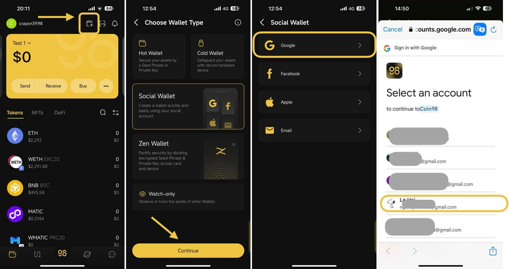

# How to restore a Social Wallet

## The first way: relog in to Social Wallet

If you've previously used a social wallet on Coin98 Super Wallet, you can restore it by logging into the same social account option associated with that wallet.

**Step 1**: At the top right corner of the home page, choose **Add Wallet** icon

**Step 2**: Select the **Social Wallet** option then click **Continue**

**Step 3**: Choose the Social Account (Facebook, Google, Email. Apple).

**Step 4**: Authorize Access

* You will be redirected to the login page of the selected social media platform.
* If you're not already logged into your social media account, you'll be asked to enter your social media credentials (username and password).

<figure><figcaption></figcaption></figure>

## The second way: restore a Social wallet with its recovery keys

If you wish to restore a social wallet from another party such as Ramper Wallet into Coin98 Super Wallet, you will need to import the wallet in the same manner as a Hot Wallet, **using the Seed phrase or Private key**.

You can refer to the document below for more detailed instructions on how to restore a wallet with its Seed Phrase


[v15-how-to-import-multi-chain-wallets-to-coin98-super-wallet.md](../wallet-management/v15-how-to-import-multi-chain-wallets-to-coin98-super-wallet.md)


<figure><figcaption></figcaption></figure>
