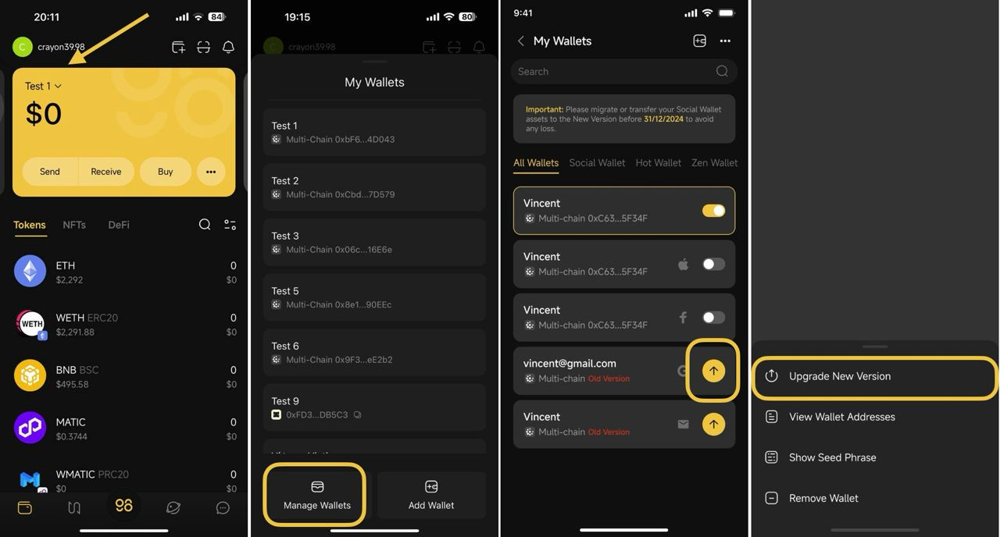

# How to upgrade a social wallet to Ramper Core V2 on Coin98 Super Wallet


**Important Note:**

To ensure uninterrupted access and avoid any losses, please migrate or transfer your Social Wallet assets to the new version before the old version is discontinued on **31/12/2024.**

* **Login via Facebook & Apple**: You'll be prompted to choose between the old version and the new version. Please note that the new version wallet address will differ from the old version address. Therefore, you should manually transfer your assets on the old address to the new address. If you don't do this, you won't be able to access your assets through your social account once the old version stops working. Instead, you'll need the seed phrase of the old version wallet to re-import your wallet into a hot wallet.
* **Login via Google & Email options**: The new version wallet address will remain the same as the old version address.


Make sure you already updated your app to the latest version and then kindly follow these steps to migrate your existing social wallet to the new version.

### 1. If your social wallet is logged in the Coin98 Super Wallet


**Note:** This part is for the social wallet logged in via Google or Email. For the social wallet logged in via Facebook and Apple, kindly refer to the guide in the second part.


**Step 1**: On the main screen of the App, choose the currently active wallet

**Step 2**: Choose **Manage Wallets**

**Step 3:** Choose the social wallet marked as the **Old Version** by clicking the **Upgrade** icon next to the wallet.

**Step 3:** Click **Upgrade New Version**

<figure><figcaption></figcaption></figure>

**Step 4**: You will be redirected to the login page of the selected social media platform. Login to the social account linked to the wallet you wish to upgrade and authorize access if needed to complete the upgrade.

After success, you will be navigated back to the Wallet screen, where you will see your recently upgraded Social Wallet.&#x20;

### 2. If your social wallet is not logged in the Coin98 Super Wallet

**Step 1**: At the top right corner of the home page, choose **Add Wallet** icon

**Step 2**: Select the **Social Wallet** option then click **Continue**

**Step 3:** Choose the social media platform associated with your social account (e.g., Facebook, Google, Email, Apple)

**Step 4:** Pick the social account linked to the wallet you wish to upgrade. The system will verify and upgrade your account to the new version

**Step 5:** Sign in again to your account to access the upgraded wallet

<figure><figcaption></figcaption></figure>

After completing the upgrade, you will be navigated back to the Wallet screen, where you will see your recently migrated Social Wallet.&#x20;
