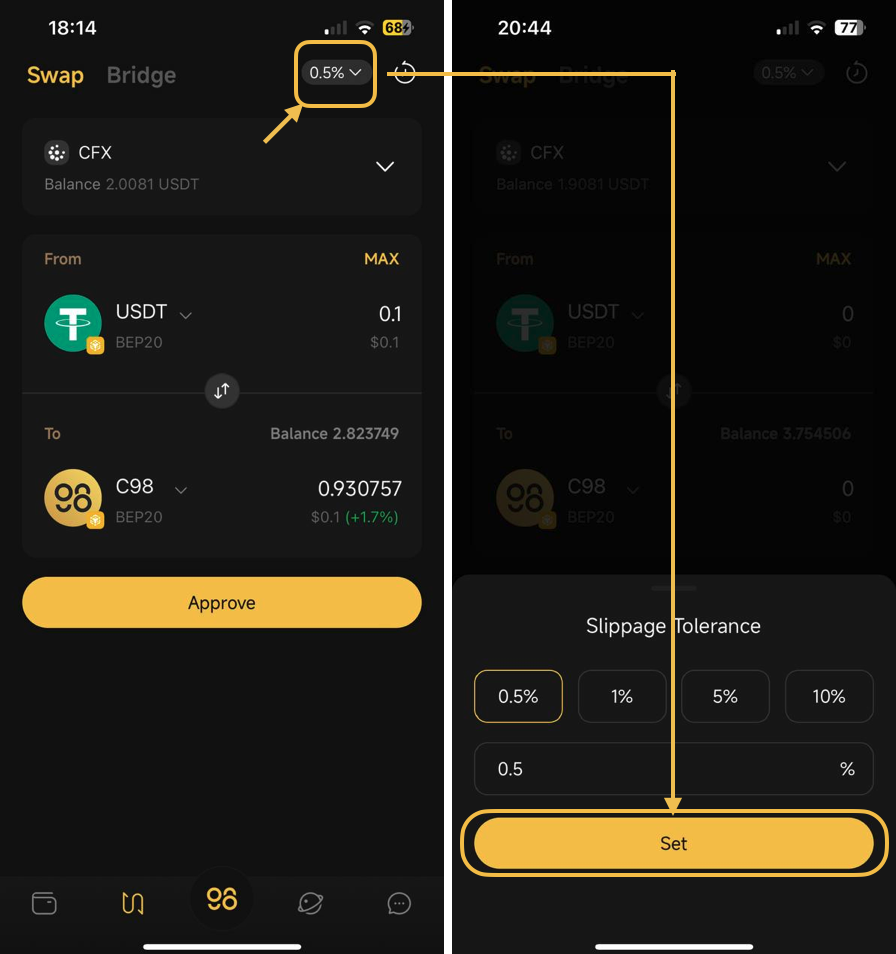

# What is slippage tolerance

Coin98 Super Wallet has integrated popular AMMs in the market to provide a seamless, simple, fast, and extremely safe trading experience for users. To help users have a better understanding of the advanced features when trading on Coin98 Super Wallet, let's take a closer look at the term “Slippage Tolerance”.&#x20;

### What is Slippage Tolerance?

Slippage Tolerance is the pricing difference between the price at the confirmation time and the actual price of the transaction users are willing to accept when swapping on AMMs. Slippage tolerance is set as a percentage of the total swap value.

In the case of volatile markets or low-liquidity pools, users can complete the transactions faster and avoid failures by accepting a higher slippage and slippage tolerance percentage.&#x20;

### How to use Max Slippage

The default Slippage on Coin98 Super Wallet is set at the standard rate of 0.5%, which is quite safe and applicable to most coins on the market. You can select the appropriate **Slippage Tolerance** level from the suggested rates like 0.5%, 1%, 5%, 10%, or fill in the number manually (maximum is 25%).

<figure><figcaption></figcaption></figure>


**Note**:

* Avoid trading when the market has major fluctuations.
* Slippage Tolerance partly comes from the low-liquidity pools, not from Ninety Eight’s system. Coin98 Super Wallet is not responsible for any trading loss.

