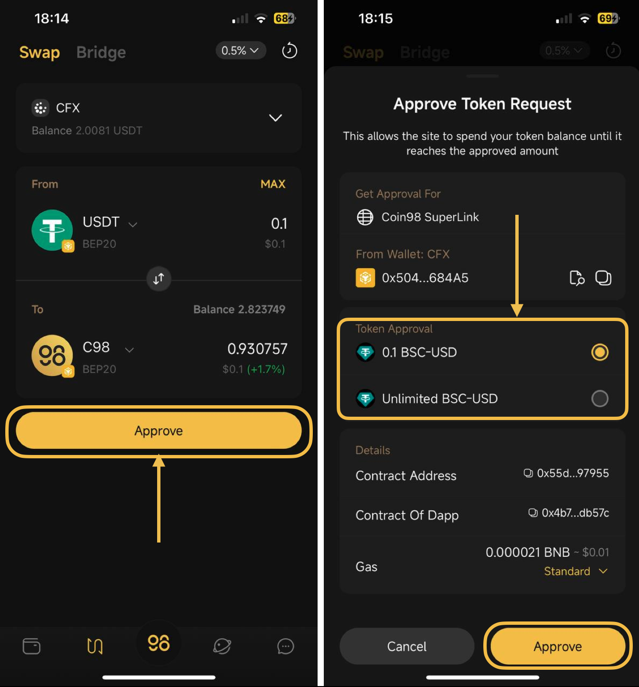

# What is Unlimited approval?

Coin98 Super Wallet has integrated various popular AMMs in the market to provide a seamless, simple, fast, and extremely safe trading experience for users. To help you have a better understanding of the advanced features when trading on Coin98 Super Wallet, let's take a look at the term “Unlimited Approval” and see what it means.&#x20;

## What is Unlimited Approval?

Unlimited Approval is a feature that enables you to grant platforms and smart contracts permission to spend tokens/ coins on your behalf without limit.

Normally, when swapping on a specific AMM such as Uniswap, you need to approve the smart contract/ platform to transfer those tokens. When swapping a specific amount, you can choose to set an allowance of that exact amount.&#x20;

### Advantages

When the Unlimited Approval feature is activated, you can save time and gas fees as you only need to confirm the allowance once. The approval will then be automatically renewed in all transactions afterward.

### Risks

When giving these platforms/ smart contracts unlimited approval, you may face 2 main risks: malicious projects and bug exploits. This risk gives hackers the right to use the approved tokens for many lucrative purposes.

## How to select/deselect Unlimited Approval

Unlimited Approval is the default feature displayed in the confirmation popup for an approval transaction during the native swap on the Coin98 Super Wallet.

To select this option, choose the swapping pair with the desired amount of token in the Native Swap and click on the **Approve** button. There will be 2 options:&#x20;

1. Approve only the amount of token you desire to swap
2. Unlimited approval for this token

<figure><figcaption></figcaption></figure>

The Unlimited Approval offers a superior user experience, but with the highlighted risks, please carefully take it into consideration.
