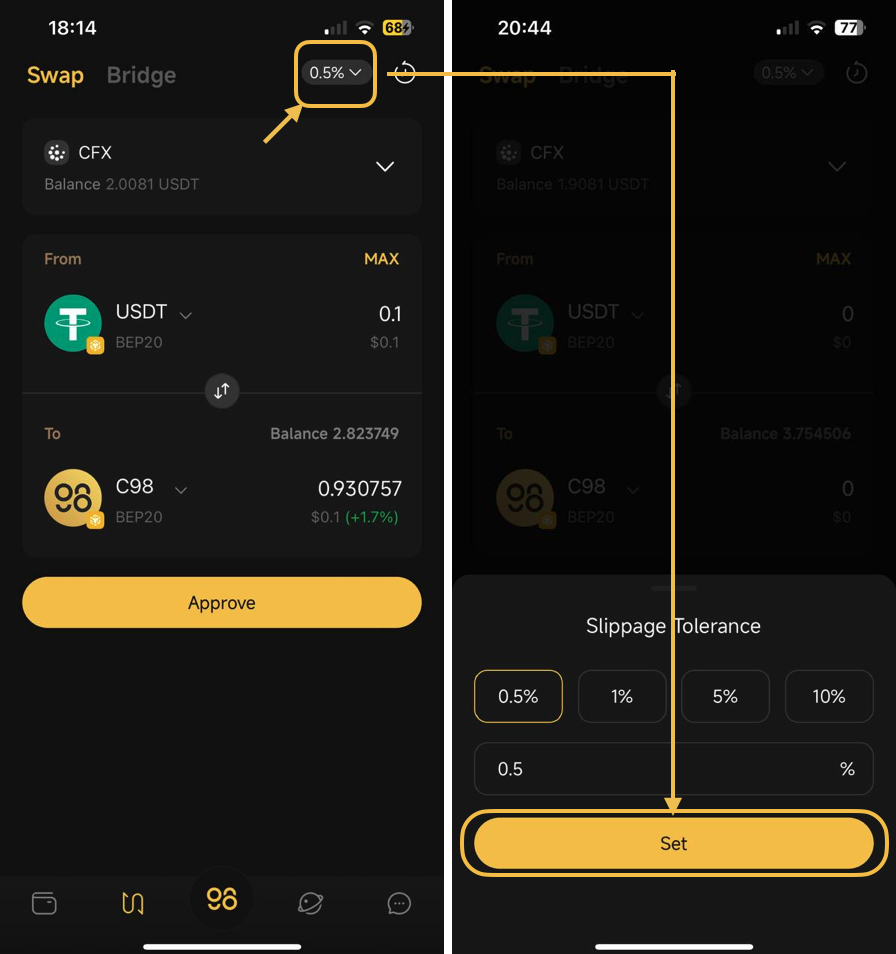
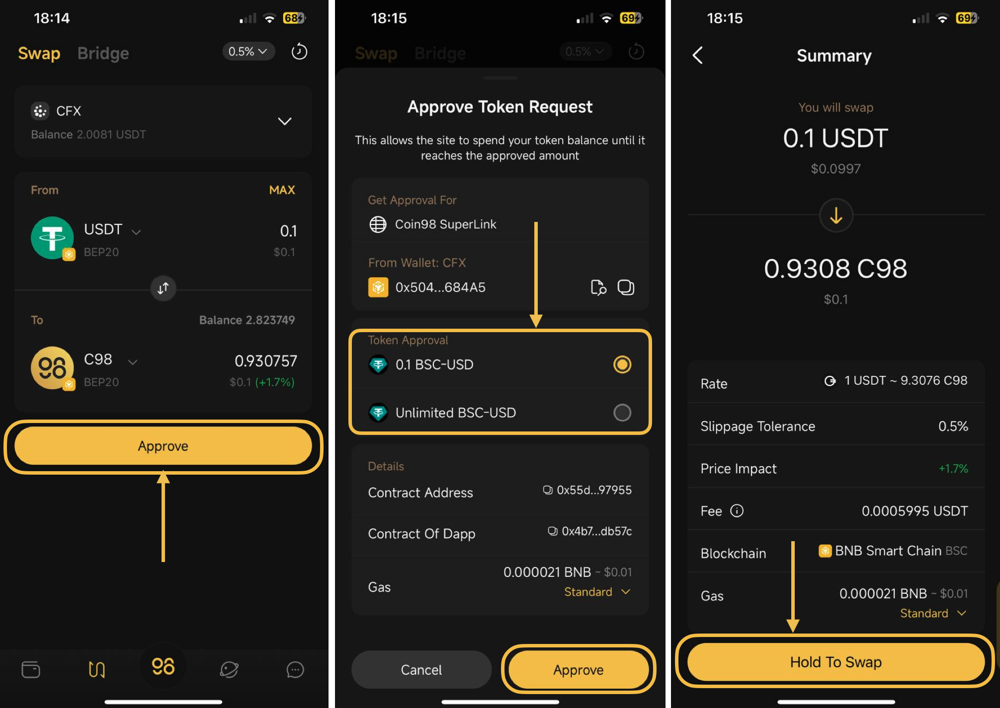

# How to swap natively on Coin98 Super Wallet

Coin98 Super Wallet supports users in trading natively on 7 blockchains: Ethereum, BNB Smart Chain, Polygon, Avalanche C-Chain, Fantom, Arbitrium, and Optimism.

**Step 1**: On the main screen of the Coin98 Super Wallet, select the Swap icon at the bottom.

**Step 2:** Select the wallet containing the token/coin you want to swap.

<figure><figcaption></figcaption></figure>

**Step 3**: Select the desired blockchain then choose the trading token from the list. For those tokens that haven’t been listed yet, you can paste the Contract Token and swap as usual. We will use the **USDT/C98** trading pair for example.

<figure><figcaption></figcaption></figure>

**Step 4**: Adjust the slippage tolerance if needed. The default slippage rate on the wallet is 0.5%. This is one of the most common reasons for swap failures, so it's important to customize it to ensure the highest success rate.

<figure><figcaption></figcaption></figure>

**Step 5**: Click **Approve/Swap.** Carefully read the information below before deciding to trade:

* **Rate & Inverse rate**: The price ratio of the 2 tokens.
* **Slippage Tolerance**: The difference between the price at the confirmation time and the actual price of the transaction you are willing to accept when swapping on AMM
* **Price impact**: Estimated % difference in price when swapping compared to the displayed price.
*   **Fee:**

    \- Liquidity Provider Fee: The amount that will be used to pay the liquidity providers.

    \- SuperLink Fee: The amount that will be used to find the best route. The fee is about 0.1% of the total amount as the default

    \- UI fee: The fee for the swap interface and operation. The fee is about 0.5% of the total amount as the default.
* **Gas**: A feature that allows you to adjust the amount of Gas fee (transaction fee) according to your needs by sliding the bar.

**Step 6**: If you agree, click **Hold to Swap** to finish.

<figure><figcaption>
Approve
</figcaption></figure>

<figure><figcaption></figcaption></figure>


**Note**:

* The default [gas fee](https://www.google.com/url?q=https://coin98.net/what-is-gas-fee\&sa=D\&source=editors\&ust=1678071474327707\&usg=AOvVaw0eiOeskbFviPYzUyaBVvv2) on Coin98 Super Wallet has been set for the highest speed with the most reasonable cost.
* The arrow in the middle of the trading interface is used to switch between the buying and selling positions. You need to check the tokens’ positions carefully before making any transaction.
* You need to have the corresponding blockchain wallet and a proper balance of father tokens in this wallet to pay the fee before trading.
* The Approve step is only displayed in the very first trade. In the following trades, you only need to click Swap to complete the transactions.
* Coin98 will charge **0.6%** fee on the swapped amount for the Superlink fee and UI fee.

