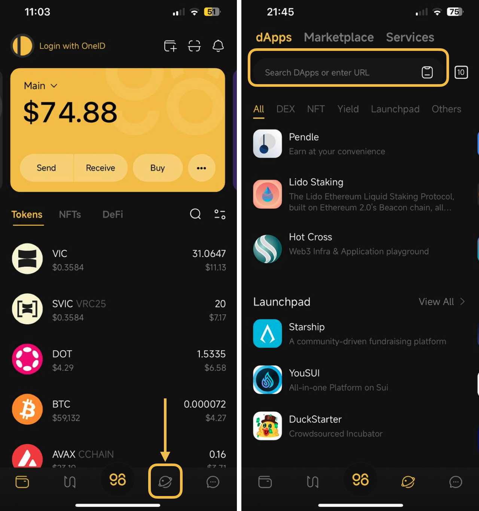
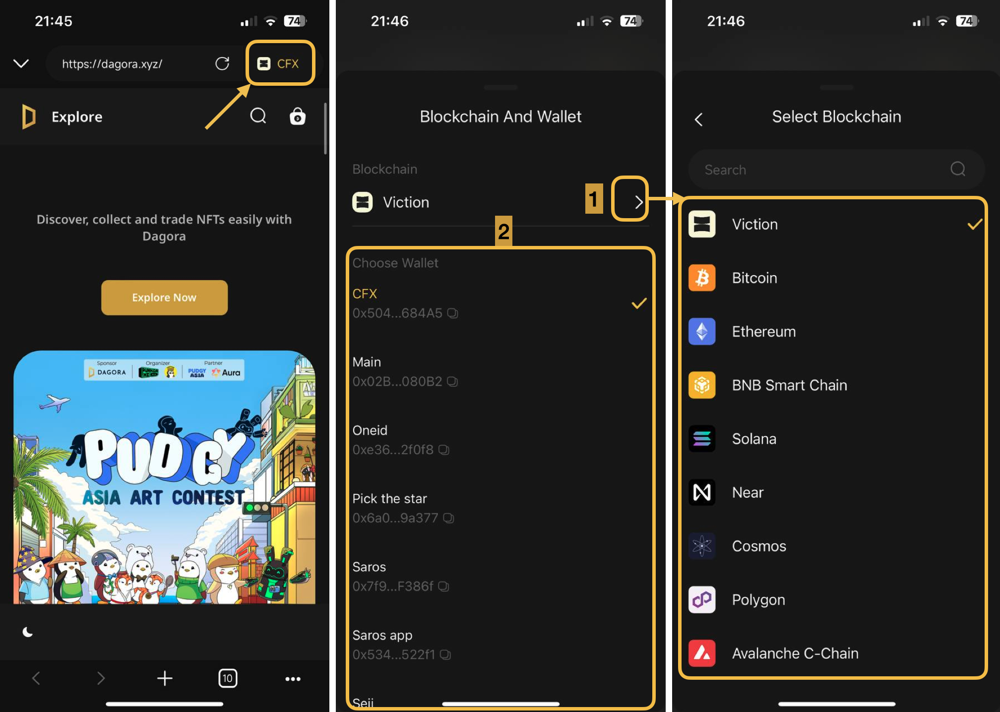
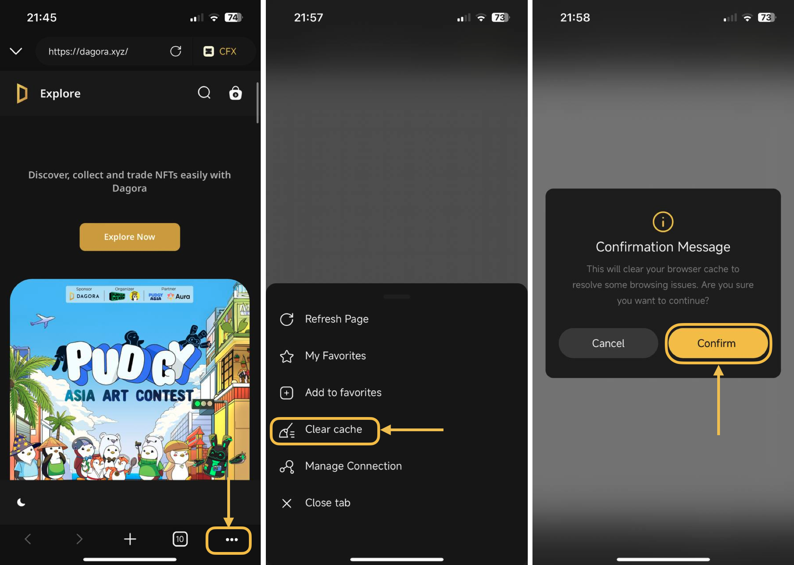
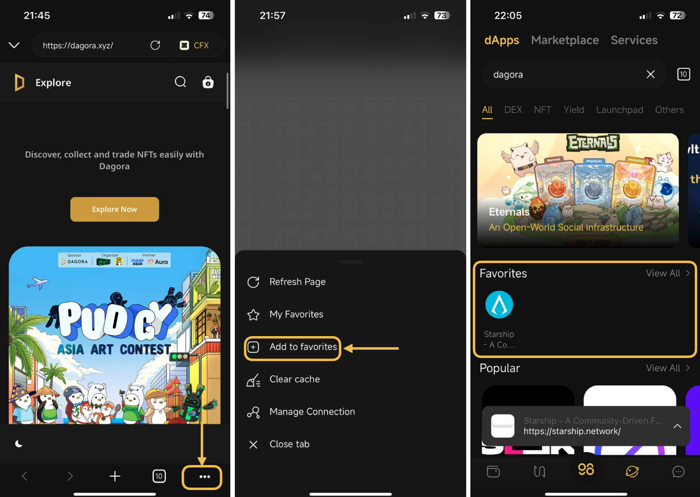

# How to use multichain dApp browser on Coin98 Super Wallet

Coin98 Super Wallet currently supports DApps on more than 100 blockchains: Ethereum, Ethereum PoW, BNB Smart Chain, HECO Chain, Solana, Avalanche (C-Chain), Polygon (Matic), Fantom, Viction, OKExChain, GateChain, xDAI Chain, Klaytn, KardiaChain, Celo, Optimism, Arbitrum, Boba Network, Kucoin Chain, Near, various EVM Custom Networks, etc.&#x20;

In the future, Coin98 Super Wallet will integrate more top-tier dApps to elevate users' trading experience to a new level.

### Create a Multi-chain Wallet 

After downloading or updating the Coin98 Super Wallet, you can follow the instructions below to create a Multi-chain Wallet or import wallets from other platforms to the Coin98 Super Wallet.

If you are currently a Coin98 Super Wallet user, please re-import your multichain wallet to update other new chain wallets available in the latest version!


* [How to create a Multichain Wallet](../getting-started/v15-how-to-create-a-multichain-wallet.md)
* [How to import Multi-chain wallets to Coin98 Super Wallet](../wallet-management/v15-how-to-import-multi-chain-wallets-to-coin98-super-wallet.md)


### Prepare the blockchains' native coins for transaction fees 

The transaction fee is calculated differently depending on the blockchain-based dApps. Users need to prepare the blockchains' native coins in the corresponding wallets of the respective chains, _such as:_

* Transaction fees of dApps built on **BNB Smart Chain** will be calculated in **BNB.**
* Transaction fees of dApps built on **Ethereum** will be calculated in **ETH**.
* Transaction fees of dApps built on **HECO Chain** will be calculated in **HT**.
* Transaction fees of dApps built on **Polygon** will be calculated in **MATIC.**
* Transaction fees of dApps built on **Avalanche C-chain** will be calculated using **AVAX (Avalanche C-chain)**.
* Transaction fees of dApps built on **Viction** will be calculated using **VIC**.
* Transaction fees of dApps built on **Fantom** will be calculated using **FTM**.
* Transaction fees of dApps built on **xDai Chain** will be calculated using **XDAI**.
* Transaction fees of dApps built on **Ronin** will be calculated using **RON**.
* Transaction fees of dApps built on **Klaytn** will be calculated using **KLAY**.
* Transaction fees of dApps built on **KardiaChain** will be calculated using **KAI**.
* Transaction fees of dApps built on **Gate Chain** will be calculated using **GT.**
* Transaction fees of dApps built on **OKEx Chain** will be calculated using **OKT**.
* Transaction fees of dApps built on **Near** will be calculated using **NEAR**.
* Transaction fees of dApps built on **Arbitrum, Optimism & Boba Network** will be calculated in **ETH on the respective blockchain**.
* Transaction fees of dApps built on **KuCoin Chain** will be calculated using **KCS**.
* Etc.


[What is Gas Fee?](https://coin98.net/what-is-gas-fee)


You can get these coins from centralized exchanges like Binance, Gate.io,... and transfer them to your wallet.

> **Note:** You must transfer each coin to the corresponding wallet on the correct blockchain.

### How to access the DApp Browser on Coin98 Super Wallet 

**Step 1:** Click the **Discover** icon on the home screen.

**Step 2:** On the Discover interface, enter the name/URL of the Dapps you want to access in the search bar.

<figure><figcaption></figcaption></figure>

**Step 3:** Connect your wallet after entering the DApp.

To change the chain or the wallet, you can select the chain/ wallet you want to connect by clicking on the selection tab in the top right corner of the screen.

<figure><figcaption></figcaption></figure>

### How to clear cache in Dapp Browser on Coin98 Super Wallet 

If you have some browsing issues when using Dapp Browser, you can clear the cache by following the steps below

**Step 1:** Click the "..." icon at the bottom corner

**Step 2:** Select **Clear cache,** then click **Confirm** on the confirmation popup.

<figure><figcaption></figcaption></figure>

### How to add a dApp to the favorite list 

**Step1:** Click the "..." icon at the bottom corner

**Step 2:** Select **Add to Favorites**

After successfully adding a Dapp to the favorite list, go back to the dApps interface to check the Favorites list.

<figure><figcaption></figcaption></figure>

### How to remove a dApp from the favorite list 

**Step1:** Click the "..." icon at the bottom corner

**Step 2:** Select **Remove from favorites**

After successfully removing a Dapp from the favorite list, go back to the dApps interface to check the Favorites list.

<figure><figcaption></figcaption></figure>
