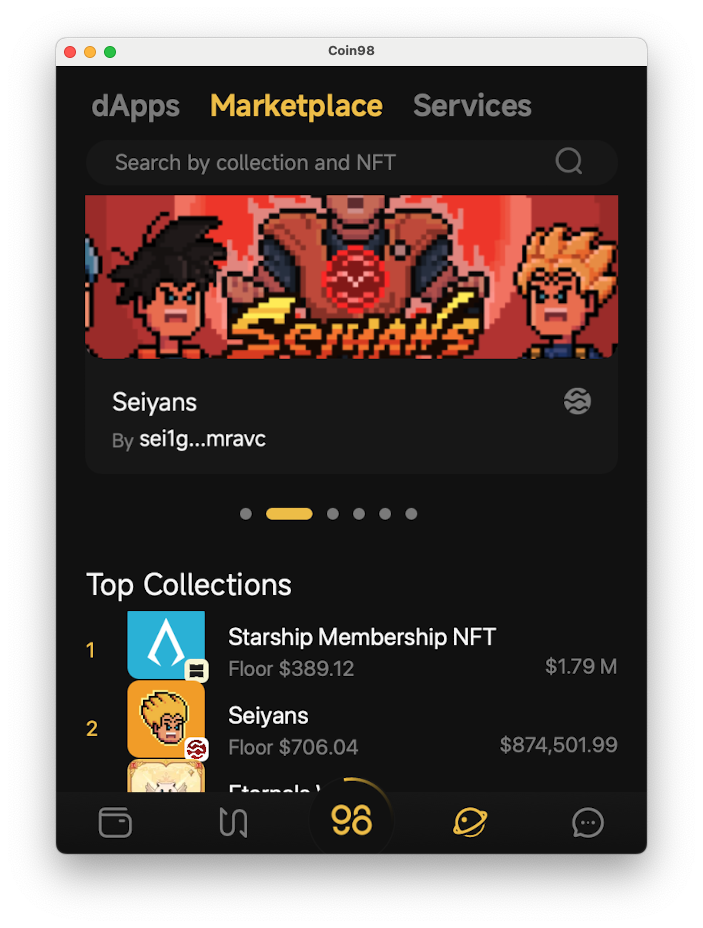

# How to buy NFT in Coin98 Super Wallet

**Step 1**: Access NFT marketplace to buy NFT. There are 2 ways to do that:

* In your main Wallet section, choose **NFT** tab. If you don't own any NFT yet, you can click on **Discover Marketplace** to visit NFT Market place tab

<figure><figcaption></figcaption></figure>

 

<figure><figcaption></figcaption></figure>

* Or you can simply choose **Browser** section, then choose **Marketplace** to visit NFT Marketplace

**Step 2**: Choose NFTs that you want to buy.

If you don't see it displayed in the NFT Marketplace screen. Use search bar on top to look it up.

Once you see the NFT that you want to buy, choose the NFT to proceed.

<figure><figcaption></figcaption></figure>

Take **Contrarians** NFT Collection for example. Supposed we want to buy a Contrarians NFT. Simply click on the NFT.

<figure><figcaption></figcaption></figure>

Then click **Buy** button

**Step 3**: Proceeding transaction

Ensure the price and payment is correct, then click **Continue**

<figure><figcaption></figcaption></figure>

Approve Token Request to make transaction

<figure><figcaption></figcaption></figure>

Hold **Hold to Buy** button to buy NFT

<figure><figcaption></figcaption></figure>

You have successfully bought the NFT, now you can go back to **NFT** tab (As guided in Step 1) to check your NFT.
