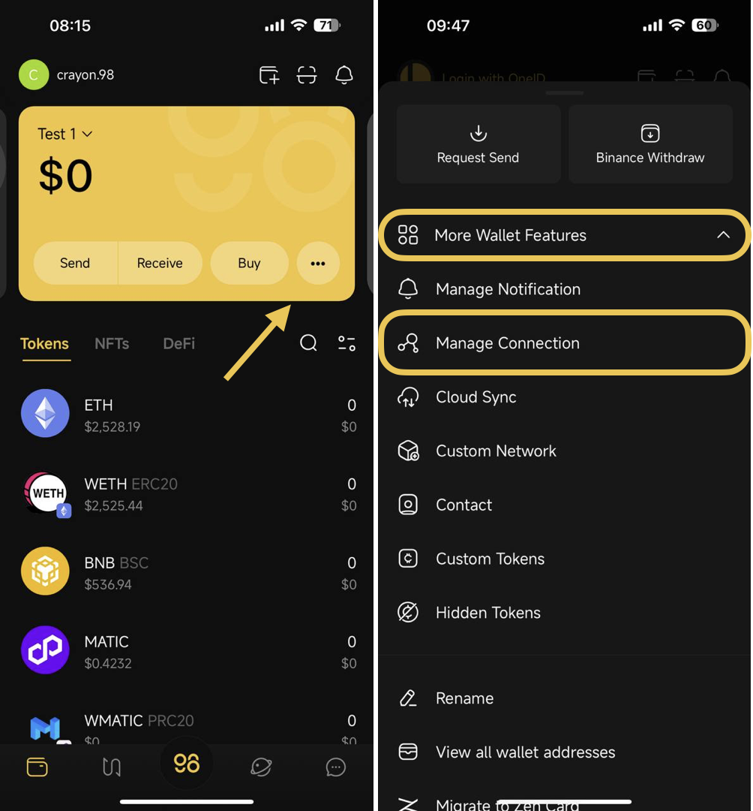
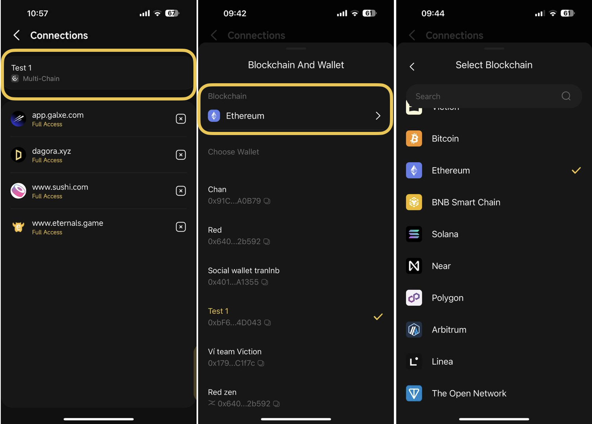
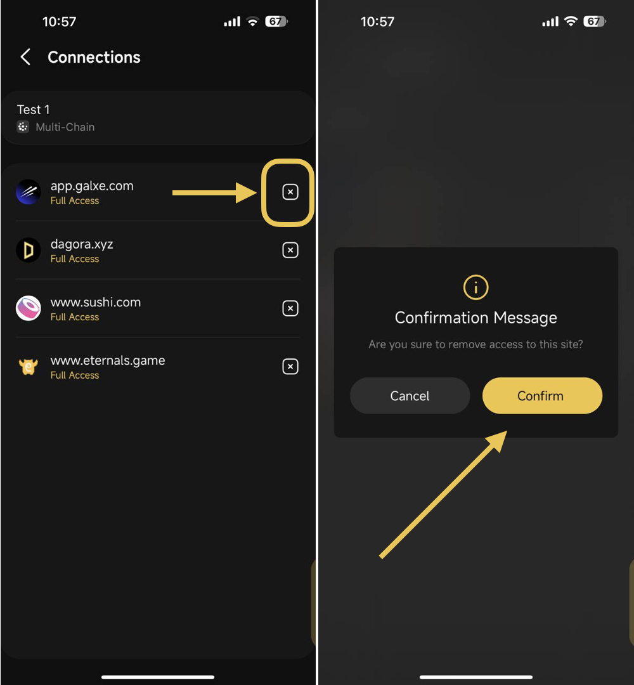

# How to manage connections of the wallet

The Manage Connection feature allows you to disconnect websites or DApps (decentralized applications) that previously had access to your wallet address.

**Step 1:** On the main screen of the Wallet section, choose the **More** icon → Select **More Wallet Features** so all options can show up&#x20;

**Step 2**: Select **Manage Connection**

<figure><figcaption></figcaption></figure>

**Step 3**: Select the wallet whose connection to DApp you would like to revoke

<figure><figcaption></figcaption></figure>

**Step 4**: Click the **X** icon to revoke the connection to a specific DApp&#x20;

**Step 5**: Click **Confirm** on the pop-up to complete the process

<figure><figcaption></figcaption></figure>
