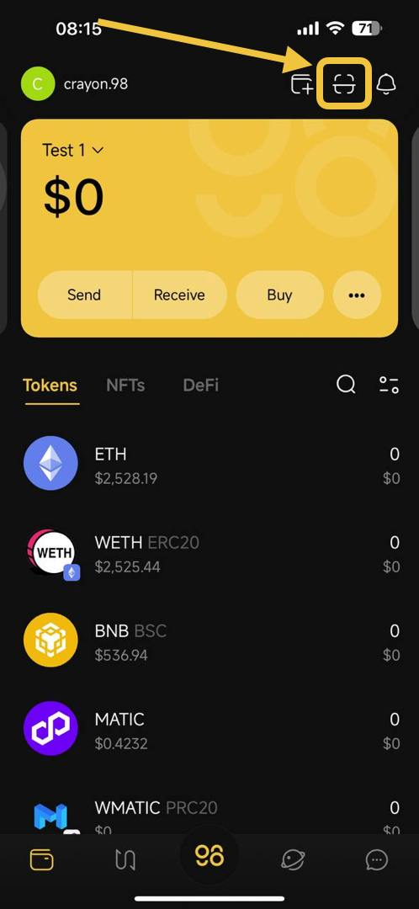
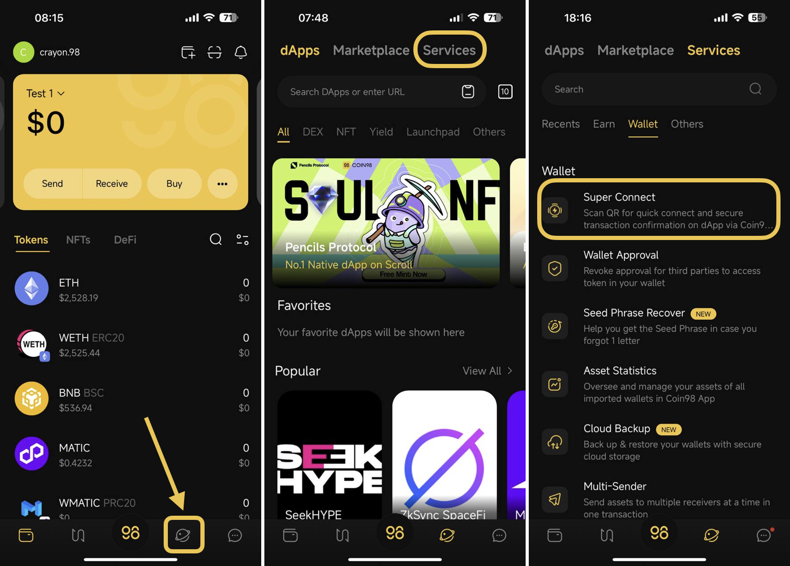
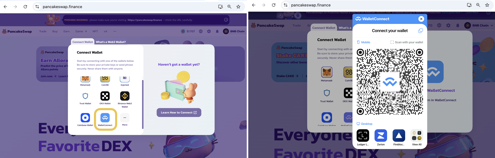

# How to use Super Connect

## What is WalletConnect?

WalletConnect is an open-source protocol, allowing wallets to connect and interact with DApps using mobile devices or computers. WalletConnect is now available on Coin98 Super Wallet under the name Super Connect, an optimized version designed to provide smooth and uninterrupted wallet connectivity.

## How to use Super Connect

**Step 1:** Access the Super Connect feature

* **The first way**: On the top right of the App's mainscreen, click on **Scan** icon

<figure><figcaption>
The first way
</figcaption></figure>

* **The second way**: Choose the Discover icon on the App's mainscreen, then choose the Service → Wallet section&#x20;

<figure><figcaption>
The second way
</figcaption></figure>

**Step 2**: Open any DApps. We'll use the PancakeSwap in this tutorial for example

**Step 3**: Select the **WalletConnect** option at the Wallet Connection on the DApp → The QR code will show up for you to scan

<figure><figcaption></figcaption></figure>

**Step 4**: Use the SuperConnect to scan the QR code provided on the PancakeSwap platform

* 4.1. On the Super Connect interface, choose **New Connection** → then scan the QR code provided on Pancake
* 4.2. Select the wallet you would like to connect it
* 4.3. Review the information displayed on **Connect Request** popup → If you agree, click **Connect** to connect your wallet to the DApp

<figure><figcaption></figcaption></figure>
