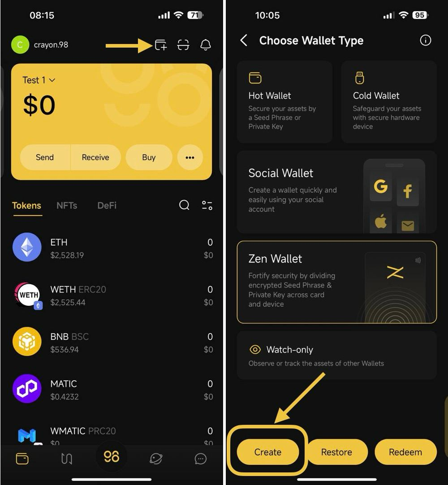
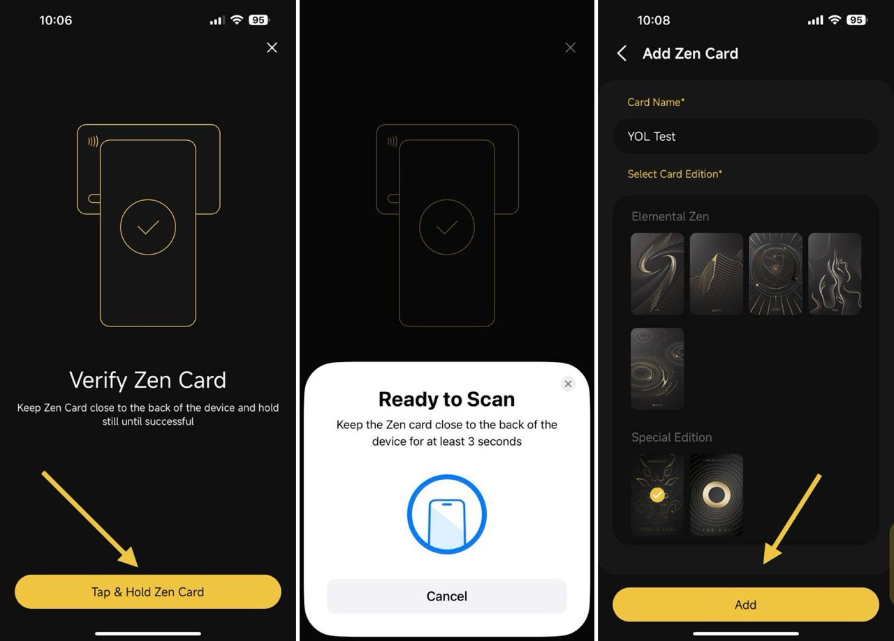
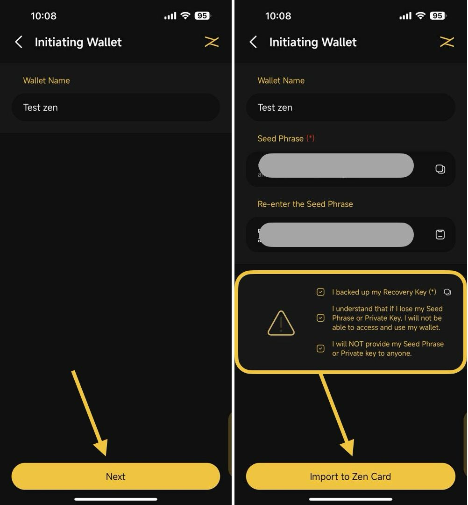
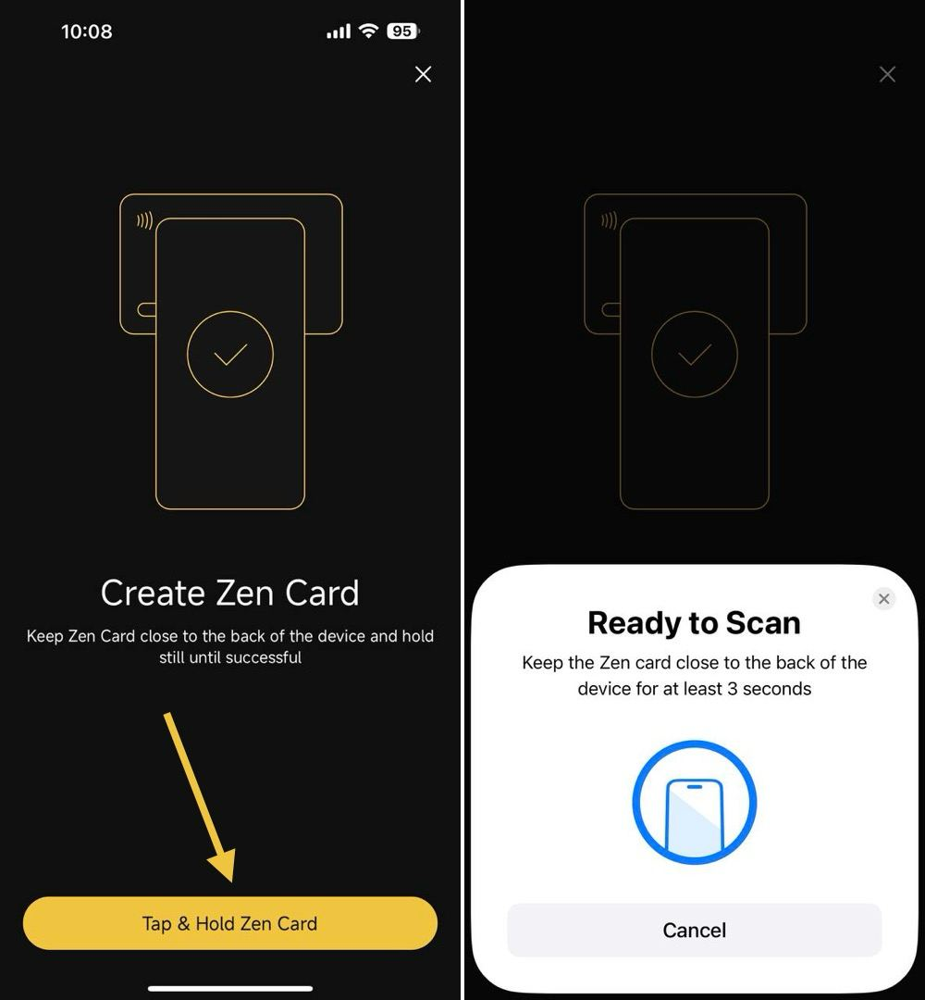
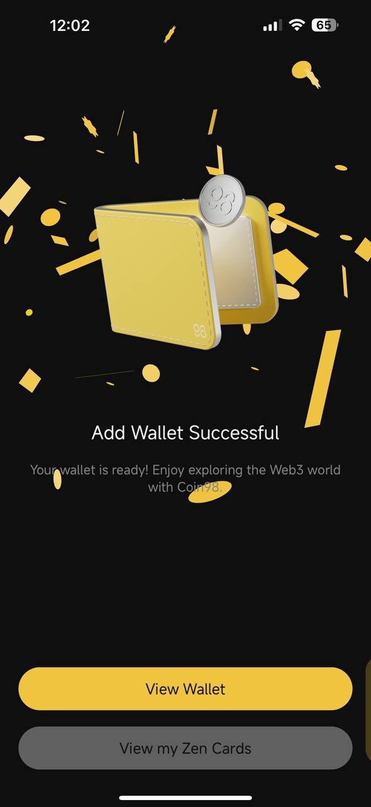
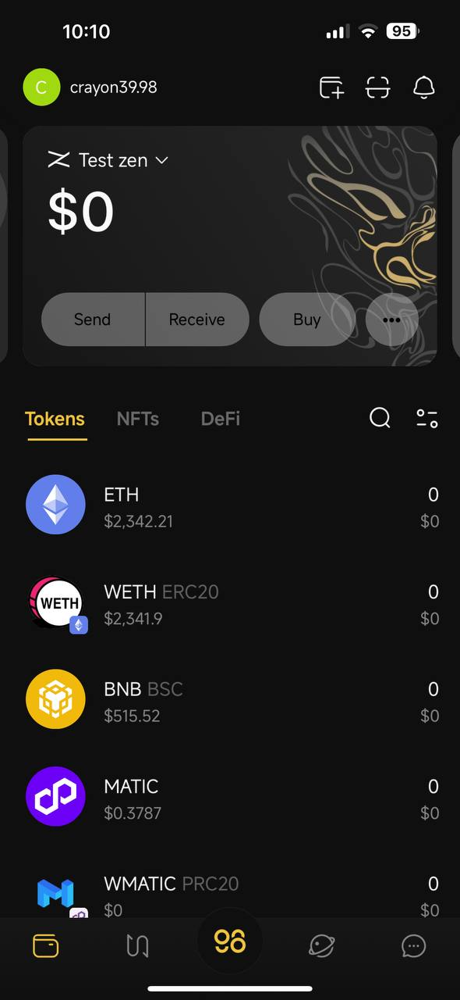

# How to Create a Zen Card Wallet


**Important note**: Please be aware that this process will replace any existing Wallet in the Zen Card with the newly created Wallet because each Zen Card can hold only one wallet. Therefore, make sure you back up the **Seed Phrase** and **Private Key** of the existing wallet in Zen Card in a safe place before creating a new wallet. After being replaced, you can only restore the replaced wallets by **Seed Phrase or Private Key**.




### **Requirements:**

* You must have a Zen Card
* Downloaded the Coin98 Super Wallet
* Your phone must support NFC

**Step 1:** On the mainscreen of the Coin98 Super Wallet, click **Add Wallet** icon

**Step 2:** Choose wallet type: **Zen Card** and click **Create;**

<figure><figcaption></figcaption></figure>

**Step 3**: Click **Tap & Hold Zen Card** to verify Zen Card -> Tap the Zen Card to the back of your mobile device (position may be different for different devices) and hold until the popup notifies Success


1. The area where you tap to scan a card may vary depending on different phone models. It's advisable to look up the appropriate placement for NFC cards on your specific phone.\
   _For iPhones 10 and newer (e.g., iPhone 13, 14, 15), it's recommended to place the card horizontally on the upper half of the front side of the phone._
2. The display for successful scans will differ between Android and iOS devices.


**Step 4:** Enter your Card Name and select Card Edition based on your physical Zen Card -> then click **Add** once done

<figure><figcaption></figcaption></figure>

**Step 5**: Enter Wallet Name, then click **Next**

**Step 6:**&#x20;

* Pay attention to every word and make sure you back up the Seed phrase/ Private key correctly and in a safe place;
* Re-enter your Seed Phrase into the reconfirmation box.
* Read the warnings carefully, then select three checkboxes to confirm your awareness of the risks when losing keys.
* Click **Import to Zen Wallet** to continue

<figure><figcaption></figcaption></figure>

**Step 7:** Click the **Tap & Hold Zen Card**&#x20;

**Step 8:** The system will pop up the instruction to scan the Zen Card ->  Tap the Zen Card to the back of your mobile device and hold until the popup notifies Success

<figure><figcaption></figcaption></figure>

After having been created successfully, the recently created Zen Wallet will be shown automatically in the Wallets tab. You can click **View Wallet** to see it

You also can access the **Manage Wallets** section to see & manage all of your created/restored wallets on Coin98 Super Wallet.

<figure><figcaption></figcaption></figure>

 

<figure><figcaption></figcaption></figure>

