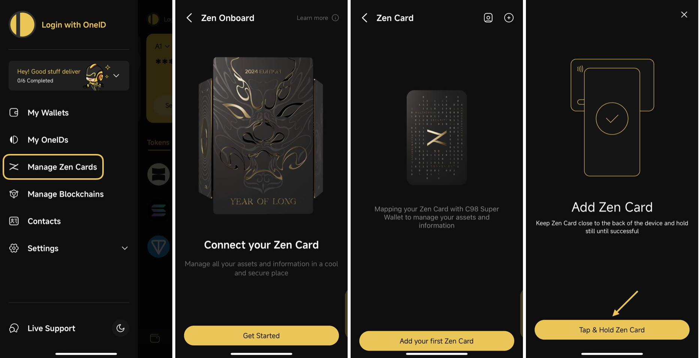
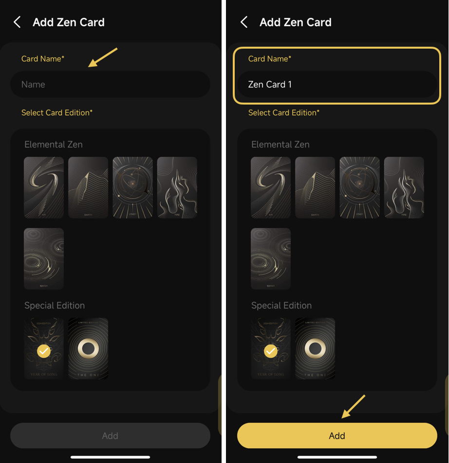
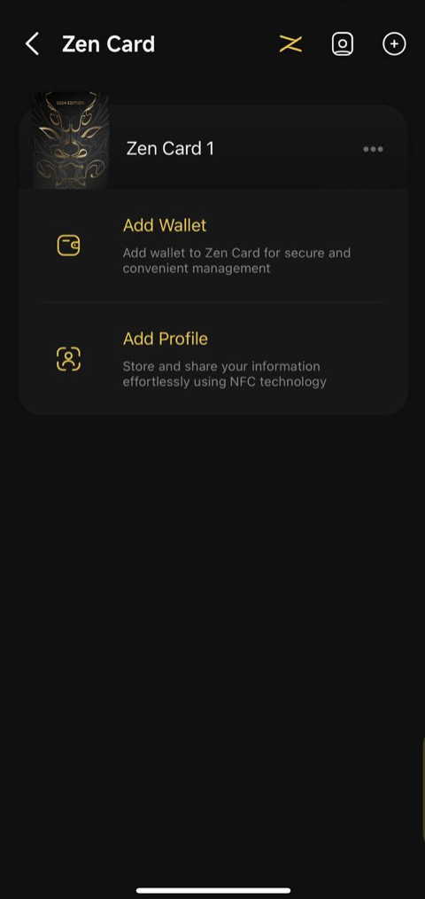
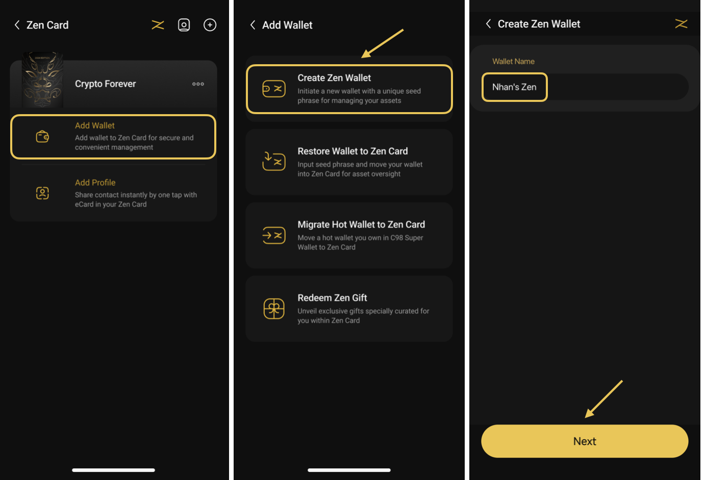
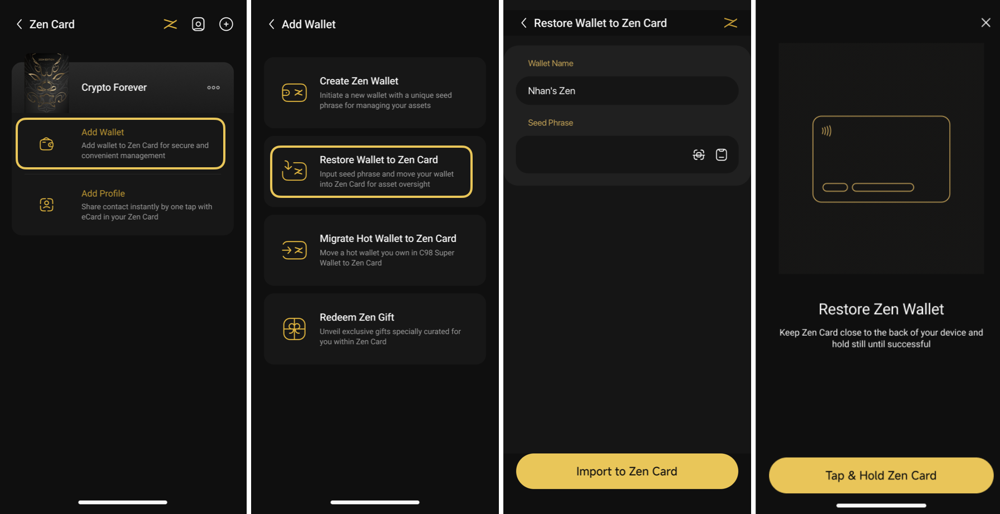
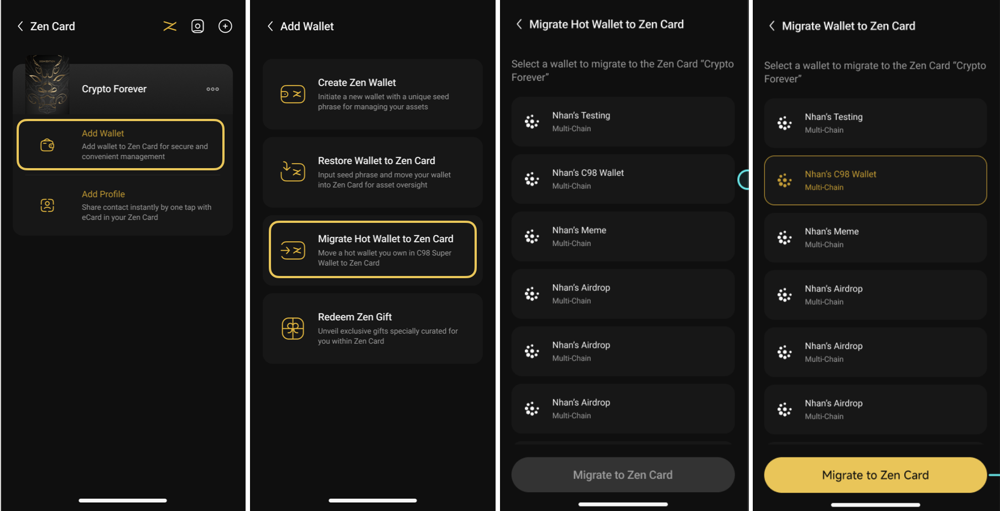
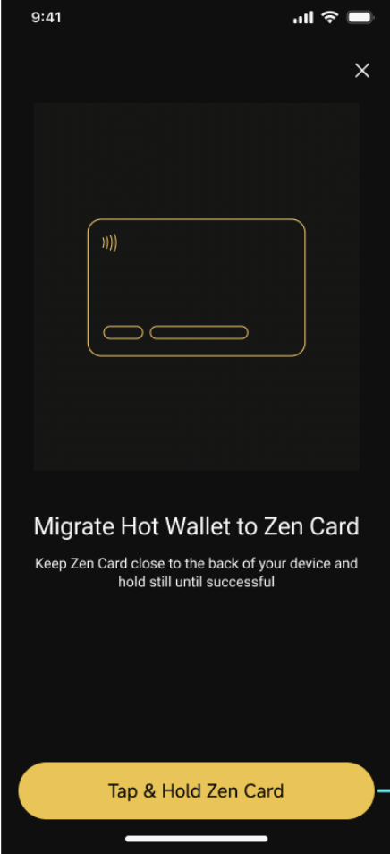

# How to Manage Zen Card

## How to Add a Zen Card

**Step 1:** Open the side menu, choose **Manage Zen Cards**

**Step 2:** On the Zen Onboard screen, choose **Get Started** and select **Add your first Zen Card**

**Step 3:** Tap and hold the Zen Card, then follow the on-screen instructions

<figure><figcaption></figcaption></figure>

**Step 4:** Enter a name for the wallet, select the corresponding Card Edition, and click **Add**;

<figure><figcaption></figcaption></figure>

\
After completing these steps,your Zen Card will be displayed. You may then choose to **Add Wallet** to Zen Card for secure asset management or **Add Profile** to share your contacts as an eCard.

<figure><figcaption></figcaption></figure>

## How to Add a Zen Card Wallet

After successfully adding Zen Card to Coin98 Super Wallet, you can enhance security and simplify asset management by adding a wallet.

In the Manage Zen Cards section, you will see all added Zen Cards. Select the Add Wallet option under the desired card. You can add a wallet to Zen Card in the following 3 scenarios:

### 1. Create a new Zen Wallet:

**Step 1:** Name the wallet as desired, then click **Next**

<figure><figcaption></figcaption></figure>

**Step 2:** Carefully back up your Seed Phrase or Private Key in a secure location. Re-enter the Seed Phrase into the reconfirmation box

Read the warnings, then select the three checkboxes to acknowledge the risks of losing your keys. Click **Import to Zen Wallet** to proceed

**Step 3:** Click on **Tap & hold Zen Card** on the NFC scanner of the phone until the notification shows successful

<figure><figcaption></figcaption></figure>


* The system will prompt you to scan the Zen Card. Tap and hold the card on the back of your device until the success message appears. Placement varies by device—refer to your phone’s NFC guidelines.

_For iPhones 10 and newer, place the card horizontally on the upper half of the phone's front side. Scan notifications may differ between Android and iOS._

* The display for successful scans will differ between Android and iOS devices.


You may create your Zen Card Wallet in a different way by referring to [this guidance](how-to-create-a-zen-card-wallet-1.md)

### 2. Restore Wallet to Zen Card

**Step 1:** Enter a desired wallet’s name and Seed phrase

**Step 2:** Click **Import to Zen Wallet**

**Step 3:** Click on **Tap & hold Zen Card** on the NFC scanner of the phone until the notification shows successful

<figure><figcaption></figcaption></figure>

You may also restore your Zen Card Wallet by following the instructions provided [in this document](how-to-restore-a-zen-card-wallet-1.md)

### 3. Migrate Hot Wallet to Zen Card

**Step 1:** Choose the existing Hot Wallet (Multichain) that you want to migrate then click on **Migrate Zen Card**

<figure><figcaption></figcaption></figure>

**Step 2:** Click on **Tap & hold Zen Card** on the NFC scanner of the phone until the notification shows successful

<figure><figcaption></figcaption></figure>

There is another way to migrate your Zen Card Wallet outlined [here](how-to-migrate-hot-wallets-to-zen-card.md)


**Important Note:**

Please be aware that processes such as creating a new wallet, restoring a wallet, or migrating a wallet to Zen Card will replace any existing Wallet in the Zen Card with the newly created/restored/migrated Wallet because each Zen Card can hold only one wallet. Therefore, make sure you back up the **Seed Phrase and Private Key** of the existing wallet in Zen Card in a safe place before creating/restoring/migrating a wallet. After being replaced, you can only restore the replaced wallets by **Seed Phrase** or **Private Key**.


When you add a wallet to a Zen Card that already has wallet data, you’ll see a warning. Please kindly make sure. Please kindly make sure to back up the Seed Phrase and Private Key of the current wallet before proceeding.

<figure><figcaption></figcaption></figure>
