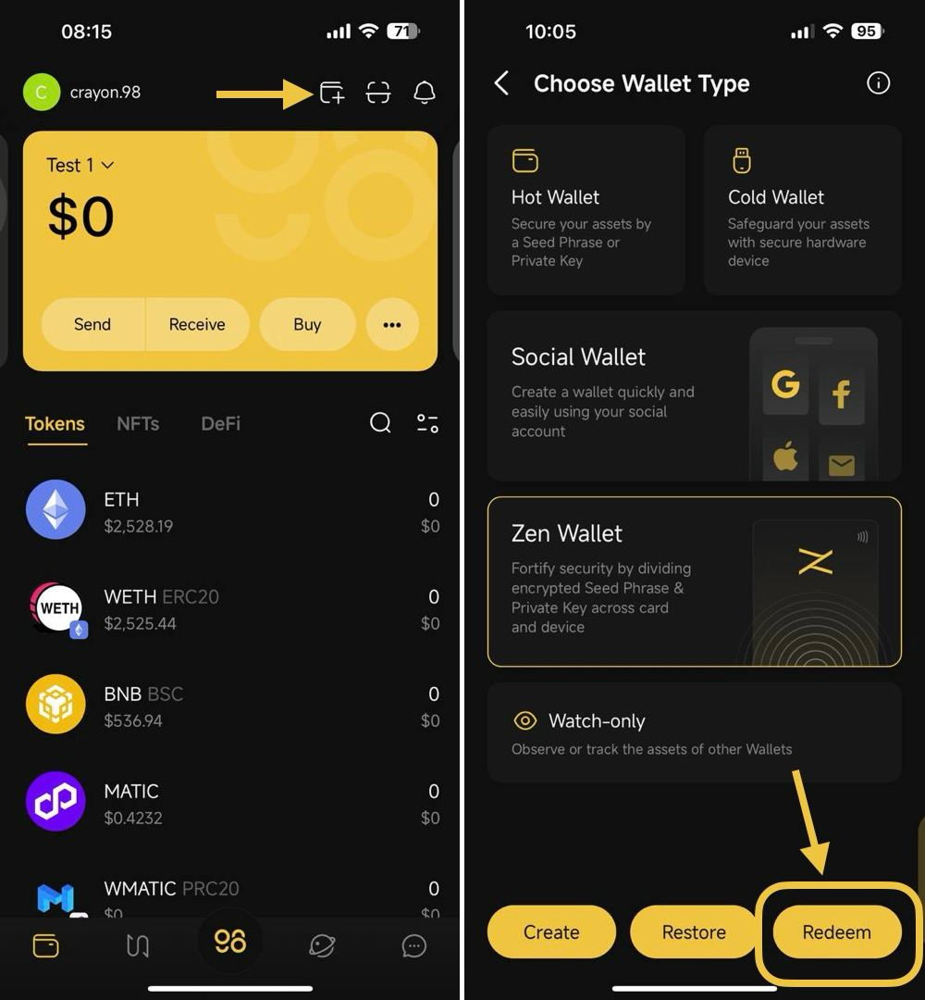
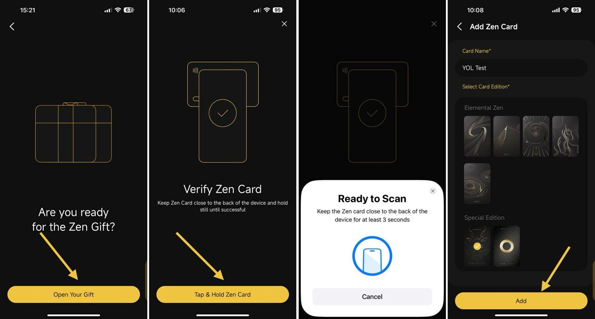
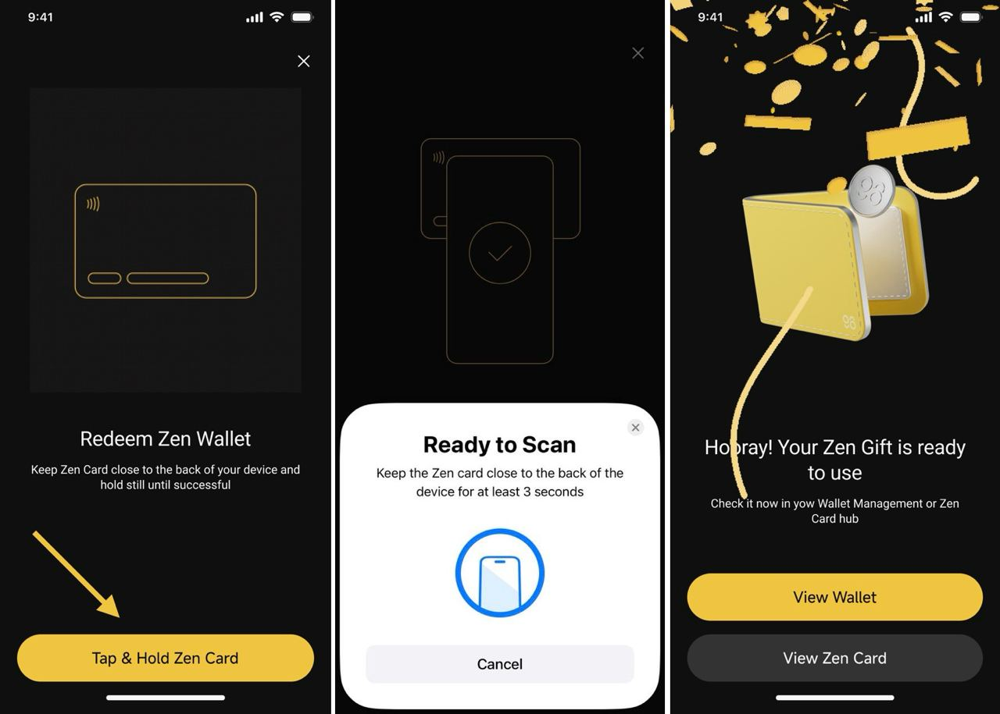
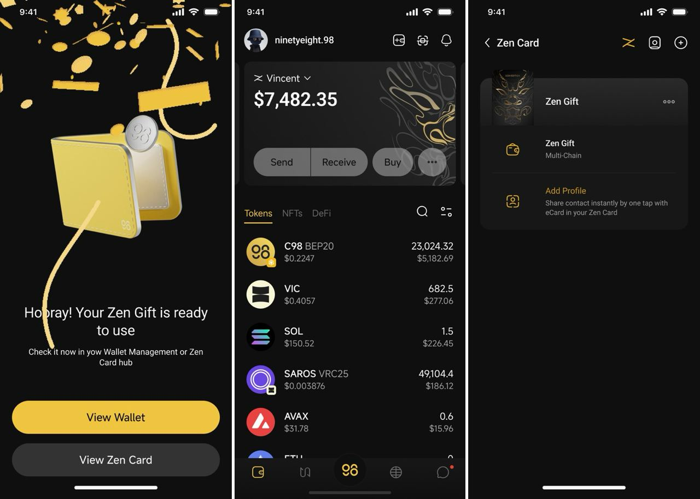

# How to Redeem Zen Gift


**Important Note**:&#x20;

* The Zen Card must be pre-configured with data to redeem a Gift, and the Gift can only be redeemed once.
* Please be aware that processes such as creating a new wallet, restoring a wallet, or migrating a wallet to Zen Card will replace any existing Wallet in the Zen Card with the newly created/restored/migrated Wallet because each Zen Card can hold only one wallet. Therefore, make sure you back up the **Seed Phrase and Private Key** of the existing wallet in Zen Card in a safe place before creating/restoring/migrating a wallet. After being replaced, you can only restore the replaced wallets by **Seed Phrase or Private Key.**


### **Requirements:**

* You must have a Zen Card
* Having Coin98 Super Wallet installed
* Your phone must support NFC

**Step 1:** On the main screen of the Coin98 Super Wallet, click **Add Wallet** icon

**Step 2:** Select the Zen Card option then click **Redeem**

<figure><figcaption></figcaption></figure>

**Step 3:** Click on **Open Your Gift**

**Step 4**: Click **Tap & Hold Zen Card** to verify Zen Card -> Tap the Zen Card to the back of your mobile device (position may differ for different devices) and hold until the popup notifies Success.


1. The area where you tap to scan a card may vary depending on different phone models. It's advisable to look up the appropriate placement for NFC cards on your specific phone.\
   _For iPhones 10 and newer (e.g., iPhone 13, 14, 15), it's recommended to place the card horizontally on the upper half of the front side of the phone._
2. The display for successful scans will differ between Android and iOS devices.


**Step 5:** Enter your Card Name and select Card Edition based on your physical Zen Card -> then click **Add** once done

<figure><figcaption></figcaption></figure>

**Step 5**: On the "Redeem Zen Wallet" interface, click **Tap & Hold Zen Card**&#x20;

**Step 6:** Tap the Zen Card on the back of your mobile device and hold it until the popup notifies Success

<figure><figcaption></figcaption></figure>

**Step 7**: After redeeming successfully, your Zen Gift wallet will be activated on the main screen of the Coin98 Super Wallet. You can click **View Wallet** or **View Zen Card** to see it

<figure><figcaption></figcaption></figure>
