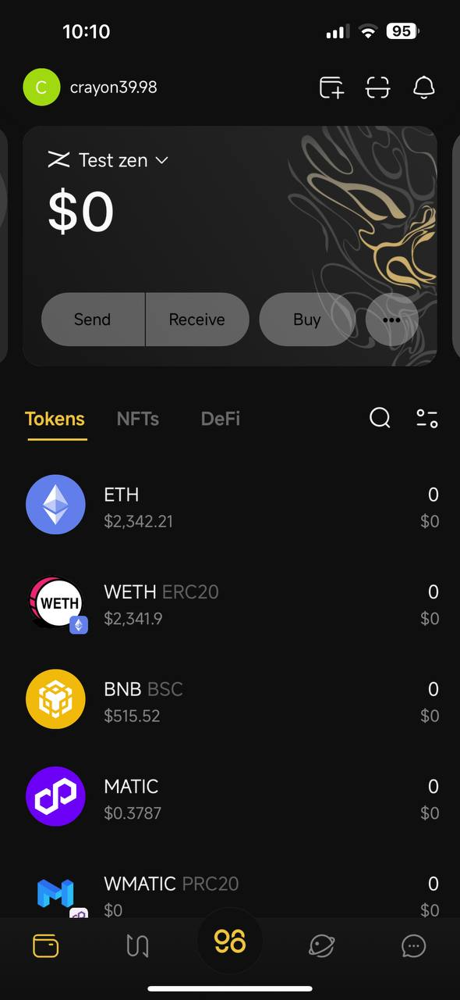

# How to Restore a Zen Card Wallet


**Important Note**: Please be aware that this process will replace any existing Wallet in the Zen Card with the restored Wallet because each Zen Card can hold only one wallet. Therefore, make sure you back up the **Seed Phrase** and **Private Key** of the existing wallet in Zen Card in a safe place before restoring a wallet. After being replaced, you can only restore the replaced wallets by **Seed Phrase or Private Key.**


### **Requirements:**

* You must have a Zen Card
* You have Coin98 Super Wallet and a hot wallet created
* Your phone must support NFC

**Step 1:** On the main screen of the Coin98 Super Wallet, click **Add Wallet** icon

**Step 2:** Select the Zen Card option then click **Restore**

<figure><figcaption></figcaption></figure>

**Step 3**: Click **Tap & Hold Zen Card** to verify Zen Card -> Tap the Zen Card to the back of your mobile device (position may be different for different devices) and hold until the popup notifies Success.


1. The area where you tap to scan a card may vary depending on different phone models. It's advisable to look up the appropriate placement for NFC cards on your specific phone.\
   _For iPhones 10 and newer (e.g., iPhone 13, 14, 15), it's recommended to place the card horizontally on the upper half of the front side of the phone._
2. The display for successful scans will differ between Android and iOS devices.


**Step 4:** Enter your Card Name and select Card Edition based on your physical Zen Card -> then click **Add** once done

<figure><figcaption></figcaption></figure>

**Step 5:** Input the Wallet Name and Seed Phrase, then click **Import to Zen Wallet**

**Step 6:** Click the **Tap & Hold Zen Card**&#x20;

**Step 7:** The system will pop up the instruction to scan the Zen Card -> Tap the Zen Card to the back of the mobile device (position may be different for different devices) and hold until the popup notifies Success.

<figure><figcaption></figcaption></figure>

After restoring successfully, your Zen Wallet will be activated on the main screen of the Coin98 Super Wallet.  You can click **View Wallet** to see it


_Zen Card is a Multi-chain Wallet._


<figure><figcaption></figcaption></figure>

 

<figure><figcaption></figcaption></figure>

