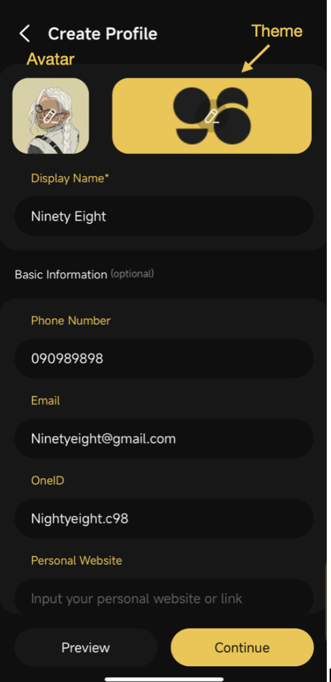
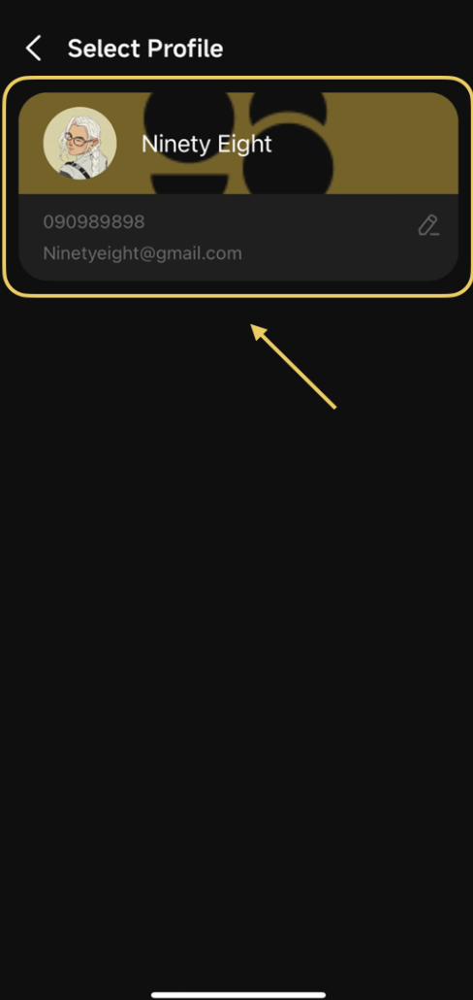
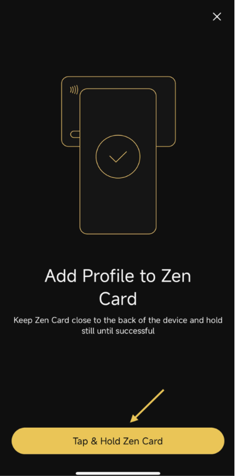
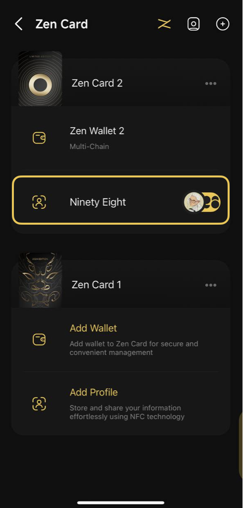
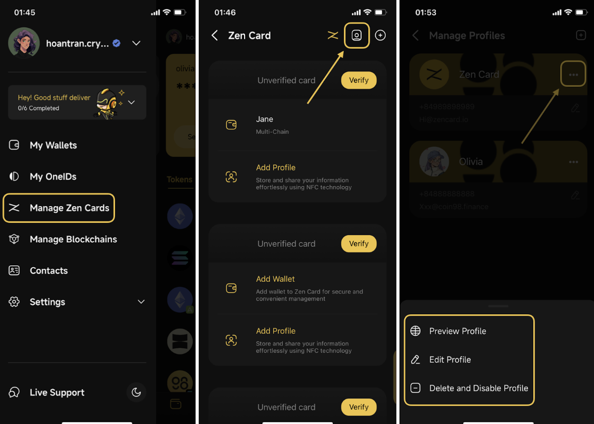

# How to Setup and Manage a Profile for eCard

Before proceeding to set up a new profile for your eCard, you must first ensure that you have added at least one Zen Card to the Coin98 Super Wallet. Please follow the instructions provided here on [How to Add a Zen Card](broken-reference)

### Set up a new profile

Once the Zen Card has been successfully added, follow these steps to set up a New Profile for eCard:

**Step 1:** In the **Manage Zen Cards** section, select **Add Profile** under the desired Zen Card

**Step 2:** On the Add Profile screen, click **Get Started**

<figure><figcaption></figcaption></figure>

**Step 3:** On the Create Profile screen, provide the required personal information, including:

* Avatar (profile image)
* Theme (customize the profile's appearance)
* Display Name

Other information are optional (Phone Number, Email, OneID,..)

**Step 4:** Click **Preview** to review your profile or **Continue** to finalize the setup

<figure><figcaption></figcaption></figure>

**Step 5:** Once the profile is created, select the profile to associate with your Zen Card

<figure><figcaption></figcaption></figure>

**Step 6:** Click on **Tap & hold Zen Card** on the NFC scanner of the phone until the notification shows successful

<figure><figcaption></figcaption></figure>

**Step 7:** The associated profile will now appear under the Zen Card.

<figure><figcaption></figcaption></figure>

### Manage your Profile

After setting up profiles, you can easily manage them by accessing the Manage Profile section:&#x20;

**Step 1:** Open the side menu, choose **Manage Zen Cards**, then click on the **Profile icon** on the top right corner.&#x20;

**Step 2:** For each profile, you can either preview it, edit it, or delete it.&#x20;

* **Preview Profile:** shows how your profile appears when others tap your Zen Card.
* **Edit Profile:** edit any information on your Profile
* **Delete and Disable Profile:** after deleting, the link of your profile you shared with other people will be disabled.&#x20;

<figure><figcaption></figcaption></figure>

