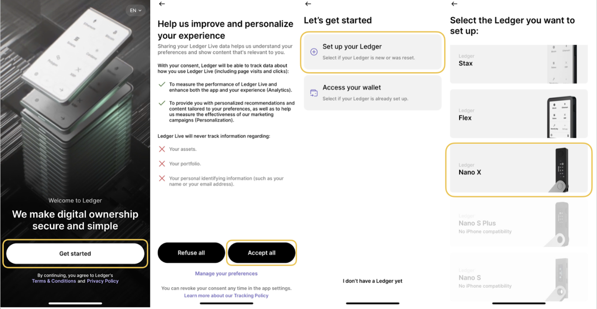
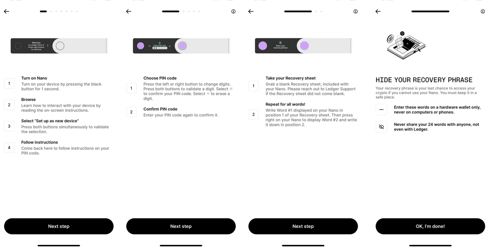
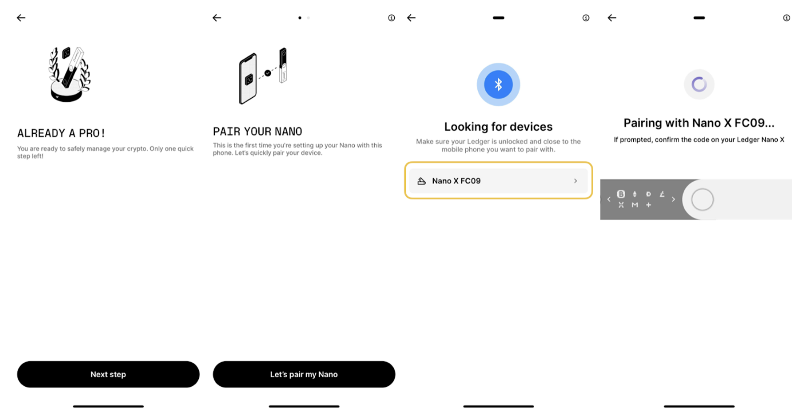
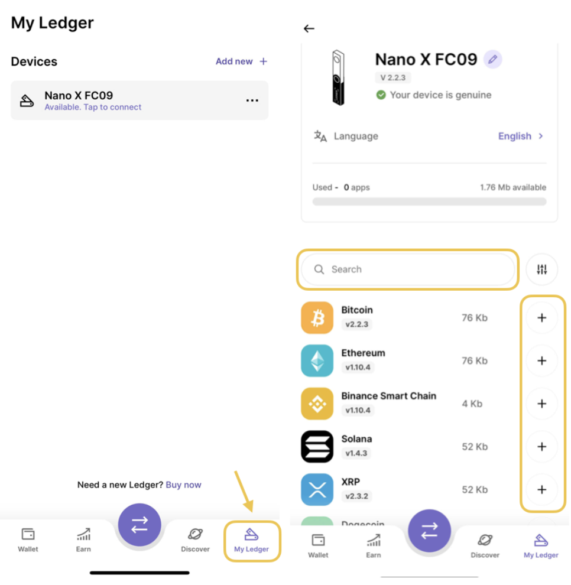
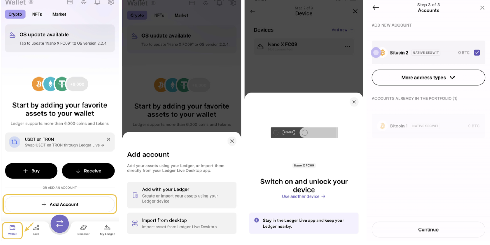
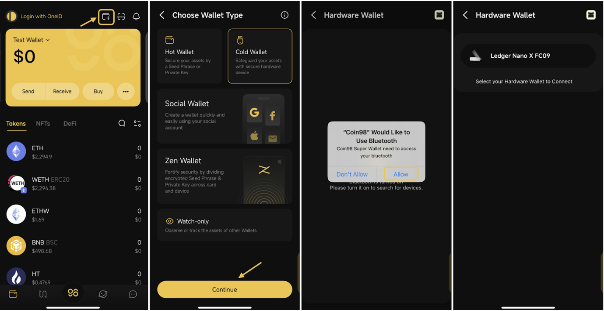

# How to connect Hardware Wallet on Coin98 Super Wallet

### **How to prepare and set up a Ledger device** 


Before connecting Ledger with Coin98 Super Wallet, you need to [download Ledger Live](https://www.ledger.com/ledger-live/download) to:

* Create a new wallet or restore the wallet on the Ledger device;
* Connect the device to the app for installing apps, adding accounts to your hardware wallet device, etc.


**Step 1:** Open Ledger Live → Click **Get started** → Read the terms of service and privacy policy → Select **Accept all** → Choose your device (In this article, we will use the Nano X wallet as an example) → Click **Set up your Ledger**;

**Step 2:** Open your Ledger device by pressing the left black button for one second and then:

* Read Ledger’s instructions on the device;
* Press the black and white button at the same time to select **Set up a new device**;
* Insert 4 to 8 digits long to set up PIN code for your device → Reconfirm the PIN;
* Pay attention to each word of the Recovery Phrase and write down the 24 words correctly and in the right order → After having written them down, input them into the device to confirm _(Scroll through until you find the correct word by pressing the right button and repeat for all words)_.

_**Note:** This_ Recovery Phrase _is extremely important. If you lose this recovery phrase, you will not be able to access your crypto in case you lose the device._

* Press two buttons at the same time to move to **Dashboard** after the device shows **Your device is now ready**;

**Step 3:** Connect your device with Ledger Live:

* Complete Ledger’s quiz → Open the phone’s Bluetooth or connect with a USB cable → Click **Let’s pair my Nano** → **Add new Ledger Nano X**;

**Step 4:** Install apps and create accounts:

* Open Ledger Live → Access the **My Ledger** section → Select your device → Search the application corresponding to the coin/token you want to store → Click **+** symbol to install;

**For example:** To store Ethereum (ETH) → Install the Ethereum app.

* Access the **Wallet** section → Select **Add Account** → Choose one of the following options: **Add with your Wallet** or **Import from Desktop** → Click **Continue** → Choose the crypto asset → Select Device → Synchronize Account and complete the process.

For more detailed instructions from Ledger, kindly check them out here: [LEDGER DOCS](https://support.ledger.com/hc/en-us/categories/4404376139409-Documentation-?docs=true)

### **How to connect your Ledger on Coin98 Super Wallet** 


**Before connecting Ledger to Coin98 Super Wallet, please notice:**

1. Ledger Nano S can’t be connected with iOS devices as the mentioned hardware wallet neither has Bluetooth function nor supports cable connection for iOS. You can use an OTG-cable to connect Nano S with Android smartphones by the way.
2. Make sure Bluetooth is enabled on your smartphone and your Ledger Nano X. For Android in particular, make sure location services are enabled in your phone's **Permission settings**, this is [a requirement for Bluetooth on Android](https://developer.android.com/guide/topics/connectivity/bluetooth/ble-overview#permissions).
3. Make sure to enable Blind Signing on your Ledger device before connecting as this feature is required for signing transactions involving smart contracts that come from third-party products like the Coin98 Super Wallet.

You can enable this feature by following this: Open the coin/token’s app on your hardware wallet device → Press the right button to navigate to **Settings** → Press both buttons to enable **Blind Signing** if it is being disabled.


**Step 1:** On the Home screen of the Coin98 Super Wallet, choose the **Add Wallet** icon;

**Step 2:** Select **Cold Wallet** → then click Continue;

**Step 3:** Enable Bluetooth for Coin98 Super Wallet following on-screen instructions. Once enabled, the detected hardware wallet will appear for pairing

**Step 4:** You can choose the network that you want connect at the top right screen;

**Step 5:** Select the Wallet Name, confirm on your Ledger to display the wallet address, then click Connect.

After connecting successfully, your wallet will be automatically displayed on the home screen. You can access the **Manage Wallet** section to review & manage all restored/ created wallets, get addresses, etc.

<figure><figcaption></figcaption></figure>


You can use the connected hardware wallet like other wallets created on Coin98. However, before receiving any coin/token, you need to make sure that coin/token is supported on Ledger devices by searching for the name of the coin [here](https://www.ledger.com/supported-crypto-assets).

