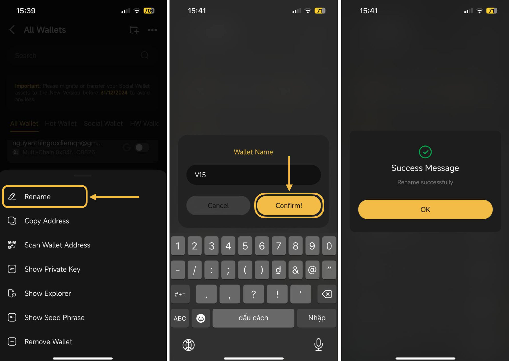
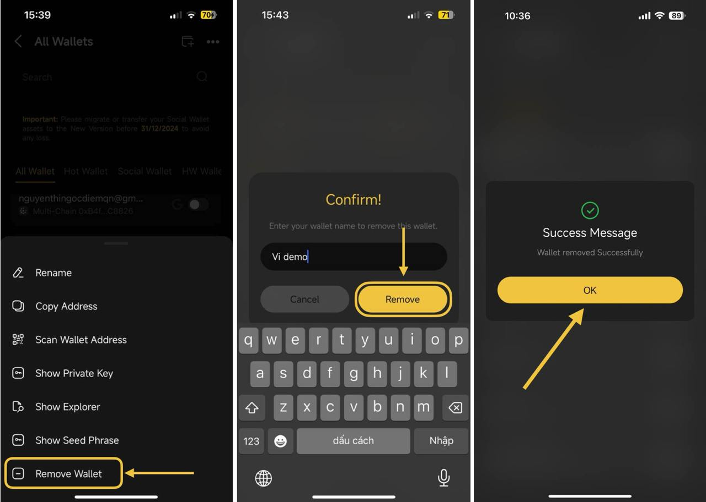

# How to rename/remove Wallet

## **How to rename a wallet**

**Step 1:** Click on the OneID icon at the top left corner of the main screen;

**Step 2:** Choose **My Wallets** to access the All Wallets section

**Step 3:** Choose a wallet you want to rename

<figure><figcaption></figcaption></figure>

**Step 4**: Click **Rename** → Enter the wallet name you want  →click **Confirm** to complete.

<figure><figcaption></figcaption></figure>

## **How to remove a wallet**

**Step 1:** Click on the OneID icon at the top left corner of the main screen;

**Step 2:** Choose **My Wallets** to access the All Wallets section

**Step 3:** Choose a wallet you want to remove

<figure><figcaption></figcaption></figure>

**Step 4**: Click **Remove Wallet** → Enter the wallet name → click **Remove** to complete.

<figure><figcaption></figcaption></figure>


**Note:**&#x20;

* Coin98 Super Wallet requires inputting a PIN Code or biometrics authentication whenever removing wallets.&#x20;

