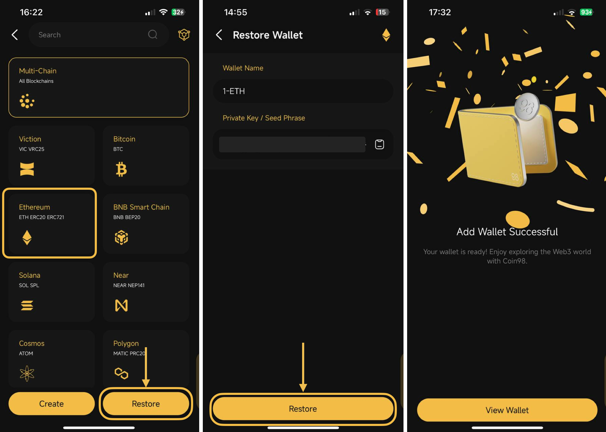
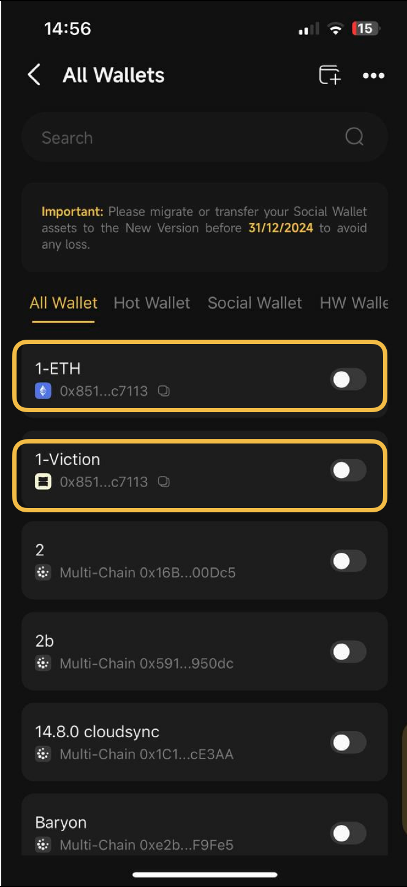

# How to switch a single-chain wallet to another chain wallet on Coin98 Super Wallet


This guide is for users who already have a wallet on a single blockchain _(eg. Ethereum wallet)_ and want to experience other blockchains using the same Seed Phrase and at the same time, having **the same wallet address** across all EVM-based blockchains _(like Viction, BNB Smart Chain, etc.)_


## How to switch wallets on Coin98 Super Wallet

### I. Get the Seed Phrase

Seed Phrase must be saved in a safe place when you create a wallet. You can copy your backed-up Seed Phrase and move on to the **Restore Wallet** part.

However, if you accidentally deleted, or forgot your keys, here’s how to retrieve them:

**Step 1:** Open the Coin98 Super Wallet & click on the OneID icon at the top left corner;

**Step 2:**  Choose **My Wallets**

**Step 3:** Click on the desired wallet&#x20;

**Step 4:** Click **Show Seed Phrase;**

<figure><figcaption></figcaption></figure>

**Step 5:** Read carefully the warning pop-up and click **View** to continue

**Step 6:** Copy the **Seed Phrase.**&#x20;

<figure><figcaption></figcaption></figure>

### II. Restore the wallet

**Step 1:** Back to the main screen  → click the Add Wallet icon at the top right corner;

**Step 2:** Choose a wallet type that you desire (for example: _Hot Wallet_) and click **Continue;**

If you're unclear about these wallet types, you can refer to a wallet comparison by clicking the icon in the top right corner;

<figure><figcaption></figcaption></figure>

**Step 3:** Select the blockchain on which you want to restore your wallet, and click **Restore**. You can:

* Restore a wallet on a specific blockchain based on your preference; or
* Restore a multichain wallet containing all the blockchains that Coin98 Super Wallet supports. Currently, Coin98 Super Wallet supports more than 100 blockchains, and many more to come in the future.

**Step 4**: Name the wallet and enter the copied Seed Phrase;

**Step 5:** Click **Restore** to complete.

<figure><figcaption></figcaption></figure>

After restoring your wallet, go to the **Manage Wallets** section to check.&#x20;

<figure><figcaption></figcaption></figure>
