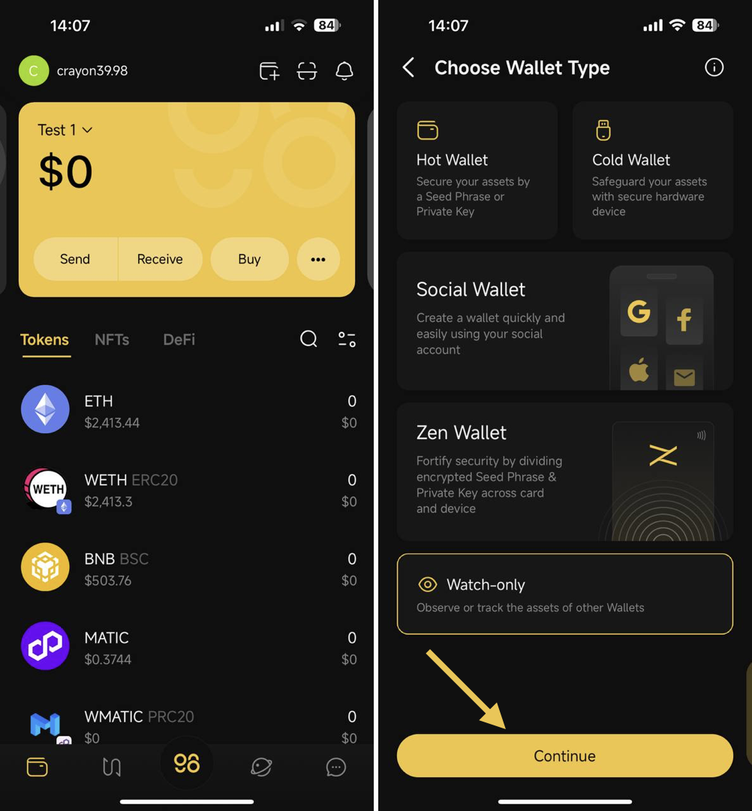
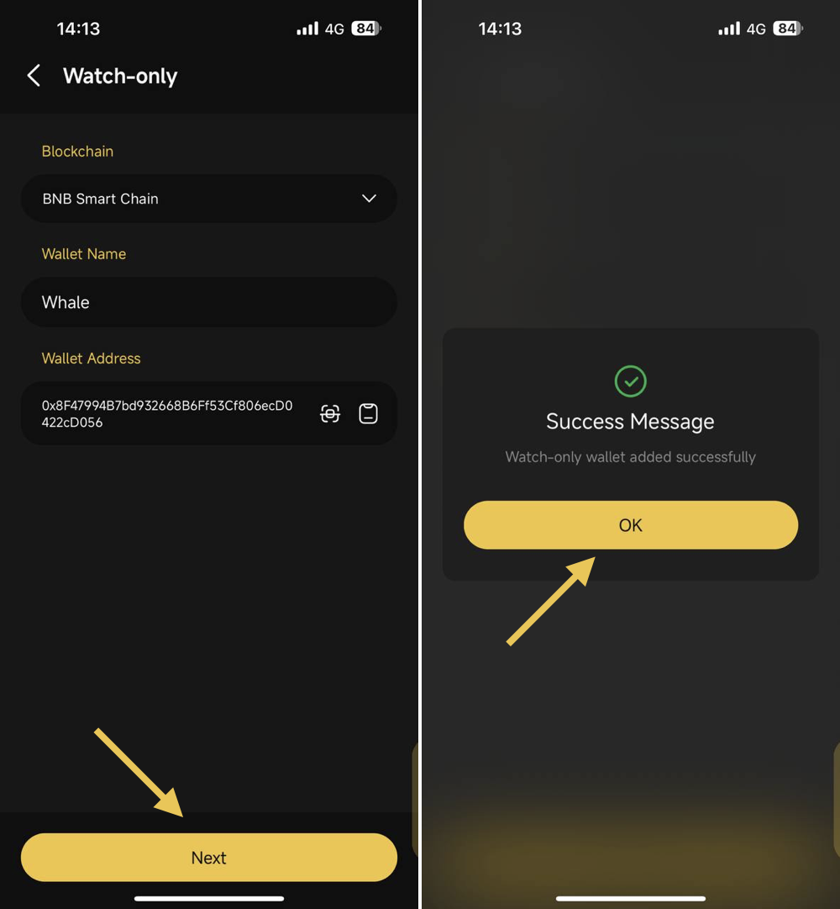
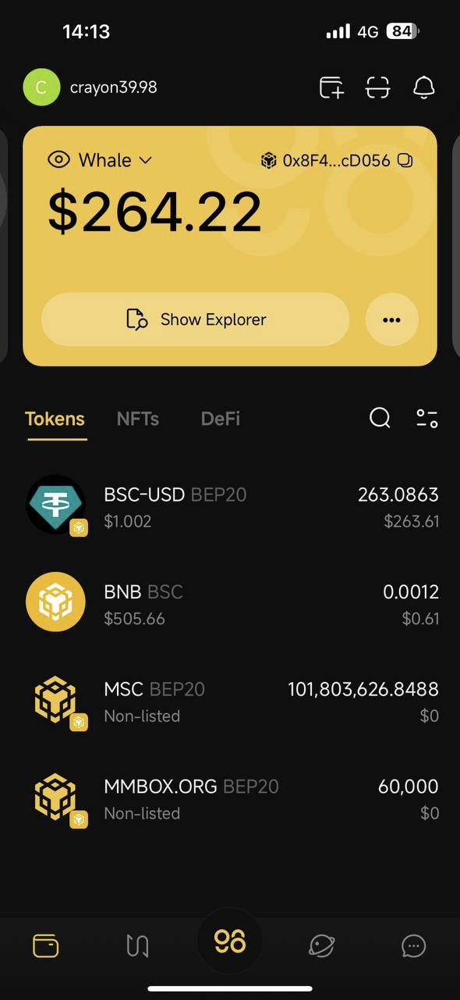
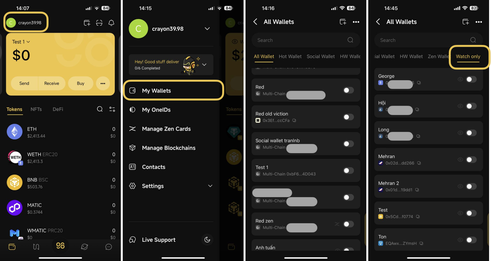
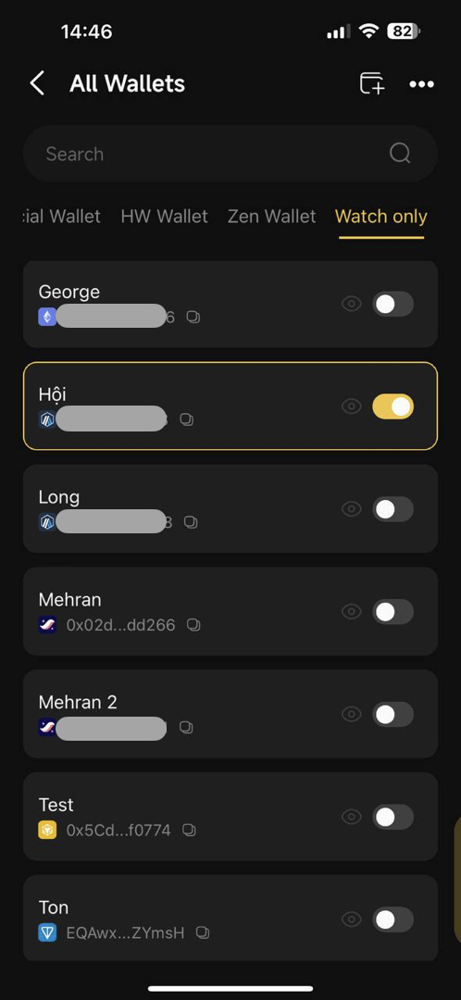

# How to use Watch-only Wallet

## What is the Watch-only Wallet feature?

A watch-only wallet within Coin98 Super Wallet serves as a read-only representation of a cryptocurrency wallet. It allows you to observe the wallet's balance and transactions without the ability to initiate transactions or access private keys. This feature is often utilized for the purposes of enhanced security and monitoring.

## How to add a Watch-only Wallet 

**Step 1**: On the Home screen of the Coin98 Super Wallet, choose the **Add Wallet** icon

**Step 2**:  Select **Watch-only** → then click **Continue**

<figure><figcaption></figcaption></figure>

**Step 3**: Choose the Blockchain, the Name of the Wallet, and input the wallet address that you want to observe -> then click **Next**.


**Note**: Please ensure that you input the accurate address associated with the correct blockchain. Failing to do so will result in an inability to proceed to the next step or monitor the desired wallet's balance.


**Step 4**: There'll be a popup that notifies you in case you add a watch-only wallet successfully, then click **OK**

<figure><figcaption></figcaption></figure>

**Step 4**: After successfully adding the Watch-only wallet, you will be navigated back to the Wallet main screen with the recently created Watch-only wallet.

<figure><figcaption></figcaption></figure>

## How to manage a Watch-Only wallet

* To conveniently manage all watch-only wallets on your App, simply click the “Watch-only” category within the Wallet Management section.

<figure><figcaption></figcaption></figure>

* If you have multiple wallets with the same blockchain on the App, you can only enable one wallet in the All Wallets section.

<figure><figcaption></figcaption></figure>

## FAQs 

#### Can I withdraw funds from the Watch-only wallet in Coin98 Super Wallet? 

**-> No**, since the purpose of a watch-only wallet is to exclusively monitor the funds and assets of a wallet. To access the wallet's funds, you must possess the Seed phrase or private key. Once you have the seed phrase or private key, you can restore the wallet in the same manner as a hot wallet.
