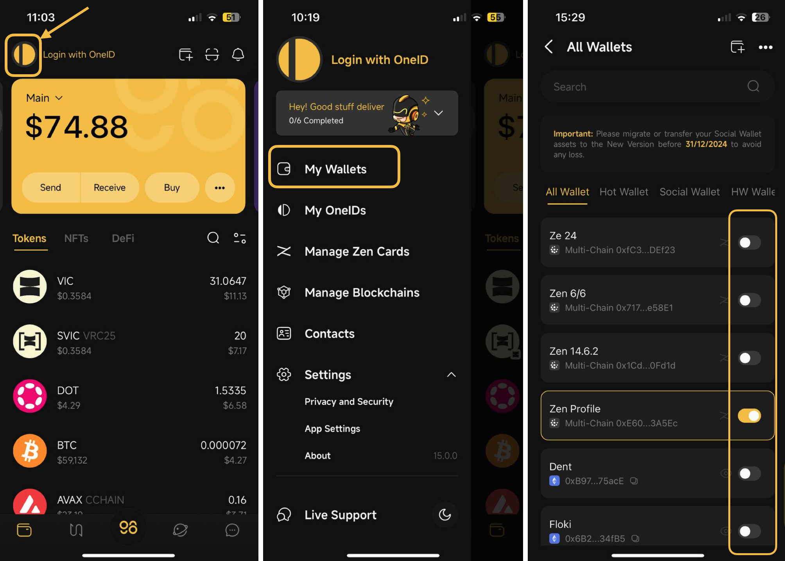
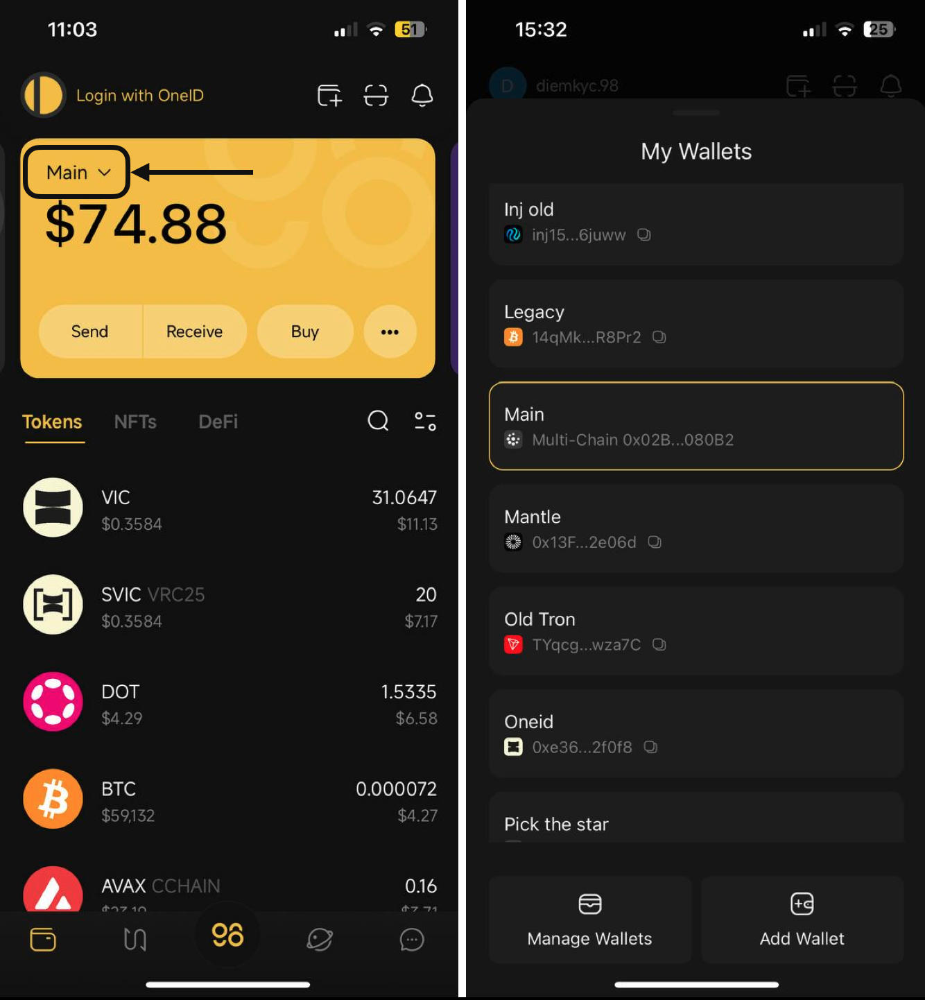

# How to activate a wallet on Coin98 Super Wallet

In the 14.1.1 version, Coin98 Super App supports the following wallet types:

1. Social Wallet: Create a wallet quickly and easily using your social account
2. Hot Wallet: Secure your assets by a Seed Phrase or Private KeyNon-custodial Wallet is used via Seed Phrase or Private Key
3. Zen Card: Fortify security by dividing encrypted Seed Phrase & Private Key across card and device
4. Cold Wallet: Safeguard your assets with secure hardware device
5. Watch-only: Observe or track the assets of other wallets

### How to activate a wallet?

We have developed the Manage Wallets feature to activate or inactivate your wallets.&#x20;

**Step 1:** Click on the OneID icon at the top left corner of the main screen;

**Step 2:** Choose **My Wallets** to access the All Wallets section

**Step 3:** Toggle the button next to the wallet as desired to activate/deactivate.


**Note:** You can only activate one wallet at a time. When the wallet A is activated in the app, all other wallets will be deactivated. As a result, assets in deactivated wallets will not be displayed in the app.


<figure><figcaption></figcaption></figure>

You can also change the active wallet by clicking on the wallet on the main screen, and then selecting the wallet you want to activate.

<figure><figcaption></figcaption></figure>
