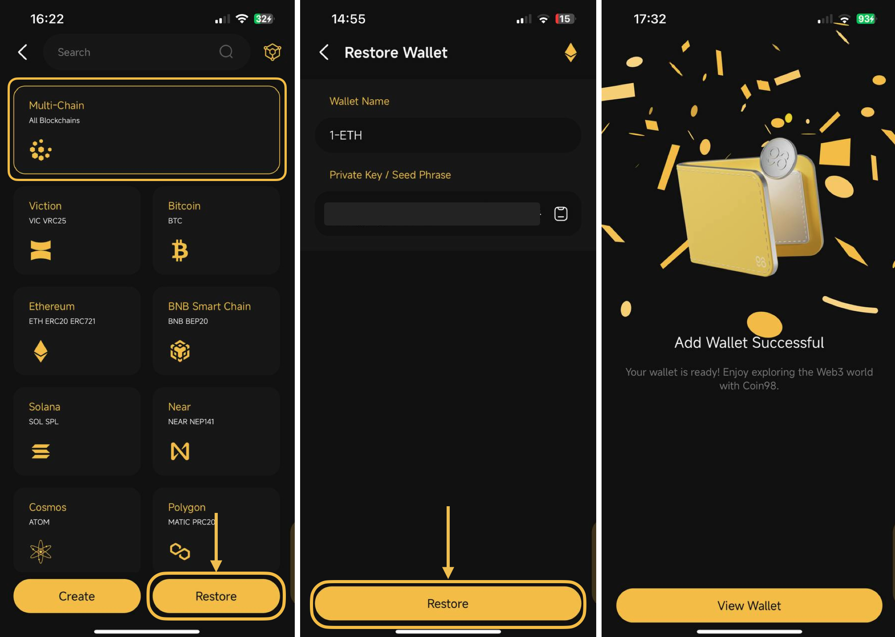
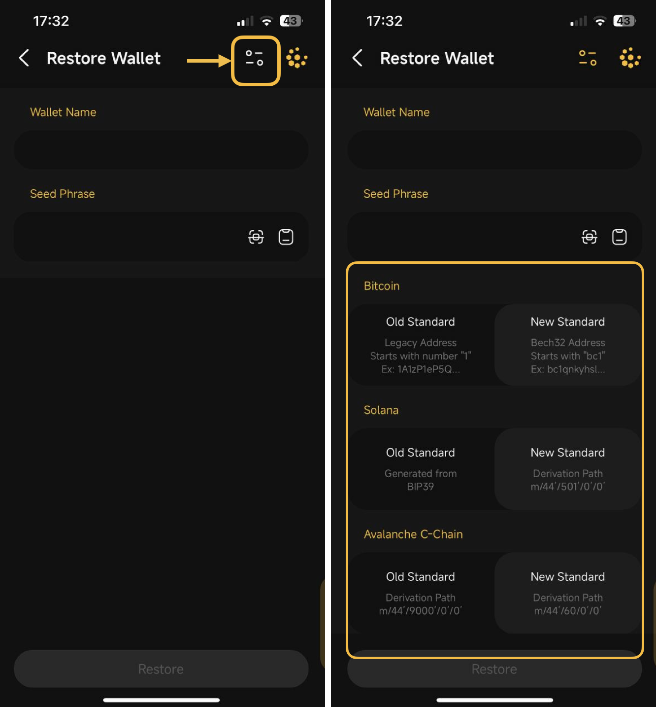

# How to import Multi-chain wallets to Coin98 Super Wallet

If you already have a Multi-chain wallet, you can simply import it to Coin98 Super Wallet to store coins/tokens as well as experience multiple AMMs and the Web3 Dapp Browser directly on the Mobile App by following these steps:

## How to import Multi-chain wallets to Coin98 Super Wallet

To import a Multi-chain wallet to Coin98 Super Wallet, you need its Seed phrase. Therefore, you should store the Seed phrase carefully from the moment of creating the wallet.


Seed phrase and Private Key are security keys that can be understood as a type of password in which the Seed phrase consists of 12 random English keywords, while the Private Key consists of a string of letters and numbers. If you want to restore access to your wallets, you must have ownership of the Seed phrases (used for restoring both Single Chain Wallet and Multichain Wallet) or Private Key (only used for restoring Single Chain Wallet).


**Step 1:** Open Coin98 Super Wallet, click the Add Wallet icon at the top right corner;

**Step 2:** Choose your desired wallet type and click **Continue**.

If you're unclear about these wallet types, you can refer to a wallet comparison by clicking the icon in the top right corner;

<figure><figcaption></figcaption></figure>

**Step 3:** Choose **Multi-Chain** -> Then click **Restore**

**Step 4:** Name the wallet and paste Seed Phrase into the **Seed Phrase box**

**Step 5:** Click **Restore** to complete.

<figure><figcaption></figcaption></figure>


**Note:** Coin98 supports 2 import options (New Standard or Old Standard) for each wallet on some blockchains such as Bitcoin, Solana, Avalanche C-chain, Viction (formerly Tomochain), Celo, Injective, The Open Network, Tron, Persistence and Aptos (including Aptos Testnet, Aptos Devnet and Aptos mainnet). If the correct standard is not selected, the wallet cannot be properly recovered.


<figure><figcaption></figcaption></figure>
