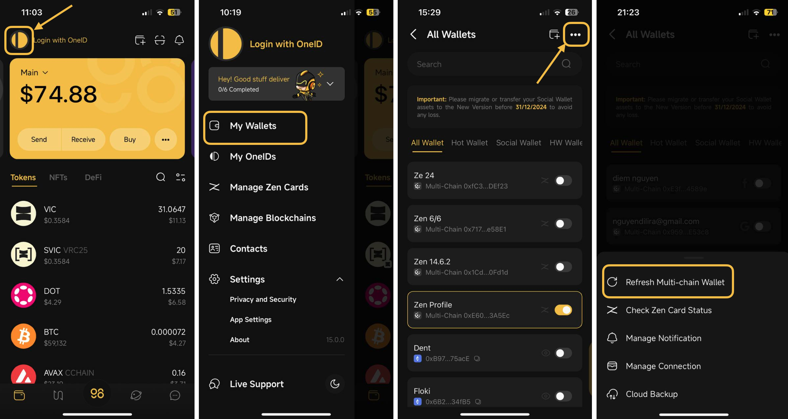

# How to Refresh a Multichain Wallet

The Refresh Multi-chain Wallet feature allows users to update their existing multichain wallets with newly integrated blockchains.

For example, if your multichain wallet was created before Coin98 supported or integrated Blockchain A, you can use this feature to update your wallet with all the latest supported blockchains.

**Step 1:** Click on the OneID icon at the top left corner of the main screen

**Step 2:** Choose **My Wallets**

**Step 3:** Click the **"..."** icon at the top right corner of the screen, then choose **Refresh Multichain Wallet;**

**Step 4:** Click **Confirm** to complete. After that, all the wallets belonging to the newest chains will be updated in your Multichain wallets.

<figure><figcaption></figcaption></figure>
